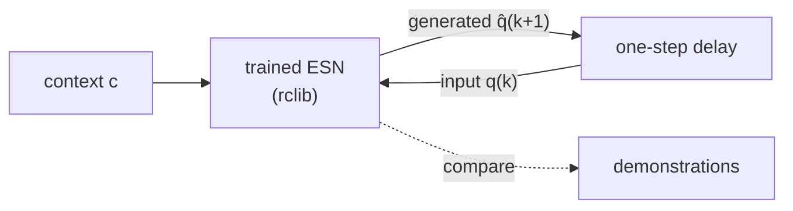
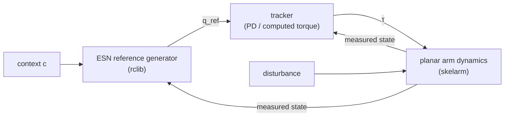

# arm-esn-ctrl

Echo state network (ESN) reference generators for robot-arm control,
learned from demonstration.

An ESN is trained on a few demonstrated joint-angle trajectories so that
it replicates the dynamical system underlying the demonstrations. At run
time, the ESN receives the robot's measured joint angles and a
task-specific context signal, and generates the next joint-angle
reference. A conventional trajectory tracker converts this reference
into joint torques, which drive a simulated planar arm subject to
disturbances. We study whether this state-driven ESN reference generator
makes the arm more robust than the standard approach of tracking a
time-indexed reference trajectory.

> **Status:** Stages 1 and 2 have first results, in reports 001 and 002 (eight
> demonstrations) and 003 (one demonstration).

## Motivation

A time-indexed reference $q^\mathrm{ref}(t)$ ignores what the robot is
actually doing. When the arm is pushed or blocked, the reference keeps
moving on schedule, the tracking error grows, and the tracker responds
with large corrective torques that drag the arm toward where the
schedule says it should be, not necessarily along a sensible path.

Dynamical-systems approaches to learning from demonstration, such as
dynamical movement primitives and stable estimators of dynamical
systems, avoid this by learning a state-dependent motion policy: the
reference is a function of the current state, so after a disturbance
the motion resumes from where the robot actually is. These methods
usually impose a hand-designed model structure to make the learned
system behave well.

Reservoir computing offers a complementary route. An ESN driven by a
time series can learn to replicate the dynamical system that generated
it, including its attractors, and studies have reported ESNs that
reproduce parts of the dynamics never visited during training. We ask
whether this capability carries over to learning from demonstration,
where

- the demonstrator's underlying dynamical system is unknown;
- only a few of its trajectories, the demonstrations, are observed, so
  the system is only *partially observed*; and
- the robot inevitably leaves the observed trajectories, for example
  when it is disturbed, so the learned system must also behave sensibly
  outside them.

If it does, the learned ESN is a reference generator that takes the
current robot state and context into account, and it should keep the
arm robust to disturbances without being told explicitly how to recover.

## Research questions

1. **Replication.** Trained on a few demonstrations, does the ESN
   reproduce the demonstrated trajectories and settle at the
   demonstrated goal?
2. **Partial observation.** Does the ESN replicate the underlying
   dynamical system outside the observed trajectories, for example when
   it starts from a posture that was never demonstrated? How many
   trajectories, and how much variety among them, are needed to
   replicate the system reliably?
3. **Context.** Can a context signal select or modulate the generated
   motion? Candidate contexts are a motion label, the size of an
   obstacle, and the timing to start the motion.
4. **Robustness.** Connected to the robot and disturbed (pushes,
   temporary blocking, initial-posture offsets), does the ESN reference
   let the arm complete the task more reliably, or with smaller
   corrective torques, than time-indexed reference tracking with the
   same tracker?

A negative answer is also a result, and the reports record it as one.

## Approach

The ESN is studied in two stages. It is first run **autonomously**,
without the robot, to understand what it has learned and how its
hyperparameters affect it. Only after it reproduces the demonstrations
well is it connected **to the robot** and compared with baselines.

### ESN formulation

At step $k$, the ESN input $u_k$ stacks the joint angles $q_k$ and the
context $c_k$. A leaky reservoir with state $x_k$ is updated, and a
linear readout produces the next joint angles:

$$
u_k = \begin{bmatrix} q_k \\ c_k \end{bmatrix}, \qquad
x_{k+1} = (1-\alpha)\,x_k + \alpha \tanh\left(W_\mathrm{res}\,x_k + W_\mathrm{in}\begin{bmatrix} 1 \\ u_k \end{bmatrix}\right), \qquad
\hat q_{k+1} = W_\mathrm{out}\begin{bmatrix} 1 \\ x_{k+1} \end{bmatrix}.
$$

- $W_\mathrm{res}$ and $W_\mathrm{in}$ are random and fixed. Only
  $W_\mathrm{out}$ is trained, by ridge regression.
- The ESN works only with the observed quantity, the joint angles, in
  both its input and its output. It is not expected to generate
  unobserved states such as joint velocities. If joint angles alone
  turn out to be insufficient, the input may be extended with joint
  velocities; in the autonomous stage, these would then be computed by
  finite differences of the generated angles.
- **Training (teacher forcing).** The inputs are the demonstrated joint
  angles and the target is the next demonstrated joint angle
  $q^\mathrm{demo}_{k+1}$. Each demonstration starts from a reset
  reservoir, and an initial washout period is excluded from the fit.
- **Hyperparameters.** These are the reservoir size, spectral radius,
  leak rate $\alpha$, input scaling, connection density, ridge
  coefficient, washout length, and random seed. All of them are set in
  the configuration file (see *Configuration and reproducibility*
  below).

### Stage 1: autonomous ESN (without the robot)

After a warm-up driven by the demonstration, the ESN's output is fed
back as its own input at the next step, $q_{k+1} := \hat q_{k+1}$. The
trained ESN then runs as an autonomous dynamical system, and the
trajectory it generates is compared with the demonstrations.



This stage needs no robot simulator and runs fast. It serves two
purposes:

- **Building intuition.** We sweep the ESN hyperparameters by hand to
  get a feeling for how each one affects the generated trajectories,
  and to find a parameter set with which the trained ESN performs well
  (RQ1).
- **Probing the learned system.** We start the ESN from postures that
  were never demonstrated, or perturb the fed-back angles, to see
  whether it behaves sensibly outside the observed trajectories (RQ2).
  We also vary the context (RQ3).

### Stage 2: ESN connected to the robot



The ESN input is now the *measured* joint angles of the robot, never the
ESN's own prediction. The reservoir warms up while the arm holds its
initial posture, before the task starts at t = 0. Every ESN period Δ,
the ESN turns the measured posture $q(t_k)$ into the posture the arm
should have next, $\hat q_{k+1}$; between those instants, the reference
$q^\mathrm{ref}$ moves in a straight line from $\hat q_k$ to
$\hat q_{k+1}$. The tracker's desired velocity is that line's slope, and
its desired acceleration is the change of the slope, smoothed by a causal
low-pass filter.

The **baseline** replaces the ESN block with the demonstration replayed
against time, $q^\mathrm{ref}(t) = q^\mathrm{demo}(t)$. Everything else
is shared: the robot model, the tracker and its gains, the disturbances,
and the metrics. Differences in outcome can then be attributed to the
reference generator alone.

Nothing in this construction guarantees that the autonomous ESN, or the
coupled ESN–robot system, is stable. At this stage, we observe stability
empirically and report it.

### Disturbance scenarios *(initial set)*

| Scenario | What happens |
| --- | --- |
| nominal | No disturbance. |
| push | A short external force acts on the arm during the motion. |
| block | The arm is held in place for a while, then released. |
| initial offset | The motion starts from a posture away from the demonstrated start. |

### Metrics

Metrics depend on the task, and each report defines the ones it uses.
Typical examples are:

- **Autonomous ESN:** each run is split at its **arrival time** t_a, the
  first time the hand comes within the goal radius r of the target (the
  target tolerance of the task). The **reach** [0, t_a] is compared with
  the demonstrator's reach from the same start posture: the hand
  displacement in the first step (a jump shows the ESN snapping back to a
  learned trajectory), the deviation from the demonstrated path regardless
  of timing, the joint-angle error over time, and the arrival delay. The
  **hold** window [t_a, t_a + T_h], with the hold duration T_h set by
  `hold` in `[evaluation]`, needs no reference: a run succeeds if it
  arrives and does not leave the goal radius during the window, and the
  hold error is the distance to the target at the window's end. A window
  that would run past the end of the run is cut there, and the observed
  hold length is recorded.
- **ESN with the robot:** the goal error, the deviation from the
  demonstrated path, the joint torques (or accelerations) generated to
  recover after a disturbance, and the smoothness of the reference,
  including any jump right after a disturbance.

## Guiding principles

- **Concept first.** Demonstrate the idea in a small, clear setup, such
  as a two-link arm and one reaching motion, before scaling up.
  Understand the ESN autonomously before connecting it to the robot.
  Explore hyperparameters by hand to build intuition; automated
  hyperparameter optimization waits until the concept is established.
- **Simple code.** Use plain functions on NumPy arrays and few layers
  of abstraction. Add a new abstraction only when a second real use
  appears. A researcher should be able to read any script from top to
  bottom.
- **Human-readable reports.** Each study is a short Markdown report
  written for people: a question, the setup, figures, observations, and
  next steps.
- **Everything in configuration files.** Every parameter that affects a
  result is set in a configuration file, not hidden in a script.
- **Libraries own their domain.** ESN numerics belong to rclib and arm
  simulation belongs to skelarm. Fix issues upstream first, then advance
  the submodule pin in a separate commit.

## Repository layout

```text
arm-esn-ctrl/
├── src/arm_esn_ctrl/   # small library: demonstrations, ESN, autonomous and robot runs, tracking, metrics
├── experiments/        # the runner scripts, and one directory per experiment: its README and configurations
├── tools/              # interactive apps that run a trained ESN or the robot live
├── reports/            # one directory per study (see Reports)
├── tests/              # sanity tests of the core pieces
└── third_party/        # rclib and skelarm (Git submodules)
```

## Experiments

Each experiment is a directory under [`experiments/`](experiments/README.md),
with a README that describes it and its configuration files; the runner scripts
that run them are shared:

| Experiment | What it studies | Report |
| --- | --- | --- |
| [demonstrations](experiments/demonstrations/README.md) | scripted reaching demonstrations of a two-link arm | |
| [single_demonstration_autonomous_reaching](experiments/single_demonstration_autonomous_reaching/README.md) | an ESN trained on one demonstration, run on its own (Stage 1) | [003](reports/003-single-demonstration/README.md) |
| [single_demonstration_robot_tracking](experiments/single_demonstration_robot_tracking/README.md) | that ESN as the reference generator of the simulated robot (Stage 2) | [003](reports/003-single-demonstration/README.md) |
| [multi_demonstration_autonomous_reaching](experiments/multi_demonstration_autonomous_reaching/README.md) | an ESN trained on eight demonstrations, run on its own (Stage 1) | [001](reports/001-autonomous-reaching/README.md) |
| [multi_demonstration_robot_tracking](experiments/multi_demonstration_robot_tracking/README.md) | that ESN as the reference generator of the simulated robot (Stage 2) | [002](reports/002-esn-reference-on-the-robot/README.md) |
| [manual_demonstration_autonomous_reaching](experiments/manual_demonstration_autonomous_reaching/README.md) | an ESN trained on one take taught by hand, run on its own (Stage 1) | [004](reports/004-manual-demonstration/README.md) |
| [manual_demonstration_robot_tracking](experiments/manual_demonstration_robot_tracking/README.md) | that ESN as the reference generator of the simulated robot (Stage 2) | [004](reports/004-manual-demonstration/README.md) |
| [manual_demonstration_v2_autonomous_reaching](experiments/manual_demonstration_v2_autonomous_reaching/README.md) | the same on a remade arm, with a new take (Stage 1) | [005](reports/005-tuned-on-the-robot/README.md) |
| [manual_demonstration_v2_robot_tracking](experiments/manual_demonstration_v2_robot_tracking/README.md) | ESNs tuned on the robot, by how it follows the taught path (Stage 2) | [005](reports/005-tuned-on-the-robot/README.md) |

Every parameter that affects a result is in a TOML configuration file, and every
run records its configuration, the command, and the commit that produced it, so
that running the same configuration again on the same machine reproduces the same
result. Runs go into a storage root outside the repository, filed by experiment:
`<storage root>/results/<experiment>/<date>-<time>-<configuration name>/`.
[`experiments/README.md`](experiments/README.md) describes the configurations, the
run records, reproducibility, and the storage. The interactive apps that run a
trained ESN or the robot live are described in [`tools/README.md`](tools/README.md).

## Getting started

Prerequisites:

- Python 3.12 or newer and [uv](https://docs.astral.sh/uv/)
- A C++17 compiler, CMake 3.15 or newer, and OpenMP, all needed to
  build rclib (on Ubuntu: `sudo apt install libomp-dev`)

```bash
git clone --recursive <repository-url> arm-esn-ctrl
cd arm-esn-ctrl
uv sync        # builds rclib from the submodule and installs skelarm
uv run pytest  # quick sanity check

# Optional: keep data and results outside the repository
echo 'storage_root = "/path/to/storage"' > storage.toml
```

If you cloned without `--recursive`, run
`git submodule update --init --recursive`.

### Advancing a submodule pin

Fix issues in rclib or skelarm upstream first. Once the fix is on the
library's `main` branch, advance the pin here in a commit of its own
(rclib shown; skelarm is the same):

```bash
git -C third_party/rclib fetch origin
git -C third_party/rclib checkout <commit>                  # the new pin
git -C third_party/rclib submodule update --init --recursive  # the library's own submodules
git add third_party/rclib
uv sync --reinstall-package rclib
uv run pytest
```

Do not run `git submodule update` in this repository between checking
out the new commit and `git add`: it resets the submodule to the old pin.
uv installs the libraries from the submodules but does not notice when
their source changes, so reinstall them with `--reinstall-package`. After
committing the new pin, rerun the experiments whose results depend on
the library.

## Development

```bash
uv run pytest                                # tests
uv run ruff format . && uv run ruff check .  # formatting and linting
uv run basedpyright && uv run mypy           # type checking
```

Type annotations are encouraged but not required. The type checkers run
in their standard (non-strict) modes. Their settings in `pyproject.toml`
also apply when your editor runs its own pyright, basedpyright, or mypy,
so imports resolve against the project's `.venv`.

## Reports

`reports/` holds one directory per study:

```text
reports/001-autonomous-reaching/
├── README.md   # the report
├── data/       # the demonstrations this report uses
└── results/    # the runs behind its figures: configurations, outputs, figures
```

The reports so far:

- [001 Autonomous reaching with an echo state network](reports/001-autonomous-reaching/README.md)
  (Stage 1): the ESN trained on eight demonstrations, run on its own.
- [002 The ESN as the reference generator of a robot arm](reports/002-esn-reference-on-the-robot/README.md)
  (Stage 2): the ESN against the replayed demonstrations, with and without
  disturbances.
- [003 One demonstration: what the ESN learns, and how it drives a robot arm](reports/003-single-demonstration/README.md)
  (Stages 1 and 2): an ESN trained on a single demonstration learns a clock or a
  path; on the robot, the path-type ESN's reference waits for a blocked arm.
- [004 A demonstration taught by hand: from a pause and pixel steps to a mild return](reports/004-manual-demonstration/README.md)
  (Stages 1 and 2): an ESN trained on one take taught by hand returns mildly to the
  taught path from offset starts, and on the robot adapts to blocks and pushes.
- [005 A remade arm, and an ESN tuned on the robot](reports/005-tuned-on-the-robot/README.md)
  (Stage 2): on a remade arm, an ESN tuned by how the robot follows the taught path
  with it follows it within about 1 mm; the more compliant of two candidates was
  chosen, at a cost in robustness from offset starts. Its reservoir states,
  recomputed from the runs' logs, wait with a held arm.

Each report has five parts:

1. **Question:** what we want to know, and why.
2. **Setup:** the robot, demonstrations, ESN settings, and scenarios,
   with links to the configuration files in `results/` and the command
   that regenerates the results.
3. **Results:** figures and a small table.
4. **Observations:** what the results show, including what did not work.
5. **Next steps.**

## Roadmap

- [x] **Scaffold.** Add the submodules, the uv environment,
      configuration loading, and the storage root. Build a minimal
      pipeline: demonstration → ESN training → autonomous run → plot.
- [ ] **Autonomous ESN.** Replicate one reaching motion of a two-link
      arm. Sweep the hyperparameters by hand and settle on a set that
      works (RQ1).
- [ ] **Partial observation.** Vary the number and variety of
      demonstrations, and start the ESN from postures that were never
      demonstrated (RQ2).
- [ ] **Context.** Condition the ESN on a motion label, an obstacle
      size, or the timing to start the motion (RQ3).
- [ ] **ESN with the robot.** Connect the ESN to the simulated arm
      through a tracker, and compare it with the time-indexed baseline
      in the nominal, push, block, and initial-offset scenarios (RQ4).
- [ ] **Systematic evaluation.** Use more demonstrations, disturbances,
      and seeds. Automated hyperparameter optimization is considered
      only at this stage.

Out of scope for now: model mismatch between the tracker and the robot,
3-D and 7-DOF arms, and physical hardware.

## Dependencies

The following libraries are pinned as Git submodules, so every result
can be traced to exact library versions:

| Library | Role | Path | License |
| --- | --- | --- | --- |
| [rclib](https://github.com/hrshtst/rclib) | ESN reservoirs and readouts (C++ core, Python bindings) | `third_party/rclib` | Apache-2.0 |
| [skelarm](https://github.com/hrshtst/skelarm) | Planar arm kinematics/dynamics simulation, tracking controllers, and teaching logs | `third_party/skelarm` | GPL-3.0-only |

## Key references

Reservoir computing and the replication of dynamical systems:

- H. Jaeger, "The 'echo state' approach to analysing and training
  recurrent neural networks," GMD Report 148, 2001.
- M. Lukoševičius and H. Jaeger, "Reservoir computing approaches to
  recurrent neural network training," *Computer Science Review*,
  3(3):127–149, 2009.
- J. Pathak, Z. Lu, B. R. Hunt, M. Girvan, and E. Ott, "Using machine
  learning to replicate chaotic attractors and calculate Lyapunov
  exponents from data," *Chaos*, 27:121102, 2017.
- Z. Lu, B. R. Hunt, and E. Ott, "Attractor reconstruction by machine
  learning," *Chaos*, 28:061104, 2018.
- A. Flynn, V. A. Tsachouridis, and A. Amann, "Multifunctionality in a
  reservoir computer," *Chaos*, 31:013125, 2021.
- J. Z. Kim, Z. Lu, E. Nozari, G. J. Pappas, and D. S. Bassett,
  "Teaching recurrent neural networks to infer global temporal structure
  from local examples," *Nature Machine Intelligence*, 3:316–323, 2021.
- A. Röhm, D. J. Gauthier, and I. Fischer, "Model-free inference of
  unseen attractors: Reconstructing phase space features from a single
  noisy trajectory using reservoir computing," *Chaos*, 31:103127, 2021.

Dynamical systems for learning from demonstration:

- S. M. Khansari-Zadeh and A. Billard, "Learning stable nonlinear
  dynamical systems with Gaussian mixture models," *IEEE Transactions on
  Robotics*, 27(5):943–957, 2011.
- A. J. Ijspeert, J. Nakanishi, H. Hoffmann, P. Pastor, and S. Schaal,
  "Dynamical movement primitives: Learning attractor models for motor
  behaviors," *Neural Computation*, 25(2):328–373, 2013.
- A. Billard, S. S. Mirrazavi, and N. Figueroa, *Learning for Adaptive
  and Reactive Robot Control: A Dynamical Systems Approach*, MIT Press,
  2022.

## License

This project is licensed under the GNU General Public License v3.0 only
(GPL-3.0-only). See [LICENSE](LICENSE). The submodules keep their own
licenses, listed under [Dependencies](#dependencies).

## AI assistance

This project is developed with the assistance of AI coding agents. The
maintainer ([@hrshtst](https://github.com/hrshtst)) sets the research
direction, and reviews, tests, and revises every change. All
responsibility for the code and reports in this repository lies with
the maintainer.
