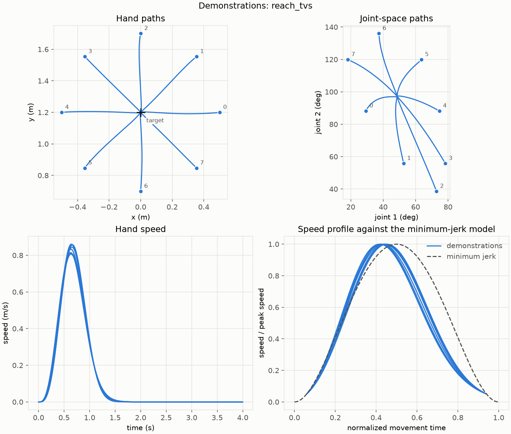
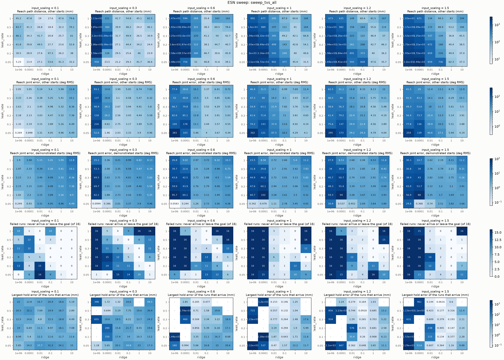
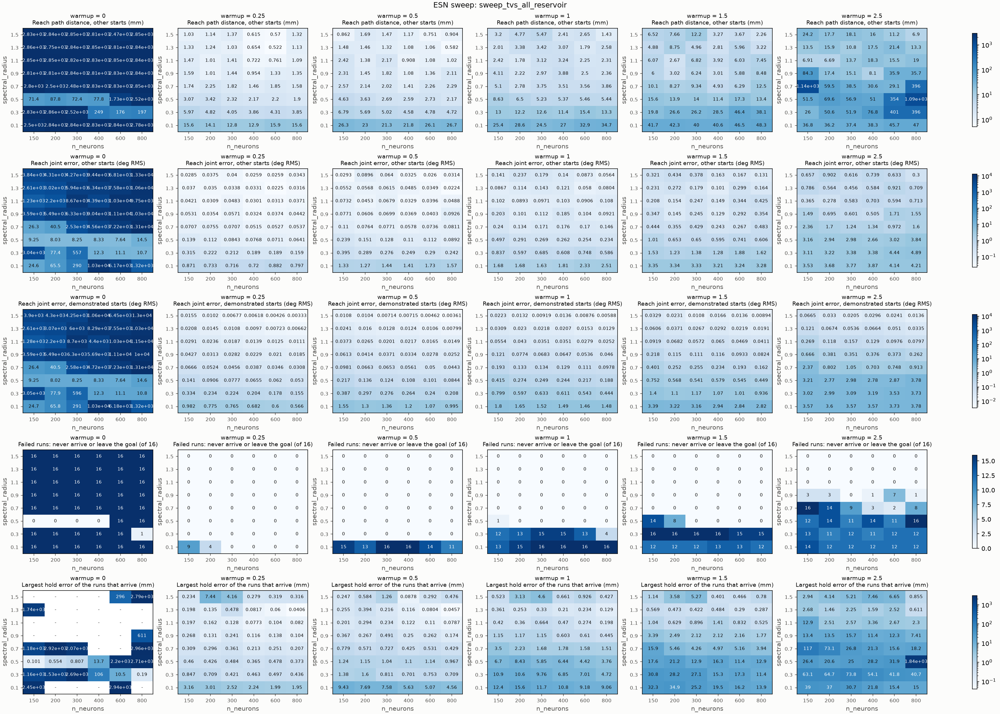
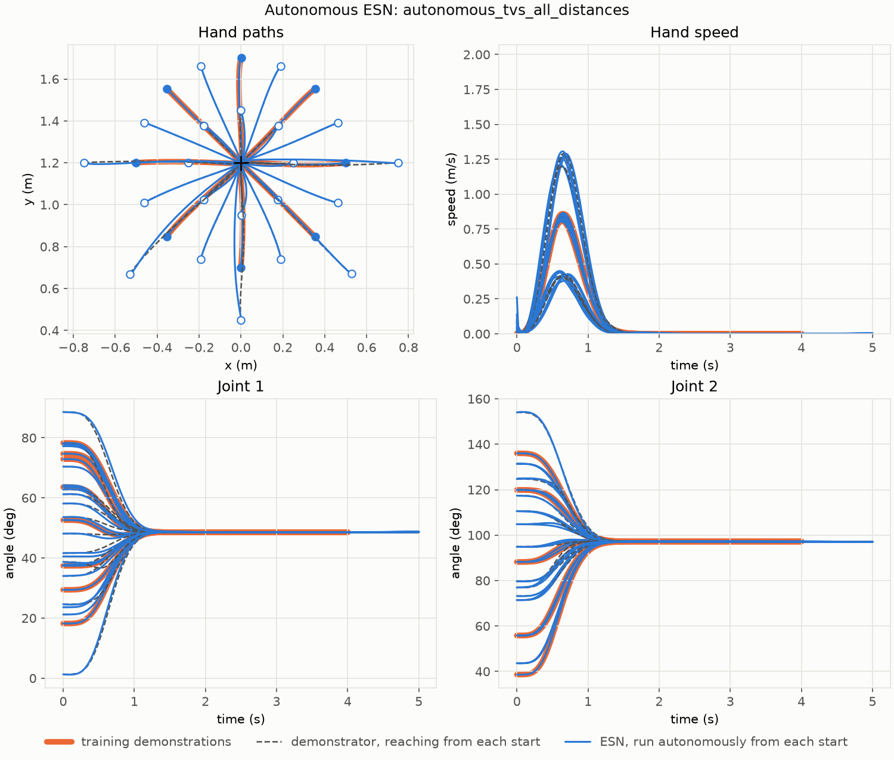

# 001 Autonomous reaching with an echo state network

**Summary.** An echo state network (ESN) was trained on eight demonstrated
reaches of a simulated two-link arm. Run on its own, its output fed back as its
next input, it reproduces the demonstrated reaches to within 0.4 mm. It also
reaches from start postures halfway between them to within 1.3 mm. From start
postures nearer to or farther from the target than any demonstration, it still
arrives and holds every time, but its path strays up to 44 mm from the
demonstrator's. Two hand sweeps found the settings: a small input scaling, a
tiny ridge, a slow leak rate, and a short warm-up matter most.

## 1. Question

Can an ESN, trained by teacher forcing on a few demonstrated reaches, reproduce
the reaching motion when it runs autonomously? And does it reach well from start
postures that no demonstration starts from? These are research questions RQ1 and
RQ2 of the [project README](../../README.md#research-questions), studied here
without the robot (Stage 1).

## 2. Setup

### Robot and task

A planar two-link arm on a horizontal plane (no gravity), simulated with
[skelarm](../../third_party/skelarm): link lengths 1.0 m and 0.8 m, masses 1.0 kg
and 0.8 kg. The task is to bring the hand to the target (0, 1.2) m and keep it
there. The **goal radius** r is the task's tolerance, 2 cm.

### Demonstrations

A scripted controller made the demonstrations: a virtual spring-damper that pulls
the hand toward the target, with a stiffness that rises over time (Sekimoto and
Arimoto, IROS 2006), tuned for human-like reaches (`[controller]` in
[`config.toml`](data/20261002-194644-reach_tvs/config.toml)). The eight
demonstrations start 0.5 m from the target, in eight directions 45° apart, and
last 4 s each: a reach of about 1.1 s, then about 3 s holding still at the target.
They are in [`data/20261002-194644-reach_tvs`](data/20261002-194644-reach_tvs).

### ESN

The ESN ([rclib](../../third_party/rclib)) reads the two joint angles and gives
the two joint angles of the next sample, every 10 ms. Before they enter the ESN,
the angles are scaled so that the training data span [−1, 1] in each joint.

- **Training (teacher forcing).** Each demonstration is fed in, sample by sample,
  and the readout learns to predict the next sample. Each demonstration starts
  from a reset reservoir, driven first by its start posture held still for the
  **warm-up**. The warm-up brings the reservoir from its reset state to one that
  reflects the start posture, and it is left out of the fit. One ridge-regression
  readout is fitted on all eight demonstrations.
- **Autonomous run.** The reservoir is reset and warmed up with the start posture
  held still, exactly as in training. From then on, the ESN's output is fed back
  as its next input, for 5 s.

### Start postures

| Group | Starts | Where the hand starts |
| --- | ---: | --- |
| demonstrated | 8 | where the demonstrations start: 0.5 m from the target |
| between | 8 | 0.5 m from the target, halfway between the demonstrated directions |
| nearer | 8 | 0.25 m from the target, in the demonstrated directions |
| farther | 5 | 0.75 m from the target, in the demonstrated directions that stay well inside the workspace |

Only the demonstrated starts appear in training. Every run is compared with the
**demonstrator's own reach** from the same start posture.

### Metrics

Each run is split at its **arrival time** t_a, the first time the hand comes
within the goal radius r of the target.

- **Reach,** from 0 to t_a, compared with the demonstrator's reach:
  - *first step*: how far the hand moves in the ESN's first 10 ms; a jump shows
    the ESN snapping toward a motion it learned;
  - *path distance*: the largest distance from the hand's path to the
    demonstrator's, regardless of timing;
  - *joint error*: the RMS difference of the joint angles at equal times, until
    the demonstrator arrives;
  - *arrival delay*: t_a minus the demonstrator's arrival time.
- **Hold,** over the window from t_a to t_a + T_h, with T_h = 2 s. A run
  **succeeds** if it arrives and does not leave the goal radius during the
  window. The *hold error* is the distance to the target at the window's end.

### Reproducing the results

| Run | What it is | Command |
| --- | --- | --- |
| [`20261002-194644-reach_tvs`](data/20261002-194644-reach_tvs) | the demonstrations | `uv run python experiments/make_demonstrations.py configs/demonstrations/reach_tvs.toml` |
| [`20261002-201614-sweep_tvs_all`](results/20261002-201614-sweep_tvs_all) | sweep of ridge, leak rate, and input scaling | `uv run python experiments/sweep_esn.py configs/esn/sweep_tvs_all.toml` |
| [`20261002-202915-sweep_tvs_all_reservoir`](results/20261002-202915-sweep_tvs_all_reservoir) | sweep of reservoir size, spectral radius, and warm-up | `uv run python experiments/sweep_esn.py configs/esn/sweep_tvs_all_reservoir.toml` |
| [`20261002-213015-autonomous_tvs_all_distances`](results/20261002-213015-autonomous_tvs_all_distances) | the final ESN, from every group of starts | `uv run python experiments/autonomous_esn.py configs/esn/autonomous_tvs_all_distances.toml` |

Each run directory holds the configuration it ran with (`config.toml`) and its run
record (`run.toml`, with the commit). The runs are deterministic, so on the same
machine they reproduce exactly from that commit. The ESN runs read the
demonstrations from `results/20261002-194644-reach_tvs` under the storage root;
place or link this report's `data/` copy there to rerun them on the same data. The
sweeps ran before the start postures were grouped by name; the current
configurations list the same "between" starts under a named group. The trained
ESN is saved with the final run (`esn.toml` and `esn.rclib`).
Logs of the runs are not kept in Git; rerun to get them.

## 3. Results

### 3.1 The demonstrations

**Figure 1.** The eight demonstrations: hand paths (top left), joint-space paths
(top right), hand speed (bottom left), and the speed profile against the
minimum-jerk model of human reaching (bottom right).

The reaches are human-like: nearly straight hand paths (at most 10 mm, 2% of
the reach, from the straight line) with a single, bell-shaped speed peak of 0.81–0.86 m/s, reached at
42–45% of the movement, and movement times of 1.10–1.18 s, without overshoot.
The peak comes a little earlier than in the minimum-jerk model.

### 3.2 Readout and input: ridge, leak rate, and input scaling

**Figure 2.** 216 combinations of ridge (x axis of each heatmap), leak rate
(y axis), and input scaling (one column each), with 300 neurons, spectral radius
0.5, and a 1 s warm-up. Rows, top to bottom: path distance from the between
starts, joint error from the between starts, joint error from the demonstrated
starts, failed runs of 16, and the largest hold error. Lighter is better.

Only 42 of the 216 combinations arrive and hold from all 16 starts (the
demonstrated and between groups). One stands out: **ridge 10⁻⁶, leak rate 0.05,
input scaling 0.1** (the bottom-left cell of the first column), with a path
distance of 5.2 mm and a joint error of 0.27° from the between starts. It is an
island: its neighbors with a larger input scaling or a larger leak rate fail from
many starts, and some diverge by meters. A large ridge (1 or 10) makes more
combinations succeed (30 of 72, against 12 of 144 below it), but none accurately:
their joint errors are 3.8–12.8° and their path distances 24–83 mm.

### 3.3 Reservoir and warm-up: size, spectral radius, and warm-up

**Figure 3.** 288 combinations of the number of neurons (x axis), spectral
radius (y axis), and warm-up (one column each), with the ridge, leak rate, and
input scaling of Section 3.2. The rows are as in Figure 2.

The warm-up matters most:

| Warm-up (s) | 0 | 0.25 | 0.5 | 1.0 | 1.5 | 2.5 |
| --- | ---: | ---: | ---: | ---: | ---: | ---: |
| combinations that arrive and hold from all 16 starts (of 48) | 4 | 46 | 42 | 35 | 34 | 19 |
| median path distance, between starts (mm) | 2827 | 1.5 | 2.2 | 3.8 | 8.4 | 33 |

Without a warm-up, almost every run fails. A short warm-up of 0.25 s is best, and
longer ones get worse. A spectral radius of 0.9 or more helps, while the number of
neurons matters less. The best combination, **600 neurons, spectral radius 1.3,
and a 0.25 s warm-up**, reaches from the between starts within 0.52 mm and
0.02°, ten times closer than the best of Section 3.2.

### 3.4 The final ESN from every group of starts

**Figure 4.** The final ESN (blue) from all 29 start postures, against the
demonstrator's reach from the same postures (dashed) and the training
demonstrations (orange). Filled markers are demonstrated starts; hollow ones are
the others. Top right: hand speed; bottom: joint angles.

| Starts | Runs | First step (mm) | Path distance, mean / largest (mm) | Joint error (deg RMS) | Arrive and hold |
| --- | ---: | ---: | ---: | ---: | ---: |
| demonstrated | 8 | 0.30 | 0.23 / 0.36 | 0.01 | 8 of 8 |
| between | 8 | 0.30 | 0.52 / 1.28 | 0.02 | 8 of 8 |
| nearer (0.25 m) | 8 | 0.82 | 15.5 / 22.1 | 0.68 | 8 of 8 |
| farther (0.75 m) | 5 | 1.51 | 23.2 / 43.8 | 1.14 | 5 of 5 |

Every run arrives within 0.07 s of the demonstrator and ends within 0.4 mm of the
target. The per-run values are in
[`metrics.csv`](results/20261002-213015-autonomous_tvs_all_distances/metrics.csv).

## 4. Observations

- **The ESN replicates the demonstrated reaches** almost exactly (0.2 mm), and
  **interpolates between them** almost as well (0.5 mm): from directions it never
  saw, at the demonstrated distance, its reach is the demonstrator's.
- **Generalizing to other distances is weaker but sound.** From 0.25 m and 0.75 m
  the path strays 15–23 mm on average (44 mm at worst, from the farther start
  straight below the target), with joint errors of 0.7–1.1°. Still, every run
  arrives and holds, on time. The ESN also scales its speed with the distance as
  the demonstrator does, peaking at about 0.45 m/s from the nearer starts and
  1.3 m/s from the farther ones (Figure 4, top right), although it was trained
  only on reaches of 0.5 m at about 0.85 m/s.
- **The first step jumps a little,** by 0.3 mm from 0.5 m and up to 1.5 mm from
  other distances: the spike at t = 0 in Figure 4's hand speed. The jump grows
  with the distance from the demonstrated starts; we have not traced its cause.
- **What made it work.** A small input scaling (0.1): with larger ones, the runs
  of a small ridge fail or diverge. A tiny ridge (10⁻⁶), so the readout fits
  closely. A slow leak rate (0.05). A short but nonzero warm-up (0.25 s). A
  spectral radius of 0.9 or more.
- **What did not work at first.** With demonstrations that held still for only
  about 1 s after the reach, the ESN drifted away from the target once it ran
  past their length, so the demonstrations now hold for about 3 s, and runs last
  5 s with a 2 s hold window. Normalizing the angles by their mean and standard
  deviation made the normalization depend on how long the demonstrations hold;
  their range does not.
- **Limits of this study.** One demonstrator, one target, and one reservoir seed.
  The sweeps scored only the 16 starts at 0.5 m, and the best setting of
  Section 3.2 is a narrow island, so its robustness to the seed and to other data
  is untested.

## 5. Next steps

- **Data coverage:** demonstrations from other distances, and how few
  demonstrations still suffice (RQ2).
- **Robustness:** other reservoir seeds, and whether the island of Section 3.2
  moves with them.
- **Context:** condition the ESN on a motion label, an obstacle size, or the
  timing to start (RQ3).
- **The robot:** report [002](../002-esn-reference-on-the-robot/README.md) uses
  this ESN as the reference generator of the simulated robot (Stage 2).
