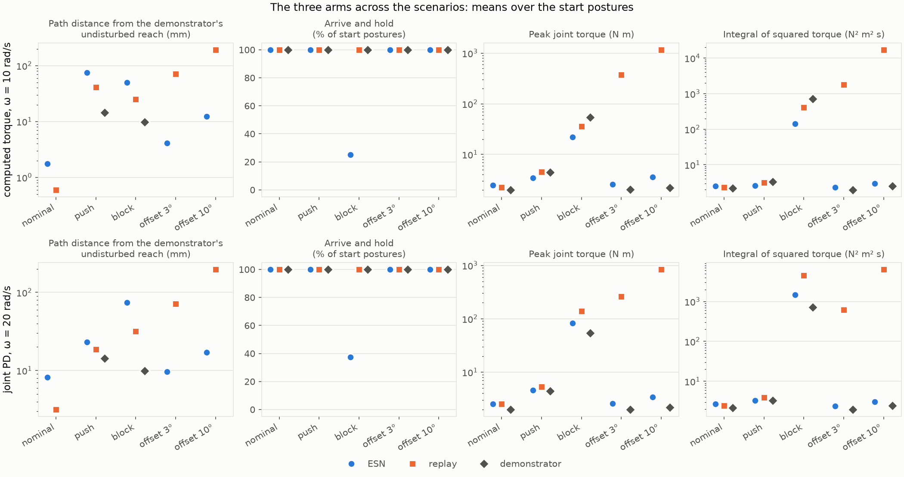
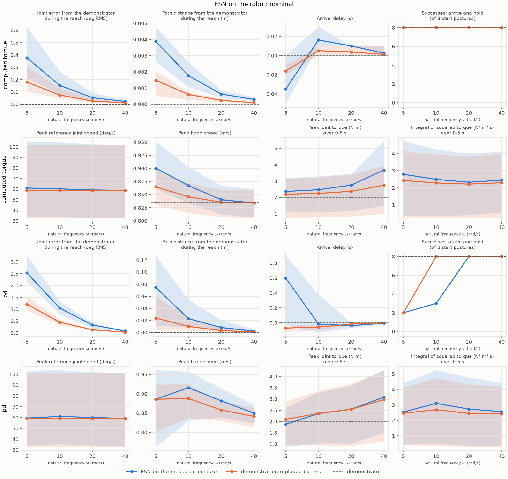
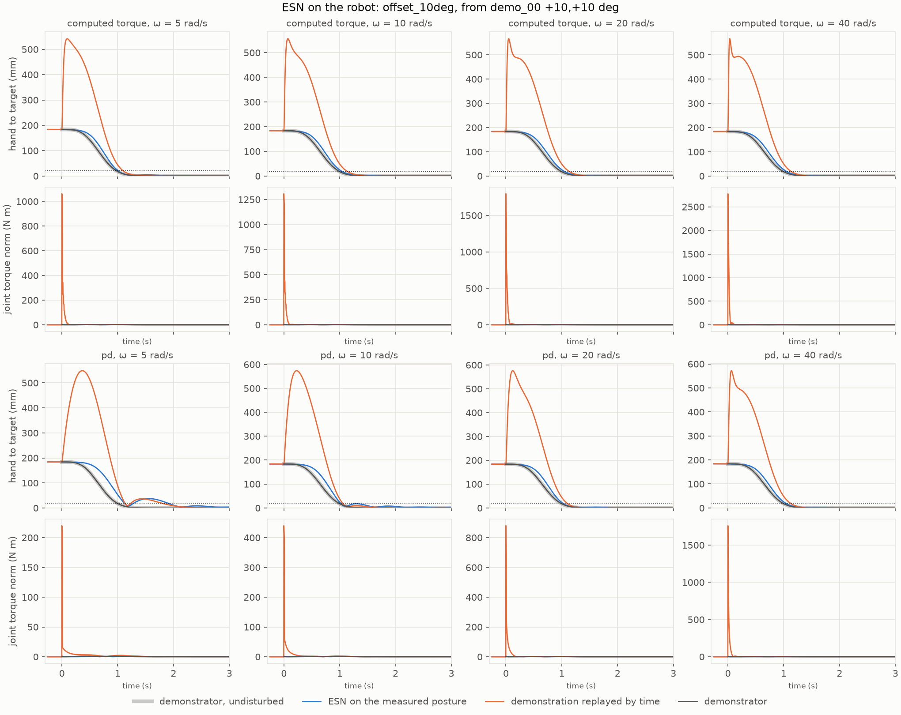
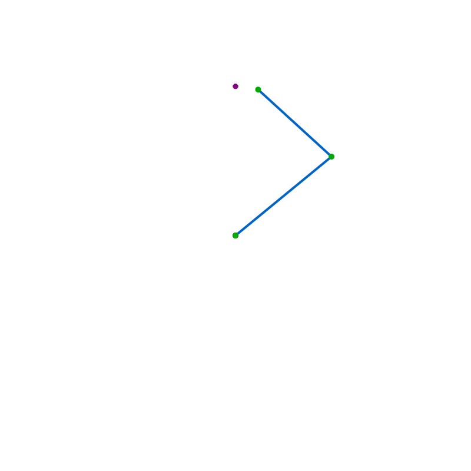
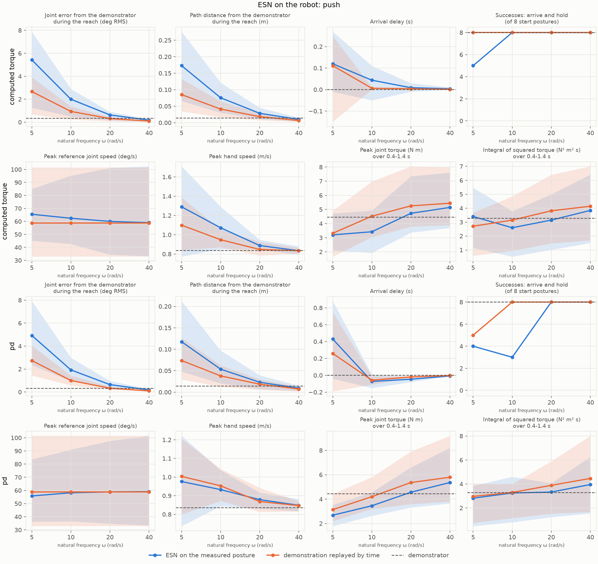
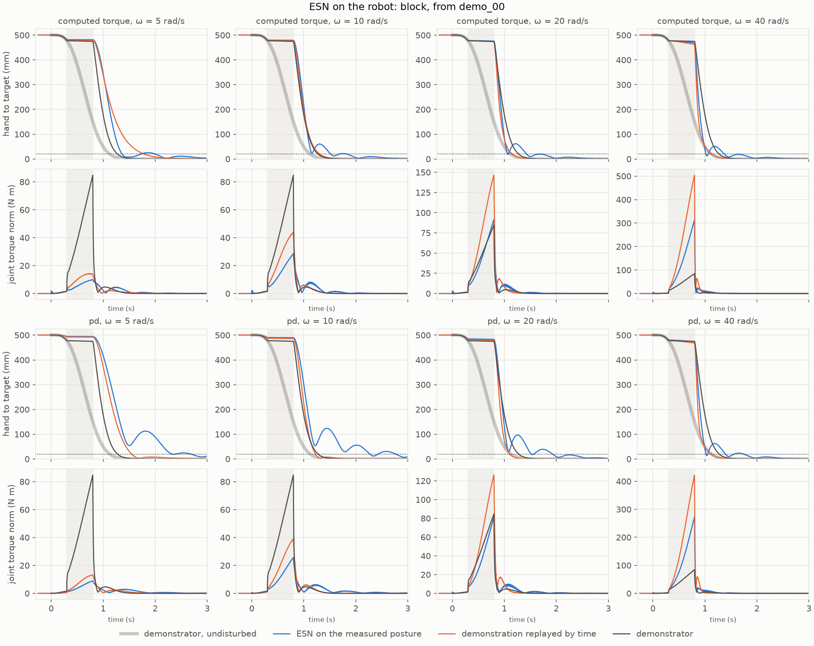
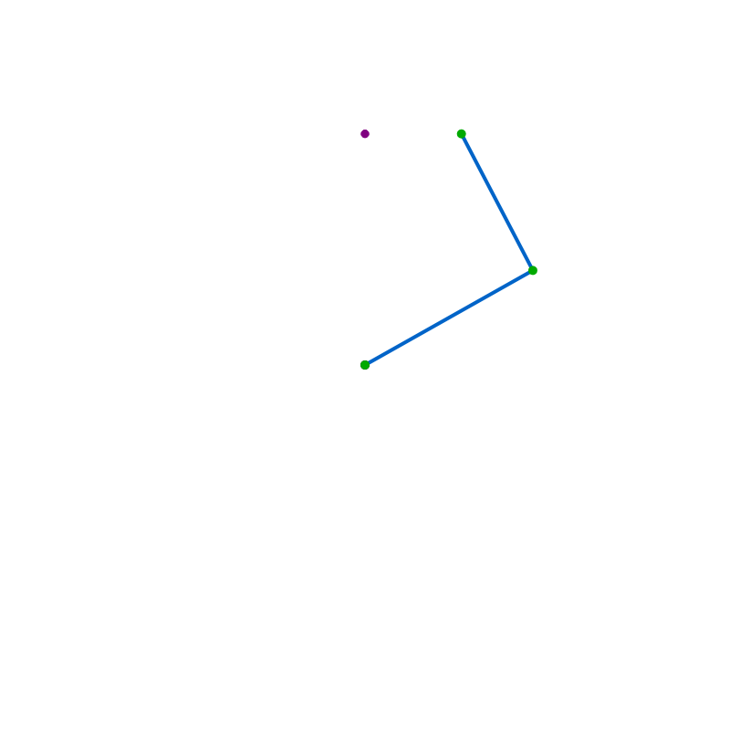
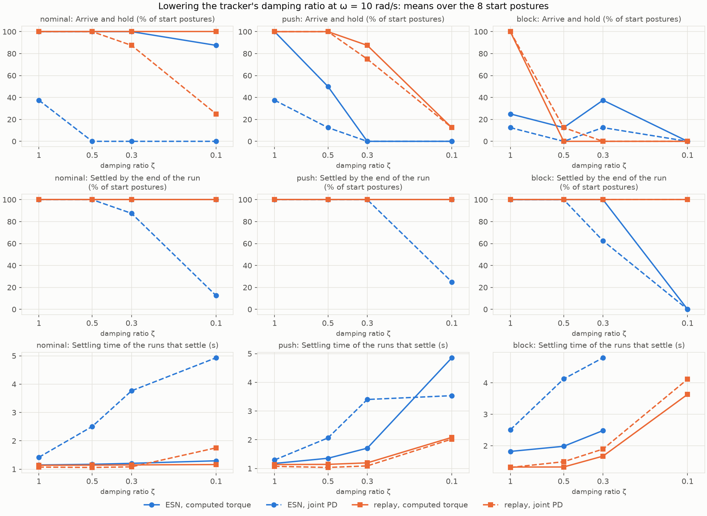
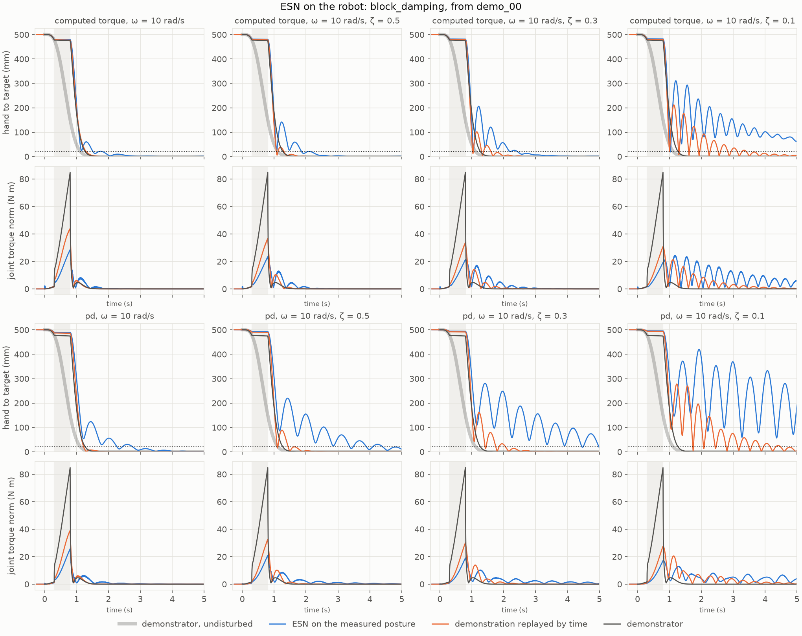
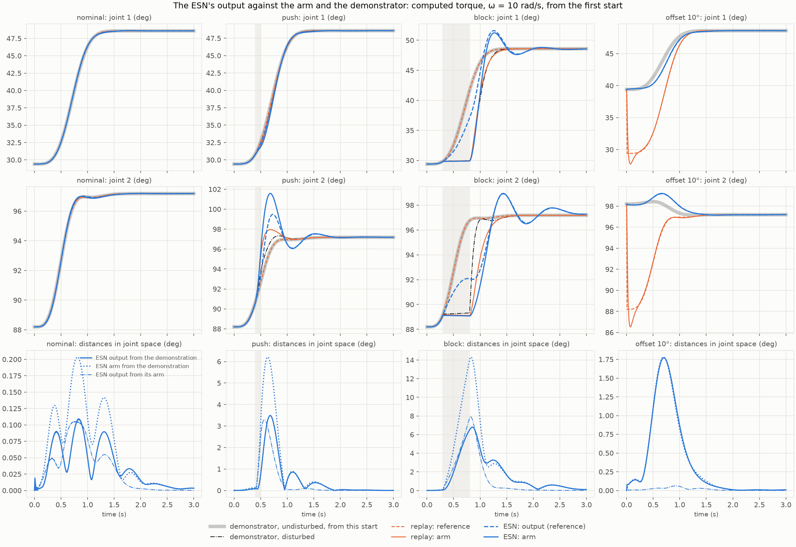

# 002 The ESN as the reference generator of a robot arm

**Summary.** The ESN of [report 001](../001-autonomous-reaching/README.md) was
connected to a simulated arm. Every 10 ms it receives the arm's measured joint
angles and gives the posture the arm should have next, which a tracking
controller follows. It was compared with the same demonstrations replayed by time,
through the same controller, in five scenarios: no disturbance, a push, a block,
and start postures 3° and 10° away from the demonstrated ones.

- **Initial offsets: a clear win.** From an offset start, the ESN reaches from
  where the arm is, with peak torques of 2–7 N m at every gain. The replay first
  yanks the arm to the demonstrated start, with peak torques of 65–2480 N m
  growing with the gain.
- **Push and block: it gives way.** The ESN needs less corrective effort than the
  replay: about a third of it while the arm is blocked. But it strays up to twice
  as far from the demonstrated path after a push. After a block, it overshoots the
  target and oscillates around it, so most runs fail to hold.
- **Gains:** with computed torque, any of the natural frequencies tried
  (5–40 rad/s) works without disturbances. With joint PD, the ESN needs higher
  gains than the replay to hold at the target.
- **What the ESN generates:** mid-motion, its output is neither the demonstration
  replayed nor the arm's state. After a push or during a block, it departs from
  the demonstration about half as far as the arm does. From an offset start, it
  follows the demonstrator's reach from that start, within 1° RMS.
- **Damping:** with an underdamped tracker, the replay rings around the target
  after a disturbance but always settles. The ESN rings longer, and at a damping
  ratio of 0.1 it no longer settles after a block, ending 9–15 cm from the target
  on average.

## 1. Question

When the ESN is fed the robot's measured posture instead of its own prediction,
is it a more robust reference generator than the demonstration replayed by time
(research question RQ4 of the [project README](../../README.md#research-questions))?
And since its reference stays close to where the arm actually is, does it make
careful tuning of the tracker's gains unnecessary?

## 2. Setup

### The arm and the reference

The robot is the simulated two-link arm of report 001, integrated every 2 ms. The
reference is updated every 10 ms, the ESN's period:

1. At each instant t_k, a **reference source** receives the arm's measured joint
   angles q(t_k) and gives the posture the arm should have 10 ms later, q̂(k+1).
2. Between two instants, the reference moves in a straight line from q̂(k) to
   q̂(k+1). Its desired velocity is that line's slope, and its desired
   acceleration is the change of the slope, low-pass filtered (time constant
   0.02 s).
3. A **tracking controller** turns the reference into joint torques every 2 ms:
   - *computed torque*, which cancels the arm's dynamics using an exact model;
   - *joint PD*, which does not.

The gains come from the natural frequency ω and the damping ratio ζ of each
joint's tracking error e = q_ref − q, which behaves as a second-order system:

| Law | Tracking error | Gains | Natural frequency and damping ratio |
| --- | --- | --- | --- |
| computed torque | ë + kd ė + kp e = 0 (exactly) | kp = ω², kd = 2ζω | ω = √kp, ζ = kd / (2√kp) |
| joint PD | M_ii ë + kd ė + kp e ≈ 0 | kp = M_ii ω², kd = 2ζ M_ii ω | ω = √(kp / M_ii), ζ = kd / (2√(kp M_ii)) |

M_ii is the joint's inertia (the diagonal of the mass matrix) at the posture
where the reaches end; for joint PD, the relation is only approximate, since the
inertia changes with the posture and couples the joints. At ζ = 1, the error is
**critically damped**: it returns as fast as it can without overshooting. Below 1,
it oscillates at ω√(1 − ζ²) as it decays; after a step, it overshoots by 16% at
ζ = 0.5, 37% at ζ = 0.3, and 73% at ζ = 0.1.

Every scenario runs both laws at ω = 5, 10, 20, and 40 rad/s, critically damped.
The nominal, push, and block scenarios run again at ω = 10 rad/s with ζ = 1, 0.5,
0.3, and 0.1 (Section 3.6).

### Three arms

From each start posture, three arms reach:

| Arm | Reference | Controller |
| --- | --- | --- |
| **ESN** | the ESN of report 001, driven by the measured joint angles | the tracker |
| **replay** | the demonstration whose start is nearest, replayed by time (the *time-indexed baseline*) | the tracker |
| **demonstrator** | none | the controller that made the demonstrations, on its own |

The ESN and the replay differ only in where the next posture comes from: the ESN
generates it from the measured state, while the replay reads it off a clock and
ignores the state. Both tracked arms first hold their start posture for the ESN's
0.25 s warm-up, at negative times. The task starts at t = 0. The ESN was trained
in report 001 (`esn.toml` and `esn.rclib` in
[`data/20261002-213015-autonomous_tvs_all_distances`](data/20261002-213015-autonomous_tvs_all_distances));
nothing is trained here.

### Scenarios

| Scenario | Start postures | What happens |
| --- | ---: | --- |
| nominal | 8 | no disturbance, from the demonstrated starts |
| push | 8 | a 5 N force at the tip for 0.1 s from t = 0.4 s, near the peak speed, sideways to the reach |
| block | 8 | from t = 0.3 s to 0.8 s, a stiff spring-damper (20 kN/m, 100 N s/m) holds the tip where it was, like a hand gripping the arm; then it lets go |
| offset 3° | 32 | starts 3° away from each demonstrated start in both joints, in the four diagonal directions; no force |
| offset 10° | 32 | the same, 10° away |

All three arms meet the same disturbance. The push was set at 5 N after a probe
from one start: 20 N pushed the hand 11–75 cm off its path at ω ≤ 10 rad/s, up to
more than the 50 cm reach itself. At ω = 40 rad/s, the trackers push against the
block with peak forces of up to 640 N (means over the starts), and in the probe
the spring yielded 13–20 mm.

### Metrics

Every run is compared with the **demonstrator's undisturbed reach** from the same
start posture, using the reach and hold metrics of
[report 001](../001-autonomous-reaching/README.md#metrics): the path distance from
it until arrival, the joint error, the arrival delay, and whether the hand
**arrives and holds** within the 2 cm goal radius for 2 s. In addition:

- **peak reference joint speed**: a jump of the reference shows as a high speed;
- **peak hand speed**;
- **settling time** (damping runs): from when the hand stays within the goal
  radius until the end of the 5 s run; a run that ends outside has not
  **settled**. Unlike "arrive and hold", which fails at the first exit from the
  goal, it lets the hand ring through the goal before staying;
- **final distance** to the target at the end of the run (damping runs);
- over an **effort window**: the peak joint torque, the integral of the squared
  joint torques (∫τ²), and the peak disturbance force. The window starts with
  the disturbance and lasts 1 s: 0.4–1.4 s for the push, 0.3–1.3 s for the
  block, and 0–1 s for the offsets. For the nominal runs, it is the whole 5 s.

### Reproducing the results

The runs used the demonstrations and the ESN in [`data/`](data). Under the
storage root, they are read from `results/20261002-194644-reach_tvs` and
`results/20261002-213015-autonomous_tvs_all_distances`; place or link the copies
there to rerun.

| Run | Command |
| --- | --- |
| [`20261005-120454-nominal`](results/20261005-120454-nominal) | `uv run python experiments/robot_esn.py configs/robot/nominal.toml` |
| [`20261005-120457-push`](results/20261005-120457-push) | `uv run python experiments/robot_esn.py configs/robot/push.toml` |
| [`20261005-120459-block`](results/20261005-120459-block) | `uv run python experiments/robot_esn.py configs/robot/block.toml` |
| [`20261005-120501-offset_3deg`](results/20261005-120501-offset_3deg) | `uv run python experiments/robot_esn.py configs/robot/offset_3deg.toml` |
| [`20261005-120503-offset_10deg`](results/20261005-120503-offset_10deg) | `uv run python experiments/robot_esn.py configs/robot/offset_10deg.toml` |
| [`20261005-160737-nominal_damping`](results/20261005-160737-nominal_damping) | `uv run python experiments/robot_esn.py configs/robot/nominal_damping.toml` |
| [`20261005-160739-push_damping`](results/20261005-160739-push_damping) | `uv run python experiments/robot_esn.py configs/robot/push_damping.toml` |
| [`20261005-160741-block_damping`](results/20261005-160741-block_damping) | `uv run python experiments/robot_esn.py configs/robot/block_damping.toml` |
| [`summary`](results/summary) | `uv run python reports/002-esn-reference-on-the-robot/make_figures.py --animations --traces` |

The first five runs are from commit `2d5b567` and the damping runs from
`88c731b` (recorded in each `run.toml`); all are deterministic. Each run directory holds its configuration, its run record, and its
per-run metrics (`metrics.csv`). [`make_figures.py`](make_figures.py) draws the
summary figures and prints the tables of Sections 3.1, 3.6, and 3.7 from those metrics. With
`--traces`, it measures the comparison of Section 3.7 from the run logs under the
storage root and saves it to `departures.csv` and `offset_references.csv` in
[`results/summary`](results/summary), from which the tables are printed. With
`--animations`, it exports the animations of skelarm's player from the run logs
under the storage root; the logs are not kept in Git.

## 3. Results

### 3.1 All scenarios at a glance

**Figure 1.** Means over the start postures, at two representative gains:
ω = 10 rad/s for computed torque (top), and ω = 20 rad/s for joint PD (bottom),
the lowest at which the ESN holds every time without disturbances. The torque metrics cover each
scenario's effort window, so compare the arms within a scenario rather than the
scenarios with each other. The undisturbed demonstrator is its own reference, so
its path distance (0 mm) is off the log scale.

Computed torque, ω = 10 rad/s (ESN / replay / demonstrator):

| Scenario | Starts | Path distance (mm) | Arrive and hold (%) | Peak torque (N m) | ∫τ² (N² m² s) |
| --- | ---: | ---: | ---: | ---: | ---: |
| nominal | 8 | 1.8 / 0.6 / 0.0 | 100 / 100 / 100 | 2.5 / 2.2 / 2.0 | 2.5 / 2.3 / 2.2 |
| push | 8 | 75.5 / 41.3 / 14.3 | 100 / 100 / 100 | 3.4 / 4.5 / 4.5 | 2.6 / 3.1 / 3.3 |
| block | 8 | 49.9 / 24.8 / 9.9 | 25 / 100 / 100 | 21.9 / 36.0 / 54.2 | 142 / 407 / 724 |
| offset 3° | 32 | 4.1 / 70.9 / 0.0 | 100 / 100 / 100 | 3 / 376 / 2 | 2 / 1767 / 2 |
| offset 10° | 32 | 12 / 192 / 0 | 100 / 100 / 100 | 4 / 1165 / 2 | 3 / 17133 / 2 |

Joint PD, ω = 20 rad/s (ESN / replay / demonstrator):

| Scenario | Starts | Path distance (mm) | Arrive and hold (%) | Peak torque (N m) | ∫τ² (N² m² s) |
| --- | ---: | ---: | ---: | ---: | ---: |
| nominal | 8 | 8.2 / 3.2 / 0.0 | 100 / 100 / 100 | 2.5 / 2.5 / 2.0 | 2.7 / 2.5 / 2.2 |
| push | 8 | 23.1 / 18.7 / 14.3 | 100 / 100 / 100 | 4.6 / 5.4 / 4.5 | 3.3 / 3.9 / 3.3 |
| block | 8 | 74.5 / 31.7 / 9.9 | 38 / 100 / 100 | 83 / 138 / 54 | 1486 / 4512 / 724 |
| offset 3° | 32 | 9.7 / 71.7 / 0.0 | 100 / 100 / 100 | 3 / 261 / 2 | 2 / 610 / 2 |
| offset 10° | 32 | 17 / 197 / 0 | 100 / 100 / 100 | 3 / 839 / 2 | 3 / 6341 / 2 |

The metrics of every run and gain are in each run's `metrics.csv`.

### 3.2 Without disturbances: how much the gains matter

**Figure 2.** Nominal runs: each metric's mean over the 8 starts (line) and range
(band) against ω, for computed torque (top two rows) and joint PD (bottom two
rows). Blue: ESN; orange: replay; dashed: demonstrator.

- **Computed torque:** both tracked arms reproduce the demonstrations at every ω,
  and all hold. The ESN's joint error ranges from 0.38° at ω = 5 to 0.02° at
  ω = 40, and its path distance from 3.9 to 0.3 mm: two to three times the
  replay's at every ω.
- **Joint PD:** the arm overshoots the target at the end of the reach, since PD
  does not compensate the arm's dynamics. The replay holds from ω = 10 on. The
  ESN needs ω = 20: at ω = 10, only 3 of 8 runs hold, and at ω = 5, 2 of 8 (as
  for the replay). In the failing runs, the ESN's reference follows the
  overshooting arm out of the goal instead of pulling it back. The arm and the
  ESN then oscillate slowly around the target, leaving the 2 cm radius and ending
  within 5 mm of the target.

### 3.3 Initial offsets: the ESN starts from where the arm is

**Figure 3.** From a start 10° away from demonstration 0 in both joints: the
hand's distance to the target (upper rows) and the joint torque (lower rows) over
time, for every law and ω. The thick gray line is the demonstrator's reach from
this start.

| ESN | replay |
| :---: | :---: |
|  |  |

**Animation 1.** The same start, computed torque at ω = 10 rad/s, in real time.
The purple dot is the target.

This offset puts the hand 180 mm from the target instead of 500 mm. The replay
reads the demonstration's next posture off the clock, so at t = 0 its reference
jumps back to the demonstrated start. The arm follows at up to 10.8 m/s, with up
to 1270 N m, before it reaches. The ESN reaches from where the arm is, much like
the demonstrator from the same start, with a peak torque of 5 N m. Over all
offset starts, the ESN's results barely change with the gains, while the replay's
torque grows with them (Figure 1; peak torques of 950–2480 N m at 10° for
computed torque as ω rises from 5 to 40 rad/s). With joint PD at ω ≤ 10, though,
the ESN fails to hold from many offset starts, as in Section 3.2 (8–12 of 32
hold, against all of the replay's at ω = 10).

### 3.4 Push: the ESN gives way

**Figure 4.** Push runs, as in Figure 2. Torque, ∫τ², and force are measured
from the push for 1 s.

After the push, the replay's reference stays where it was and pulls the arm back
onto the demonstrated path. The ESN's output instead moves along with the pushed
arm, about half as far as the arm (Section 3.7). Its path ends up 1.2–2 times as far from the
demonstrated path as the replay's (75 against 41 mm at computed torque,
ω = 10 rad/s). It needs 3–18% less effort (∫τ²) than the replay at every gain
but one: at computed torque, ω = 5 rad/s, it needs 26% more. At low
gains, it again fails to hold more often than the replay (5 of 8 at computed
torque, ω = 5 rad/s, and 3 of 8 at joint PD, ω = 10 rad/s, against 8 of 8).

### 3.5 Block: less effort, but no waiting and no settling

**Figure 5.** From demonstration 0's start, with the block shaded: the hand's
distance to the target (upper rows) and the joint torque (lower rows).

| ESN | replay | demonstrator |
| :---: | :---: | :---: |
|  |  |  |

**Animation 2.** The same start, computed torque at ω = 10 rad/s, in real time.
The red arrow is the gripping force; each animation scales it by its own largest
force, so compare the arrows only within an animation.

- **Less effort.** While the arm is held, both references run ahead of it, and
  the tracker pushes harder the further they get. The ESN's reference runs about
  13° ahead by the release, against 23° for the replay, so the ESN fights the block
  with about a third of the replay's ∫τ² at every gain (142 against 407 N² m² s
  at computed torque, ω = 10 rad/s). It also jumps less on release at high gains
  (a peak hand speed of 3.3 against 5.0 m/s at ω = 40 rad/s).
- **No waiting.** The ESN does not wait for the arm. Its reference moves on about
  60% as far as the replay's. The ESN was never trained on a reach that stalls
  midway, and its slow leak rate gives the reservoir a memory of roughly 0.2 s,
  which likely carries the reach on.
- **No settling.** After the release, the ESN overshoots the target and oscillates
  around it (Figure 5). Only 0–3 of 8 runs hold at any gain or law, against all
  of the replay's and the demonstrator's. Every run still arrives and ends within
  7 mm of the target.

### 3.6 Damping: an underdamped tracker

**Figure 6.** The nominal, push, and block scenarios at ω = 10 rad/s as the
damping ratio ζ falls (to the right). Rows: the runs that arrive and hold, the
runs that have settled by the end of the 5 s run, and their settling time. Blue
circles: ESN; orange squares: replay; solid: computed torque; dashed: joint PD.

Computed torque, ω = 10 rad/s (ESN / replay):

| ζ | Hold, nominal (%) | Hold, push (%) | Hold, block (%) | Settled, block (%) | Final distance, block (mm) |
| ---: | ---: | ---: | ---: | ---: | ---: |
| 1 | 100 / 100 | 100 / 100 | 25 / 100 | 100 / 100 | 1.5 / 0.0 |
| 0.5 | 100 / 100 | 50 / 100 | 12 / 0 | 100 / 100 | 1.5 / 0.0 |
| 0.3 | 100 / 100 | 0 / 88 | 38 / 0 | 100 / 100 | 1.6 / 0.0 |
| 0.1 | 88 / 100 | 0 / 12 | 0 / 0 | 0 / 100 | 89.1 / 4.2 |

Joint PD, ω = 10 rad/s (ESN / replay):

| ζ | Hold, nominal (%) | Hold, push (%) | Hold, block (%) | Settled, block (%) | Final distance, block (mm) |
| ---: | ---: | ---: | ---: | ---: | ---: |
| 1 | 38 / 100 | 38 / 100 | 12 / 100 | 100 / 100 | 1.7 / 0.0 |
| 0.5 | 0 / 100 | 12 / 100 | 0 / 12 | 100 / 100 | 8.1 / 0.0 |
| 0.3 | 0 / 88 | 0 / 75 | 12 / 0 | 62 / 100 | 16.9 / 0.0 |
| 0.1 | 0 / 25 | 0 / 12 | 0 / 0 | 0 / 100 | 149.0 / 6.3 |

**Figure 7.** The block from demonstration 0's start at ω = 10 rad/s, ζ = 1 to 0.1
(left to right), over the whole 5 s run.

| ESN | replay |
| :---: | :---: |
|  |  |

**Animation 3.** The block from the same start, joint PD at ω = 10 rad/s and
ζ = 0.3, in real time.

- **The replay oscillates, and then settles.** With less damping, the replayed
  arm overshoots the target and rings around it, so it fails to hold more often:
  after the block from ζ = 0.5 on, and even without a disturbance at ζ = 0.1 with
  joint PD (25% hold). But its reference holds still at the target, so the
  ringing decays: all 192 replayed runs settle within the 5 s, after the block in
  1.3–4.1 s on average (4.8 s at worst), and end within 12 mm of the target. The largest error, the reference 23° ahead of
  the arm at the block's release, rings the most (Figure 7).
- **The ESN oscillates more, and stops settling.** At every damping ratio, the
  ESN's runs settle later than the replay's. Fed the ringing arm's posture, the
  ESN moves its reference with it, so the oscillation is not damped by a fixed
  goal. At ζ = 0.1, no ESN run settles after the block: they end 89 mm (computed
  torque) and 149 mm (joint PD) from the target on average, still oscillating.
  With joint PD at ζ = 0.5, the ESN holds in at most 1 of 8 runs in any scenario.

### 3.7 What the ESN generates: its output against the arm and the demonstration

**Figure 8.** Joint angles over time from the first start posture, computed torque
at ω = 10 rad/s, one column per scenario (the shaded band is the disturbance). The
thick gray line is the demonstrator's undisturbed reach from the same start: for
the first three columns, the training demonstration itself, which the replay
replays; for the offset, the demonstrator's reach from the offset start, while
the replay replays the training demonstration. Bottom row: the distance in joint
space of the ESN's output (solid) and of its arm (dotted) from the gray line, and
of the output from its arm (dash-dot).

To see whether the ESN adapts its reference to the arm's state or replays what it
learned, we measured, in every run, how far its output departs from the
demonstration compared with how far its arm departs from it. A ratio of 0 means
the output replays the demonstration whatever the arm does; 1 means it moves as
far as the arm.

Largest distance from the demonstrator's undisturbed reach (deg), over the reach
(nominal) or 1 s from the disturbance, means over the 8 starts:

| Scenario | Law | ESN output | ESN arm | Ratio (range) |
| --- | --- | ---: | ---: | ---: |
| nominal | computed torque, ω = 10 | 0.20 | 0.40 | 0.51 (0.46 to 0.59) |
| nominal | joint PD, ω = 20 | 0.51 | 0.79 | 0.65 (0.60 to 0.68) |
| push | computed torque, ω = 10 | 3.52 | 6.11 | 0.58 (0.55 to 0.60) |
| push | joint PD, ω = 20 | 1.15 | 2.00 | 0.57 (0.50 to 0.64) |
| block | computed torque, ω = 10 | 11.98 | 27.00 | 0.45 (0.40 to 0.55) |
| block | joint PD, ω = 20 | 11.64 | 26.01 | 0.46 (0.40 to 0.55) |

From offset starts, the RMS distance of the ESN's output over the reach
(0–1.5 s, deg), means over the 32 starts:

| Scenario | Law | From the demonstrator's reach from this start | From the replayed demonstration |
| --- | --- | ---: | ---: |
| offset 3° | computed torque, ω = 10 | 0.25 | 2.55 |
| offset 3° | joint PD, ω = 20 | 0.36 | 2.58 |
| offset 10° | computed torque, ω = 10 | 0.73 | 8.12 |
| offset 10° | joint PD, ω = 20 | 0.81 | 8.16 |

- **From an offset start, the ESN adapts fully.** Its output stays within 1° of
  the reach the demonstrator makes from the actual start, ten times closer than
  to the demonstration the replay replays. The generalization of report 001 to
  unseen start postures carries over to the robot.
- **Mid-motion, it goes halfway.** After a push and during a block, the ESN's
  output departs from the demonstration about half as far as the arm, in every
  run, with both laws (ratios 0.40–0.64). It neither replays the demonstration
  nor follows the arm: it gives way along with the disturbance, partway.
- **Even without disturbances,** about half of the arm's tracking lag passes into
  the output (ratios 0.46–0.68), which moves the reference toward the lagging arm.
  If the output carries half of the arm's departure, the arm departs twice as far
  as its tracking error, which accounts for the ESN's arm straying about twice as
  far from the demonstration as the replay's (Section 3.2).
- **During the block,** the output runs on toward the demonstration in joint 1,
  but nearly waits in joint 2 (Figure 8). After the release, the output itself
  overshoots the target, by 3° in joint 1 from this start, so the overshoot of
  Section 3.5 starts in the reference, not only in the tracking.
- **After the push,** the demonstrator under the same push, whose own controller
  pulls toward the target, departs from its path by at most 1.4° and is back
  within a fifth of that about 0.45 s after the push ends. The ESN's output
  departs by up to 5.1°, dips below the path (Figure 8), and takes about 0.7 s.

Why halfway? The ESN's input is scaled down (input scaling 0.1) and its
reservoir leaks slowly (leak rate 0.05, a memory of about 0.2 s). The measured
posture likely moves the reservoir's state only partway, so the state, and the
output, still carry much of the learned motion. We have not tested this.

## 4. Observations

- **The ESN's reference partly follows the measured state.** From an offset
  start, it follows it fully: it generates the reach the demonstrator would make
  from there. Mid-motion, it gives way about half as far as the arm is displaced,
  between replaying the demonstration and following the arm (Section 3.7). That
  is its strength and its weakness:
  - **Strength:** it never jumps, and it fights a disturbance less (initial
    offsets, the push, the block).
  - **Weakness:** it does not pull the arm back onto the demonstrated path, and
    once the arm's state leaves what the ESN saw in training (an overshoot under
    joint PD, or the release after a block), it can oscillate instead of settling.
- **On the gains.**
  - **Where the hypothesis holds:** with computed torque and without large
    disturbances, a rough choice of ω is enough, and from offset starts the
    ESN's results hardly depend on ω at all.
  - **Where it fails:** the hypothesis that the ESN makes gain tuning unnecessary
    does not hold in general. With joint PD, the ESN needs higher gains than the
    replay, because it amplifies the arm's overshoot instead of correcting it.
    After a block, it fails to settle at every gain.
- **An underdamped tracker exposes the same weakness.** Its ringing decays when
  the reference holds still, as the replay's does at the target, but the ESN
  turns it into a lasting oscillation by partly following the measured state. The ESN
  needs a well-damped tracker more than the replay does.
- **Every failure is a failure to hold, not to arrive.** Every run of every arm
  arrives. The ESN's failing runs leave the 2 cm goal radius while oscillating,
  and end within 7 mm of the target.
- **Caveats.**
  - **The replay is a naive baseline.** It ignores the start posture, so its jump
    at t = 0 exaggerates the cost of an offset. A replay blended in from the
    actual start would narrow the gap.
  - **The replayed demonstration is the nearest one.** At 10°, 6 of the 32 starts
    are nearer a neighboring demonstration's start than to their own, and replay
    the neighbor's.
  - **The disturbances are single choices.** One push size, one block duration,
    and one block stiffness. The spring yields 13–20 mm at ω = 40 rad/s.
  - **One ESN, one seed, in simulation.** Computed torque used the exact model of
    the arm.
  - **The damping comparison** used one natural frequency (10 rad/s) and the
    5 s runs, so "settled" means settled within those 5 s.

## 5. Next steps

- **Teaching the ESN to return.** Both of its failures share one cause: the ESN
  has only seen inputs on the demonstrated trajectories, so off them it does not
  produce a flow back toward them. Training with noise added to its inputs (noisy
  teacher forcing) is a standard way to teach that return. It may also stiffen
  the reference and cost some of the compliance that helped here. This is open
  for discussion before any experiment. The departure ratio of Section 3.7 would
  measure the change directly: a reference that steers the arm back would depart
  from the demonstration less than the arm does, and toward it.
- **Waiting under a block** may need other data, such as demonstrations that
  pause midway, or a shorter reservoir memory.
- **A fairer baseline:** a time-indexed replay that blends in from the actual
  start posture.
- **Robustness:** more reservoir seeds and ESNs, other push sizes and block
  durations, and a stiffer block at high gains.
