# 003 One demonstration: what the ESN learns, and how it drives a robot arm

**Summary.** An ESN was trained on a single demonstrated reach and run from 169
start postures up to 15° away from the demonstrated one in each joint: first on its
own, then as the reference generator of the simulated arm of
[report 002](../002-esn-reference-on-the-robot/README.md).

- **On its own, it always arrives, but by returning to the demonstration.** With
  each of the three settings tried, the ESN arrives and holds from all 169 starts.
  None reaches as the demonstrator would from there:
  - each first jumps toward the demonstrated motion, by 108–182 mm on average in its
    first 10 ms step;
  - each then follows the demonstrated path (median training path ratio 0.09–0.32,
    where 1 would mean reaching as the demonstrator does).

  None of the 540 combinations swept changes that. The scale of the joint-angle
  normalization turns out to be the input scaling, and giving the offsets more room
  makes the ESN fail.
- **What it learns depends on its settings.**
  - *A clock:* with the settings found best for eight demonstrations
    ([report 001](../001-autonomous-reaching/README.md)), the reservoir keeps time
    from its reset. Every run is pulled onto where the demonstration is at the same
    time, and a shorter warm-up delays the arrival by about as much.
  - *A path:* with the other settings, it learns the demonstrated path. The start
    posture sets how far along it a run begins, and the warm-up does not matter.
- **On the robot, that decides whether the reference adapts to the arm.**
  - *The path-type ESN waits.* The tuned ESN's reference waits while the arm is
    blocked, then goes on from where the arm is. The block's peak holding force is
    17–30 N, against 58–813 N for the replay, and the arm keeps to the demonstrated
    path (2–7 mm, against 24–47 mm). Pushed forward or backward along the reach, it
    arrives earlier or later.
  - *The clock-type ESN runs on.* Like the replay, it keeps its schedule; after the
    block it overshoots.
- **Underdamped trackers.**
  - *With computed torque:* as in report 002, each ESN's reference rings along with
    its arm, and at a damping ratio of 0.1 neither ESN holds after a disturbance.
  - *The exception is the block:* the tuned ESN's waiting reference spares its arm
    the overshoot that the replay and the other ESN suffer after the release.
  - *With joint PD* at ω = 20 rad/s, the damping ratio hardly matters.
- **Its costs.**
  - *Offset starts:* both single-demonstration ESNs yank the arm toward the
    demonstration, as the replay does. Peak torques reach 595–714 N m from the 10°
    offsets, where report 002's eight-demonstration ESN needed 4 N m.
  - *Joint PD* needs ω ≥ 20 rad/s to hold with either ESN.
  - *The release:* the tuned ESN starts at once with an 8 mm jump, which gives torque
    spikes of 24–97 N m from the demonstrated start.

## 1. Question

Report 001 trained the ESN on eight demonstrations. Here, it learns from one, which
asks the partial-observation question (RQ2 of the
[project README](../../README.md#research-questions)) at its extreme:

- What does an ESN learn from a single demonstrated reach: a trajectory, a clock,
  or a flow?
- From which start postures does it still arrive and hold, and does it then reach as
  the demonstrator would from there?
- What shapes it: the hyperparameters, the scale of the joint-angle normalization
  (which, with one demonstration, covers only that reach), and the warm-up?

Then, connected to the robot (RQ4): does the reference it generates adapt to the
arm's actual state under disturbances? Report 002 expected such a reference from
the eight-demonstration ESN, but found one that gives way only halfway and never
waits.

## 2. Setup

### The demonstration

One scripted reach of the two-link arm of reports 001 and 002, made by the same
demonstrator: a virtual spring-damper with a time-varying stiffness (Sekimoto and
Arimoto, IROS 2006). From the start posture q = (18.2°, 119.9°), the hand moves
from (0.35, 0.85) m to the target at (0, 1.2) m, 0.5 m away toward the upper left.
It pauses for about 0.2 s, moves for 1.1 s, and holds for the rest of the 4 s.
Over the reach, joint 1 turns by +30.4° and joint 2 by −22.7°. The run and its
log are in
[`data/20261005-185525-reach_tvs_single`](data/20261005-185525-reach_tvs_single).

### The ESN

As in report 001:

- **Rate and output:** the ESN runs every 10 ms and gives the next joint angles
  from the current ones.
- **Training:** by teacher forcing, after a warm-up in which the held start posture
  drives the reservoir from its reset state.
- **Running on its own:** the same warm-up, then its output is fed back as its next
  input.
- **Normalization:** joint angles are normalized by the range each joint covers in
  the training data, so that the demonstration spans [−1, 1].

Three settings were trained on the demonstration. All use a sparsity of 0.1, a
bias, and seed 0:

| Settings | Ridge | Leak rate | Input scaling | Neurons | Spectral radius | Warm-up | Where from |
| --- | ---: | ---: | ---: | ---: | ---: | ---: | --- |
| **first** | 1 | 0.3 | 1 | 300 | 0.5 | 1 s | those first used for a single demonstration |
| **eight-demonstration** | 10⁻⁶ | 0.05 | 0.1 | 600 | 1.3 | 0.25 s | the best for eight demonstrations (report 001) |
| **tuned** | 10 | 0.2 | 3 | 400 | 0.3 | 1 s | the best of the sweeps of Section 3.4 |

### Start postures

The demonstrated start, offset by −15° to 15° in steps of 2.5° in each joint: 169
start postures, 168 of them offset. The demonstration covers only 30.4° of joint 1
and 22.7° of joint 2, so the outer offsets ask for joint angles half a range or
more beyond what the ESN was trained on.

### Measures

- **Reach and hold**, as in report 001:
  - *arrive and hold:* the hand comes within 2 cm of the target and stays for 2 s;
  - *path distance:* the hand path's largest distance from the demonstrator's own
    reach from the same start;
  - *first step:* how far the hand moves in the first 10 ms.
- **Training path ratio:** how far, in joint space, the run stays from the
  demonstrated path during the reach (mean distance to the nearest point), divided
  by the same for the demonstrator's own reach from that start.
  - Near 0, the run returns onto the demonstration; near 1, it reaches as the
    demonstrator would.
  - Starts along the demonstrated path, where the demonstrator's own reach keeps
    within 0.25° of it, have no ratio.
- **Reservoir states** (Section 3.2):
  - *Recording:* the state is recorded at every step while the demonstration is fed
    in after the training warm-up (teacher forcing), and in the runs on their own.
  - *Principal components:* those of the demonstration's states over the task.
  - *Time-matched distance:* each run's distance in the full state space from the
    demonstration's state at the same time. It is relative to the spread of the
    demonstration's states (their RMS distance from their mean).
  - *Join time:* from when that distance stays below 0.1.
  - *Phase lead:* the time of the nearest demonstration state, minus the time; its
    median over 0.1–1 s is a run's phase lead.
- **The robot**, as in report 002, plus:
  - *progress along the demonstrated path:* the length of the demonstrated joint
    path up to the point nearest a posture, as a fraction of its whole length;
  - *the reference's lead:* at the end of a disturbance, how far the reference's
    progress is ahead of the arm's;
  - *the arrival shift:* the change of the arrival time against the arm's own
    undisturbed run.

### The robot

The setup of [report 002](../002-esn-reference-on-the-robot/README.md#2-setup):

- **Reference:** every 10 ms, the reference source receives the arm's measured joint
  angles and gives the next posture.
- **Tracker:** computed torque or joint PD, critically damped, with natural frequency
  ω.
- **Arms:** four reach from each start posture:
  - two ESNs: **tuned** and **eight-demonstration settings**;
  - the **replay** of the demonstration by time;
  - the **demonstrator**'s own controller.

| Scenario | Start postures | What happens |
| --- | ---: | --- |
| nominal | 1 | no disturbance, from the demonstrated start |
| offsets | 169 | the start grid above; no force |
| push across | 1 | a 5 N force at the tip for 0.1 s from t = 0.4 s, across the reach (as in report 002) |
| push forward | 1 | the same, along the reach toward the target |
| push backward | 1 | the same, along the reach away from the target |
| block | 1 | from 0.3 s to 0.8 s, a stiff spring-damper (20 kN/m, 100 N s/m) holds the tip; then it lets go (as in report 002) |

Every scenario ran with both laws at ω = 10 rad/s, and again with joint PD at
ω = 10, 20, and 40 rad/s. Section 3.9 runs every scenario once more with the
tracker underdamped (damping ratios 1, 0.5, 0.3, and 0.1). Its offsets start only
from the two example offsets of Section 3.8. The figures feature two settings:

- computed torque at ω = 10 rad/s;
- joint PD at ω = 20 rad/s, the lowest gain at which every arm holds in every
  scenario.

### Reproducing the results

The runs read the demonstration in [`data/`](data) as
`results/demonstrations/20261005-185525-reach_tvs_single` under the storage root,
and the robot runs read the trained ESNs (`esn.toml` and `esn.rclib`, copied into
their run directories here) by their run names. A run is found by its name anywhere
under `results/`; place or link the copies there to rerun. The commands give the
configurations' paths.

| Run | Command |
| --- | --- |
| [`20261005-185525-reach_tvs_single`](data/20261005-185525-reach_tvs_single) | `uv run python experiments/make_demonstrations.py experiments/demonstrations/reach_tvs_single.toml` |
| [`20261005-190403-grid_single_demo_settings`](results/20261005-190403-grid_single_demo_settings) | `uv run python experiments/autonomous_esn.py experiments/single_demonstration_autonomous_reaching/grid_single_demo_settings.toml` |
| [`20261005-190405-grid_multi_demo_settings`](results/20261005-190405-grid_multi_demo_settings) | `uv run python experiments/autonomous_esn.py experiments/single_demonstration_autonomous_reaching/grid_multi_demo_settings.toml` |
| [`20261005-191929-states_single_demo_settings`](results/20261005-191929-states_single_demo_settings) | `uv run python experiments/reservoir_states.py experiments/single_demonstration_autonomous_reaching/states_single_demo_settings.toml` |
| [`20261005-191932-states_multi_demo_settings`](results/20261005-191932-states_multi_demo_settings) | `uv run python experiments/reservoir_states.py experiments/single_demonstration_autonomous_reaching/states_multi_demo_settings.toml` |
| [`20261005-204749-warmup_single_demo_settings`](results/20261005-204749-warmup_single_demo_settings) | `uv run python experiments/warmup_esn.py experiments/single_demonstration_autonomous_reaching/warmup_single_demo_settings.toml` |
| [`20261005-205009-warmup_multi_demo_settings`](results/20261005-205009-warmup_multi_demo_settings) | `uv run python experiments/warmup_esn.py experiments/single_demonstration_autonomous_reaching/warmup_multi_demo_settings.toml` |
| [`20261005-210423-sweep_single_demo`](results/20261005-210423-sweep_single_demo) | `uv run python experiments/sweep_esn.py experiments/single_demonstration_autonomous_reaching/sweep_single_demo.toml` |
| [`20261005-210421-sweep_single_demo_reservoir`](results/20261005-210421-sweep_single_demo_reservoir) | `uv run python experiments/sweep_esn.py experiments/single_demonstration_autonomous_reaching/sweep_single_demo_reservoir.toml` |
| [`20261005-212407-grid_tuned_settings`](results/20261005-212407-grid_tuned_settings) | `uv run python experiments/autonomous_esn.py experiments/single_demonstration_autonomous_reaching/grid_tuned_settings.toml` |
| `20261005-2310…`–`2312…` (12 runs) | `uv run python experiments/robot_esn.py experiments/single_demonstration_robot_tracking/<scenario>_<ESN>.toml` |
| `20261005-2343…`–`2344…` (12 runs) | `uv run python experiments/robot_esn.py experiments/single_demonstration_robot_tracking/<scenario>_<ESN>_pd_gains.toml` |
| `20261006-1211…`–`1221…` (12 runs) | `uv run python experiments/robot_esn.py experiments/single_demonstration_robot_tracking/<scenario>_<ESN>_damping.toml` |
| [`summary`](results/summary) | `uv run python reports/003-single-demonstration/make_figures.py --logs --animations` |

The `<scenario>` is one of `nominal`, `offsets`, `push_across`, `push_forward`,
`push_backward`, and `block`, and the `<ESN>` is `tuned` or `multi_demo_settings`
(the eight-demonstration settings). The robot runs are under [`results/`](results),
named after their configurations. Each run record (`run.toml`) gives its commit:

| Commit | Runs |
| --- | --- |
| `7f3abea` | the demonstration |
| `34dac4d` | the grids of the first and eight-demonstration settings |
| `8b71f04` | the reservoir states |
| `a794233` | the warm-up checks |
| `0dbbeb7` | the two sweeps |
| `5cc5d95` | the grid of the tuned settings |
| `097084e` | the robot runs |
| `0c228ab` | the robot runs with joint PD at higher gains |
| `6c95c68`, `3a38895` | the robot runs with underdamped trackers |

All runs are deterministic. Each run directory here holds its configuration, its
run record, and its per-run metrics. The ESN runs also hold their trained ESN and
the map of the grid (`grid.png`). The reservoir-state runs hold their figures, and
the sweeps and warm-up checks their tables.

[`make_figures.py`](make_figures.py) draws the summary figures and prints the tables
of Section 3 from those copies:

- With `--logs`, it reads the robot runs' logs under the storage root. It draws
  Figure 9 and the examples' figures of Sections 3.8 and 3.9, and writes
  `departures.csv`, `offset_references.csv`, `push_progress.csv`, `ringing.csv`,
  and `overshoot.csv` to [`results/summary`](results/summary), from which their
  tables are printed.
- With `--animations`, it exports the examples' animations of Section 3.8, each
  arm rendered by skelarm's player.

The logs and the reservoir states' `projections.npz` are not kept in Git.

## 3. Results

### 3.1 On its own, every start arrives, by returning to the demonstration

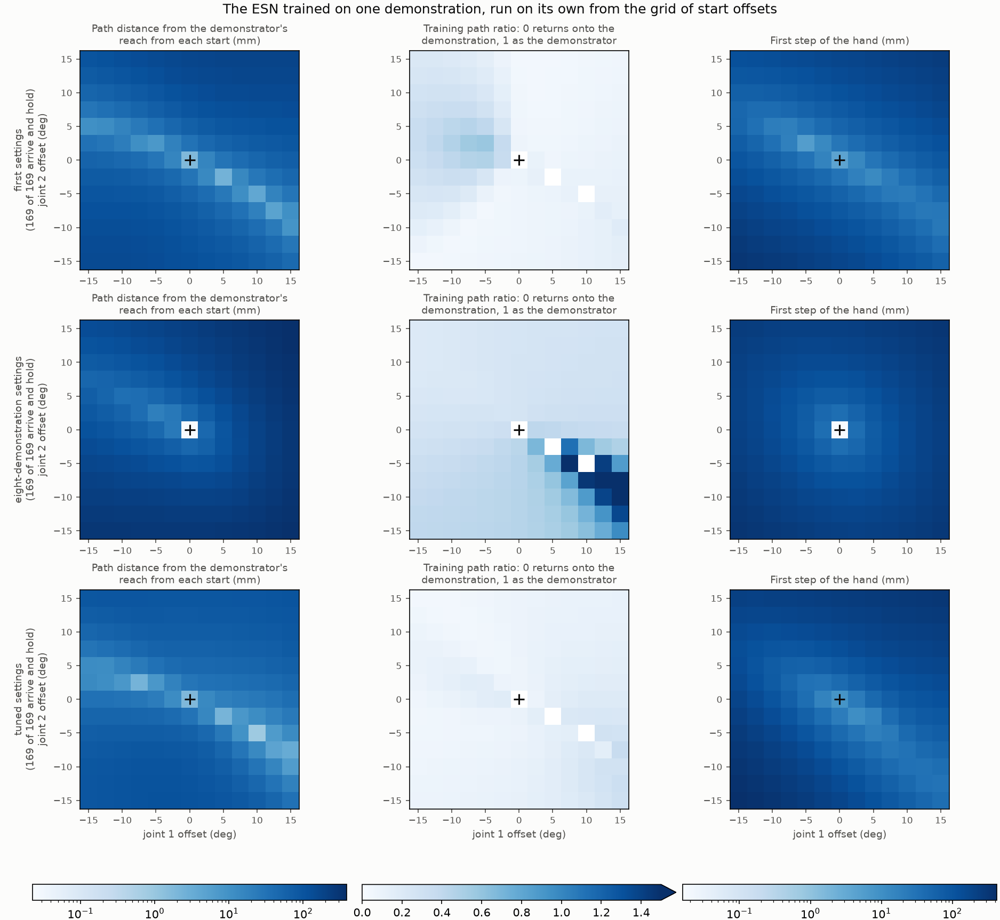

**Figure 1.** The ESN trained on the demonstration, run on its own from each start
posture of the grid, with each of the three settings (rows). The cross is the
demonstrated start. Left: the path distance from the demonstrator's own reach from
each start. Middle: the training path ratio. Right: the first step of the hand.
Each column shares one color scale. Every run arrives and holds.

Means over the 168 offset starts (the ratio: median); the last column is from the
demonstrated start:

| Settings | Arrive and hold | Path distance (mm) | Training path ratio | First step (mm) | From the demonstrated start: joint error, first step |
| --- | ---: | ---: | ---: | ---: | --- |
| first | 169 of 169 | 83.7 | 0.09 | 107.7 | 3.03° RMS, 4.1 mm |
| eight-demonstration | 169 of 169 | 185.4 | 0.32 | 182.1 | 0.00° RMS, 0.0 mm |
| tuned | 169 of 169 | 58.8 | 0.10 | 143.7 | 1.17° RMS, 8.4 mm |

- **Every start arrives and holds.** The first and the tuned settings end every run
  in one and the same posture: the hold error is identical in all 169 runs
  (0.096 mm and 0.52 mm). The eight-demonstration settings end 0.003–0.56 mm from
  the target.
- **None reaches as the demonstrator would.**
  - *The first step jumps toward the demonstration,* by 108–182 mm in 10 ms on
    average. It is smallest from starts that lie along the demonstrated path's
    direction in joint space (the light diagonal in the maps).
  - *The run then follows the demonstrated path:* median ratios of 0.09–0.32. The
    path distance from the demonstrator's reach from each start is 59–185 mm on
    average.
- **From the demonstrated start:**
  - *Eight-demonstration settings:* the ESN replicates the demonstration exactly.
  - *First and tuned settings:* the ESN starts to move at once, while the
    demonstrator first pauses (Section 3.3), and differs from it by 3.0° and 1.2°
    RMS.

### 3.2 What it learns: a clock or a path

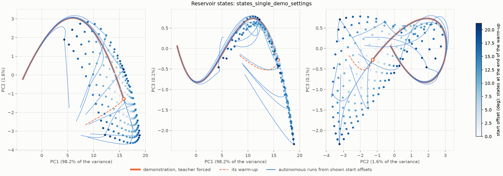

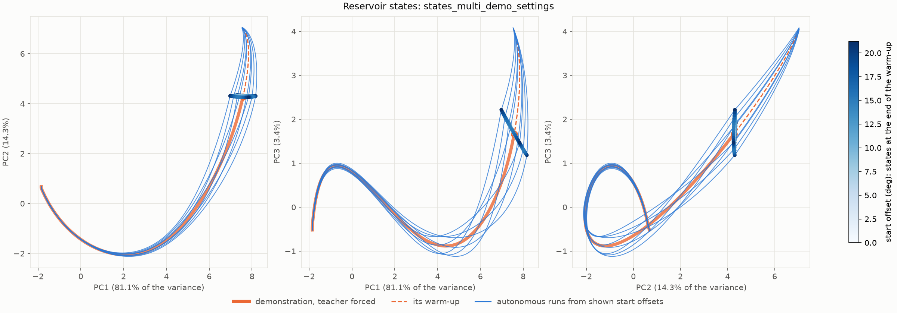

**Figure 2.** The reservoir states projected onto pairs of the first three
principal components of the demonstration's states. Top: first settings. Bottom:
eight-demonstration settings. Orange: the demonstration fed in (teacher forcing),
dashed during the warm-up. Dots: every run's state at the end of its warm-up,
darker for a larger start offset. Blue lines: the runs from the eight outer start
offsets.

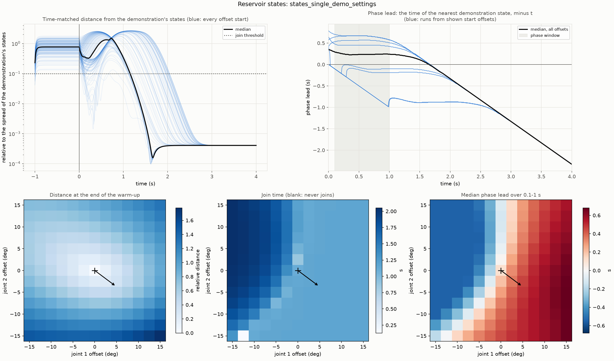

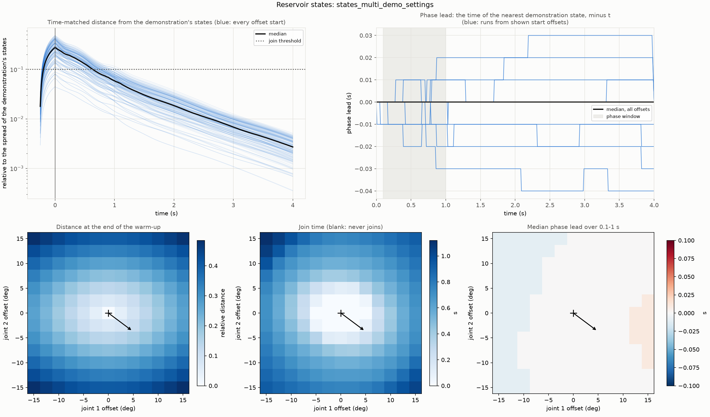

**Figure 3.** How the runs' states join the demonstration's. Top: first settings.
Bottom: eight-demonstration settings.
- Top left: the time-matched distance over time (blue: every offset start; black:
  the median).
- Top right: the phase lead over time.
- Bottom, maps over the start offsets: the distance at the end of the warm-up, the
  join time, and the phase lead during the reach. The arrow points along the
  demonstrated motion in joint space.

The 168 offset starts, median (range):

| | First settings | Eight-demonstration settings |
| --- | --- | --- |
| Variance of the demonstration's states in the first three components | 98.2%, 1.6%, 0.1% | 81.1%, 14.3%, 3.4% |
| Time-matched distance at the end of the warm-up | 0.77 (0.13–1.78) | 0.28 (0.04–0.48) |
| … at 0.25 s, 0.5 s, 1 s | 0.35, 1.14, 0.34 | 0.19, 0.13, 0.06 |
| Join time | 1.16 s (up to 2.05 s) | 0.64 s (up to 1.12 s) |
| Phase lead during the reach | +0.24 s (−0.55 to +0.68 s) | 0 (−0.01 to +0.01 s) |

- **The eight-demonstration settings learn a clock.**
  - *During the warm-up:* the offset pushes the state away from the demonstration's,
    in proportion to the offset.
  - *From then on,* the distance from the demonstration's state at the same time
    shrinks steadily. No run's phase lead during the reach exceeds one 10 ms step.
  - *So the state is pulled to where the demonstration is at that time,* not to
    where the run would be along the demonstrated path.
  - *What keeps the time:* during the warm-up the input is constant, so the time
    since the reset can only come from the reservoir's transient. Section 3.3
    confirms it.
- **The first settings learn the path.**
  - *The warm-up encodes the start posture:* the 1 s warm-up with a leak rate of 0.3
    lets the state settle where the held posture puts it. At its end, the states
    form a bent copy of the start grid (Figure 2, top).
  - *Along the first component,* which holds 98% of the demonstration's variance,
    they lie before the demonstrated path's start or along the path.
  - *The phase lead follows the offset along the demonstrated motion* (correlation
    +0.89). Starts offset in the motion's direction begin up to 0.68 s ahead, keep
    that lead at the demonstration's pace, and finish early.
  - *Starts offset backward* lie before the demonstration's start (a lead of
    −0.55 s means their nearest demonstration state stays the first one). They
    rejoin last, up to 2.05 s.
  - *These time shifts* make the time-matched distance rise again mid-reach (1.14
    at 0.5 s). The runs rejoin the demonstration's states only once it comes to
    rest.
- **The tuned settings were not analyzed this way.** Their warm-up behaves like the
  first settings' (Section 3.4: from 0.25 s on, it changes little), and on the robot
  they follow the arm along the path (Section 3.6), so they most likely learn the
  path too.

### 3.3 The warm-up check: from the reset, or from the release

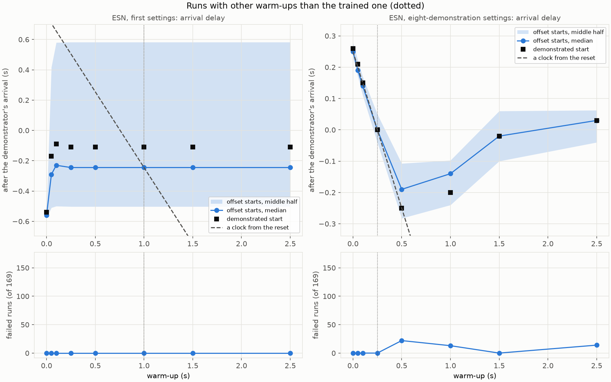

**Figure 4.** The trained ESNs of the first and eight-demonstration settings, run
from the same 169 start postures with other warm-ups than the trained one (dotted),
the trained model unchanged.
- Top: the arrival delay after the demonstrator's reach from the same start (blue:
  the offset starts; squares: the demonstrated start). The dashed line is what a
  clock from the reset would do.
- Bottom: the runs that fail.

Median arrival delay of the offset starts (s), failed runs (of 169), and the
median training path ratio of the offset starts:

| Warm-up (s) | 0 | 0.05 | 0.1 | 0.25 | 0.5 | 1 | 1.5 | 2.5 |
| --- | ---: | ---: | ---: | ---: | ---: | ---: | ---: | ---: |
| first (trained: 1 s) | −0.56 | −0.29 | −0.23 | −0.25 | −0.25 | **−0.25** | −0.25 | −0.25 |
| … failed | 0 | 0 | 0 | 0 | 0 | 0 | 0 | 0 |
| … training path ratio | 0.08 | 0.08 | 0.09 | 0.09 | 0.09 | 0.09 | 0.09 | 0.09 |
| eight-demonstration (trained: 0.25 s) | +0.25 | +0.19 | +0.14 | **0.00** | −0.19 | −0.14 | −0.02 | +0.03 |
| … failed | 0 | 0 | 0 | 0 | 22 | 13 | 0 | 14 |
| … training path ratio | 0.13 | 0.10 | 0.16 | 0.32 | 0.53 | 0.79 | 1.46 | 1.56 |

- **The eight-demonstration settings keep time from the reset.**
  - *Shorter warm-ups* delay the arrival by the missing time: +0.25 s without a
    warm-up.
  - *A 0.5 s warm-up* brings the arrival 0.25 s forward from the demonstrated
    start, as a clock would.
  - *Beyond about 0.5 s,* the reservoir no longer keeps time. The arrival drifts back
    to the demonstrator's, up to 22 of the 169 runs fail, and the runs stray from the
    demonstrated path (median ratio up to 1.56).
- **The first settings time the reach from the release.**
  - *From 0.25 s of warm-up on, the length makes no difference,* and 0.1 s differs
    by only 0.02 s. The reservoir has settled where the held posture puts it, so
    nothing tells it how long ago it was reset.
  - *The consequence:* it starts moving the moment it is released, while the
    demonstrator pauses for about 0.2 s (Figure 9). From the demonstrated start, it
    arrives 0.11 s early.
- **One more consequence of the clock:** only a clock can learn the demonstrator's
  initial pause, since the held posture alone does not say when to start. The
  eight-demonstration settings reproduce it; the first and tuned settings do not.

### 3.4 Hyperparameters and the normalization

The joint-angle normalization maps the demonstration's range to [−1, 1]. With one
demonstration, that range is only 30.4° and 22.7°, so a scale factor on it looked
worth sweeping. It needs no sweep of its own:

- **Scaling the normalization is scaling the input.** Normalizing to [−s, s] gives
  exactly the runs of an input scaling s times larger:
  - the input weights are linear;
  - the reservoir's bias depends on neither;
  - the ridge readout's solution scales with its target.
- **A test confirms it:** `test_scaling_the_normalization_is_scaling_the_input` in
  `tests/test_esn.py`.
- **So the sweep covers it:** the first sweep's input scalings, 0.03 to 3, also
  cover normalizations from ±0.03 to ±3.

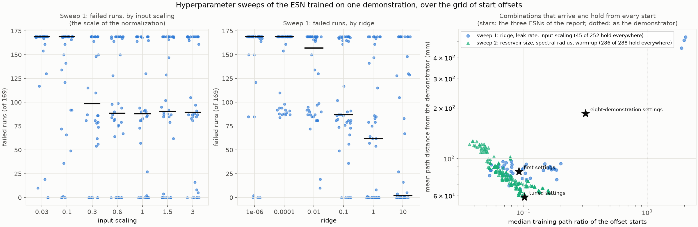

**Figure 5.** The two sweeps, each combination run from the 169 start postures.
- Left and middle (sweep 1): the failed runs of each combination, by input scaling
  and by ridge (bar: median).
- Right: the combinations that arrive and hold from every start, by the median
  training path ratio of the offset starts and the mean path distance. Stars: the
  three settings of this report. Dotted: a ratio of 1, reaching as the demonstrator.

- **Sweep 1:** ridge, leak rate, and input scaling, from the first settings' 300
  neurons, spectral radius 0.5, and 1 s warm-up.
  - *Few hold everywhere:* only 45 of the 252 combinations arrive and hold from
    every start. They need strong regularization: 42 of them have a ridge of 0.1 to
    10, and none a leak rate of 0.05.
  - *Giving the offsets more room makes the ESN fail.* At input scalings 0.03 and
    0.1, 2 and 3 of 36 combinations hold everywhere. Most fail all 169 runs, from
    the demonstrated start too.
  - *The rest hold equally rarely:* 6–9 of 36 from 0.3 up.
- **Sweep 2:** reservoir size, spectral radius, and warm-up, from the best of sweep 1
  (ridge 10, leak rate 0.2, input scaling 3).
  - *Nearly all hold:* 286 of 288 combinations hold everywhere.
  - *The warm-up stops mattering:* from 0.25 s on, warm-ups give nearly the same
    runs. Without a warm-up, the first step grows from 140 to 237 mm on average.
- **No combination reaches as the demonstrator would.**
  - *All but three return onto the demonstration:* every combination that holds
    everywhere has a median ratio of 0.04–0.20, except three with a ridge of 10⁻⁶.
  - *Those three are not an exception:* their ratios near 2 come from wandering
    0.46–0.53 m before they arrive.
  - *The best of sweep 2 makes the tuned settings:* a mean path distance of 58.8 mm
    (400 neurons, spectral radius 0.3), against 83.7 mm for the first settings.

### 3.5 On the robot: start offsets and gains

Section 3.8 shows one example of every robot scenario over time, with each ESN's
output, and animated.

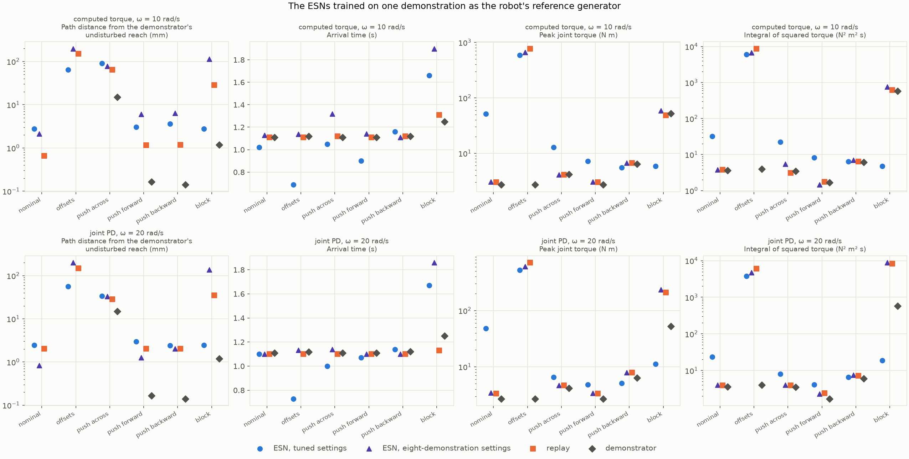

**Figure 6.** Means over the start postures (169 for the offsets, 1 otherwise) at
the two featured tracker settings. Every arm arrives and holds from every start in
every scenario at both, so the second column shows the arrival time instead. The
undisturbed demonstrator is its own reference, so its path distance (0 mm) is off
the log scale.

Computed torque, ω = 10 rad/s (tuned ESN / eight-demonstration ESN / replay /
demonstrator):

| Scenario | Path distance (mm) | Arrival (s) | Peak torque (N m) | ∫τ² (N² m² s) |
| --- | --- | --- | --- | --- |
| nominal | 2.7 / 2.1 / 0.7 / 0.0 | 1.02 / 1.13 / 1.11 / 1.11 | 51.6 / 3.1 / 3.0 / 2.7 | 32.5 / 3.8 / 3.8 / 3.6 |
| offsets | 64 / 198 / 151 / 0 | 0.69 / 1.14 / 1.11 / 1.12 | 592 / 663 / 774 / 3 | 6064 / 6717 / 8763 / 4 |
| push across | 91.2 / 77.2 / 64.8 / 15.0 | 1.05 / 1.32 / 1.12 / 1.11 | 12.8 / 4.1 / 4.1 / 4.2 | 22.2 / 5.4 / 3.1 / 3.5 |
| push forward | 3.0 / 6.0 / 1.2 / 0.2 | 0.90 / 1.14 / 1.11 / 1.11 | 7.2 / 3.1 / 3.0 / 2.7 | 8.2 / 1.4 / 1.7 / 1.7 |
| push backward | 3.6 / 6.3 / 1.2 / 0.1 | 1.16 / 1.11 / 1.12 / 1.12 | 5.5 / 6.7 / 6.7 / 6.4 | 6.4 / 6.9 / 6.5 / 6.1 |
| block | 2.7 / 114.2 / 28.3 / 1.2 | 1.66 / 1.90 / 1.31 / 1.25 | 5.9 / 59.0 / 48.7 / 52.6 | 4.8 / 766 / 619 / 574 |

Joint PD, ω = 20 rad/s (tuned ESN / eight-demonstration ESN / replay /
demonstrator):

| Scenario | Path distance (mm) | Arrival (s) | Peak torque (N m) | ∫τ² (N² m² s) |
| --- | --- | --- | --- | --- |
| nominal | 2.5 / 0.8 / 2.0 / 0.0 | 1.10 / 1.10 / 1.10 / 1.11 | 48.3 / 3.4 / 3.4 / 2.7 | 23.7 / 4.1 / 3.9 / 3.6 |
| offsets | 57 / 201 / 148 / 0 | 0.73 / 1.13 / 1.10 / 1.12 | 527 / 607 / 712 / 3 | 3752 / 4685 / 6044 / 4 |
| push across | 33.5 / 32.9 / 28.4 / 15.0 | 1.00 / 1.14 / 1.10 / 1.11 | 6.6 / 4.7 / 4.7 / 4.2 | 8.0 / 4.0 / 3.9 / 3.5 |
| push forward | 3.0 / 1.3 / 2.0 / 0.2 | 1.07 / 1.10 / 1.10 / 1.11 | 4.8 / 3.4 / 3.4 / 2.7 | 4.1 / 2.3 / 2.4 / 1.7 |
| push backward | 2.4 / 2.0 / 2.0 / 0.1 | 1.14 / 1.10 / 1.10 / 1.12 | 5.1 / 7.9 / 7.9 / 6.4 | 6.5 / 7.5 / 7.2 / 6.1 |
| block | 2.4 / 136.9 / 34.8 / 1.2 | 1.67 / 1.86 / 1.13 / 1.25 | 11.2 / 233.5 / 207.9 / 52.6 | 18.7 / 8872 / 8220 / 574 |

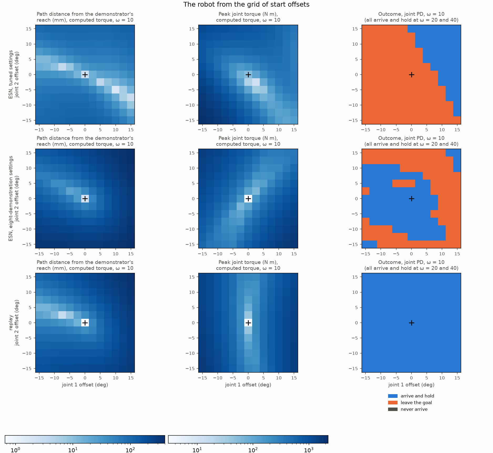

**Figure 7.** The robot runs from the grid of start offsets (rows: the two ESNs and
the replay).
- Left: the path distance from the demonstrator's reach from each start, with
  computed torque at ω = 10 rad/s.
- Middle: the peak joint torque, with computed torque at ω = 10 rad/s.
- Right: the outcome with joint PD at ω = 10 rad/s. At ω = 20 and 40 rad/s every
  run of every arm arrives and holds.

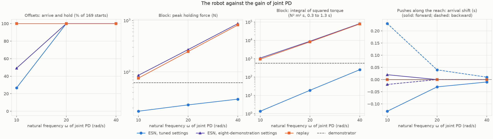

**Figure 8.** Against the natural frequency of joint PD:
- the share of the 169 offset starts that arrive and hold;
- the block's peak holding force at the tip, and the integral of squared torque
  from the block's onset for 1 s (the demonstrator, dashed, has no gains);
- the arrival shift when pushed forward along the reach (solid) or backward
  (dashed), against the same arm's undisturbed run.

- **From the start offsets, both single-demonstration ESNs pull the arm onto the
  demonstration.**
  - *The tuned ESN stays closest to the demonstrator's reach* from each start:
    64 mm, against 151 mm for the replay and 198 mm for the eight-demonstration ESN
    (computed torque, ω = 10).
  - *It arrives sooner* than the replay (0.69 s against 1.11 s): it starts at once,
    and its first step lands ahead along the path.
  - *But neither ESN reaches from where the arm is:* their first steps jump toward
    the demonstration as on their own (Section 3.1).
  - *Compared with report 002:* from the four 10° diagonal offsets, which report
    002 also used, the peak torques are 671 and 714 N m, against 944 N m for the
    replay. Report 002's eight-demonstration ESN needed 4 N m there.
- **Joint PD needs ω ≥ 20 rad/s with either ESN.**
  - *At ω = 10 rad/s,* the hand drifts out of the 2 cm goal radius after it
    arrives, and then settles (final distance 0.5 mm).
  - *How often:* the tuned ESN holds from 45 of the 169 offset starts and fails in
    every single-start scenario. The eight-demonstration ESN holds from 83 and fails
    after the push across and the block.
  - *At ω = 20 and 40 rad/s,* every run of every arm holds. The replay holds at
    every gain.
- **The tuned ESN pays for its jump at the release.**
  - *From the demonstrated start,* its first step of 8.4 mm gives a peak torque of
    52 N m with computed torque, and 24, 48, and 97 N m with joint PD at ω = 10, 20,
    and 40 rad/s.
  - *The others* peak at 3–4 N m.

### 3.6 Under disturbances: a reference that waits

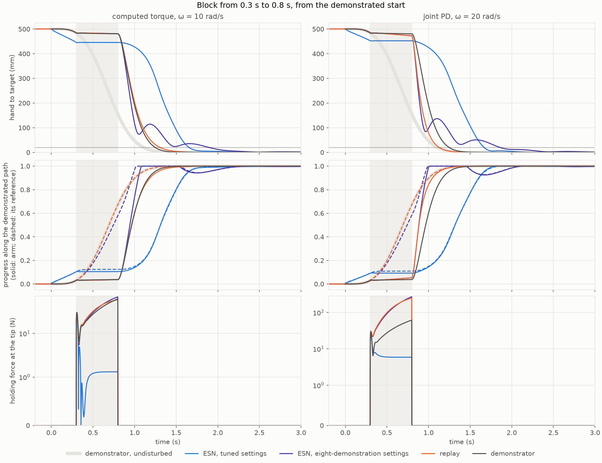

**Figure 9.** The block from the demonstrated start, at the two featured tracker
settings. Top: the hand's distance to the target. Middle: the progress along the
demonstrated path, of the arm (solid) and of its reference (dashed). Bottom: the
force holding the tip (zero outside the block). The thick light line is the
demonstrator's undisturbed reach.

Section 3.8 shows the block's joint angles, with each ESN's output, and an
animation of the four arms (Figure 16).

The block, at every tracker setting:
- *lead:* the reference's lead over the arm at the release, as a fraction of the
  path;
- *force:* the peak holding force;
- *path:* the path distance from the demonstrator's undisturbed reach.

| Arm | Tracker | Lead | Arrival (s) | Force (N) | ∫τ² (N² m² s) | Path (mm) |
| --- | --- | ---: | ---: | ---: | ---: | ---: |
| tuned ESN | computed torque, ω = 10 | +0.02 | 1.66 | 26 | 4.8 | 2.7 |
| tuned ESN | joint PD, ω = 10 / 20 / 40 | +0.01 / +0.02 / +0.02 | 1.98 / 1.67 / 1.57 | 17 / 23 / 30 | 1.3 / 18.7 / 248 | 7.3 / 2.4 / 2.0 |
| eight-demonstration ESN | computed torque, ω = 10 | +0.54 | 1.90 | 68 | 766 | 114 |
| eight-demonstration ESN | joint PD, ω = 10 / 20 / 40 | +0.55 / +0.53 / +0.49 | 2.04 / 1.86 / 1.76 | 86 / 271 / 866 | 1077 / 8872 / 81469 | 134 / 137 / 108 |
| replay | computed torque, ω = 10 | +0.64 | 1.31 | 58 | 619 | 28 |
| replay | joint PD, ω = 10 / 20 / 40 | +0.64 / +0.62 / +0.57 | 1.27 / 1.13 / 1.11 | 76 / 248 / 813 | 937 / 8220 / 77600 | 47 / 35 / 24 |
| demonstrator | its own controller | | 1.25 | 62 | 574 | 1.2 |

The arrival shift (s) against the same arm's undisturbed run, pushed forward,
pushed backward, and blocked:

| Arm | Computed torque, ω = 10 | Joint PD, ω = 10 | Joint PD, ω = 20 | Joint PD, ω = 40 |
| --- | --- | --- | --- | --- |
| tuned ESN | −0.12 / +0.14 / +0.64 | −0.13 / +0.23 / +0.70 | −0.03 / +0.04 / +0.57 | −0.01 / +0.01 / +0.51 |
| eight-demonstration ESN | +0.01 / −0.02 / +0.77 | +0.02 / −0.02 / +1.00 | 0.00 / 0.00 / +0.76 | 0.00 / 0.00 / +0.65 |
| replay | 0.00 / +0.01 / +0.20 | 0.00 / 0.00 / +0.21 | 0.00 / 0.00 / +0.03 | 0.00 / 0.00 / 0.00 |
| demonstrator | 0.00 / +0.01 / +0.14 | | | |

How far the forward push moves the arm along the demonstrated path (a fraction of
the path), against the undisturbed run, at the end of the push (0.5 s) and 0.1 s
later. The backward push moves it as far, the other way:

| Arm | Computed torque, ω = 10 | Joint PD, ω = 10 | Joint PD, ω = 20 | Joint PD, ω = 40 |
| --- | --- | --- | --- | --- |
| tuned ESN | 0.035 → 0.115 | 0.024 → 0.062 | 0.016 → 0.039 | 0.008 → 0.016 |
| eight-demonstration ESN | 0.022 → 0.030 | 0.019 → 0.023 | 0.010 → 0.006 | 0.004 → 0.001 |
| replay | 0.020 → 0.025 | 0.018 → 0.019 | 0.009 → 0.004 | 0.003 → 0.000 |

- **Under the block, the tuned ESN's reference waits.**
  - *During the block:* its reference stays within 0.02 of the path from the held
    arm (Figure 9, middle), so the tracker barely pushes against the block. The
    holding force is 17–30 N at its peak and a few newtons after, against 58–813 N
    for the replay.
  - *After the release,* it goes on from where the arm is, along the demonstrated
    path (2–7 mm from it).
  - *The cost:* it arrives 0.5–0.7 s later than undisturbed, about the length of the
    block.
- **The replay and the eight-demonstration ESN run on.**
  - *During the block:* their references reach the end of the path, 0.49–0.64
    ahead of the arm at the release.
  - *The force grows with the gain,* up to 813 and 866 N at ω = 40 rad/s.
  - *After the release:* the arm snaps after the reference.
    - With the replay, it arrives 0.00–0.21 s behind its undisturbed run.
    - With the eight-demonstration ESN, it overshoots and comes back out to more than
      100 mm from the target (Figure 9, top), 108–137 mm from the demonstrated path.
- **Pushed along the reach, the tuned ESN carries the push on.**
  - *What the push does:* the 5 N push moves every arm forward or backward along the
    path, less as the gain rises (about 2% of the path at ω = 10 rad/s, 0.3% at 40).
  - *The replay and the eight-demonstration ESN* keep their schedule. Over the next
    0.1 s, the displacement stays about as large (ω = 10 rad/s) or shrinks back
    (ω = 20 and 40 rad/s), and their arrival moves by at most 0.02 s.
  - *The tuned ESN* takes the displacement up and carries it further, two to three
    times as far 0.1 s later, so it arrives up to 0.13 s earlier or 0.23 s later.
  - *At high gains,* the push moves the stiff arm too little for this to matter
    (0.01 s at ω = 40 rad/s).
- **Pushed across the reach, the tuned ESN does worse.**
  - *It strays further:* with computed torque, 91 mm from the demonstrator's path,
    against 65 mm for the replay.
  - *It costs more torque:* 12.8 N m against 4.1 N m.
  - *Why:* its output follows the arm sideways (departure ratio 0.84–0.90,
    Section 3.7) instead of holding the reference on the path.

### 3.7 What the ESNs generate: their output against the arm

As in [report 002](../002-esn-reference-on-the-robot/README.md#37-what-the-esn-generates-its-output-against-the-arm-and-the-demonstration),
the largest distance in joint space of the ESN's output and of its arm from the
demonstrator's undisturbed reach, over the reach (nominal) or 1 s from the
disturbance (deg). A ratio of 0 means the output replays the demonstration whatever
the arm does; 1 means it moves as far as the arm:

| Scenario | Tracker | Tuned ESN: output / arm, ratio | Eight-demonstration ESN: output / arm, ratio |
| --- | --- | --- | --- |
| nominal | computed torque, ω = 10 | 2.8 / 2.8, 0.99 | 0.2 / 0.3, 0.60 |
| nominal | joint PD, ω = 20 | 3.5 / 3.8, 0.92 | 0.1 / 0.4, 0.38 |
| push across | computed torque, ω = 10 | 5.8 / 6.4, 0.90 | 3.2 / 4.9, 0.65 |
| push across | joint PD, ω = 20 | 2.0 / 2.4, 0.84 | 1.1 / 2.3, 0.47 |
| push forward | computed torque, ω = 10 | 6.3 / 6.9, 0.90 | 0.6 / 1.3, 0.46 |
| push forward | joint PD, ω = 20 | 1.6 / 1.8, 0.92 | 0.1 / 0.3, 0.31 |
| push backward | computed torque, ω = 10 | 6.1 / 6.8, 0.90 | 0.5 / 1.2, 0.44 |
| push backward | joint PD, ω = 20 | 6.0 / 6.3, 0.94 | 0.3 / 0.7, 0.36 |
| block | computed torque, ω = 10 | 28.9 / 29.2, 0.99 | 10.5 / 24.8, 0.42 |
| block | joint PD, ω = 20 | 28.7 / 28.9, 0.99 | 9.0 / 23.8, 0.38 |

From the 168 offset starts, the RMS distance of the ESN's output over the reach
(0–1.5 s), median (range), in degrees:

| Tracker | ESN | From the demonstrator's reach from this start | From the replayed demonstration |
| --- | --- | --- | --- |
| computed torque, ω = 10 | tuned | 13.2 (2.5–23.7) | 14.6 (1.3–20.6) |
| computed torque, ω = 10 | eight-demonstration | 9.5 (1.7–15.9) | 3.1 (0.5–6.3) |
| joint PD, ω = 20 | tuned | 12.0 (2.3–23.5) | 13.5 (1.3–20.3) |
| joint PD, ω = 20 | eight-demonstration | 9.7 (1.7–16.2) | 3.4 (0.5–6.8) |

- **The tuned ESN's output moves with its arm.** It departs from the demonstration
  0.84–0.99 times as far as the arm does in every scenario, 0.99 under the block.
- **The eight-demonstration ESN goes partway.** Its ratio of 0.31–0.65 is about the
  halfway of report 002's eight-demonstration ESN (means of 0.45–0.65).
- **From offset starts, neither generates the demonstrator's reach from there.**
  - *The eight-demonstration ESN* stays close to the replayed demonstration (3° RMS),
    as a clock that snaps onto the demonstration would.
  - *The tuned ESN* is as far from the replay as from the demonstrator's reach
    (12–15°). It runs along the demonstrated path, but on its own timing.
  - *Report 002's ESN,* trained on eight demonstrations, followed the demonstrator's
    reach from offset starts within 1° RMS.

### 3.8 Scenario by scenario: joint angles and animations

One example of each robot scenario, from one start posture.

- **Each figure:** the joint angles over time, at both featured tracker settings.
  - *Columns:* the ESN and the tracker. *Rows:* the joints.
  - *Each ESN:* its arm (solid) and its output, the reference it gives the tracker
    (dashed).
  - *The others:* the replay's arm (orange), and the demonstration it replays
    (thick gray). From an offset start, the gray line is instead the
    demonstrator's own reach from there, and the replay's reference is dashed
    orange.
  - *Under a disturbance:* the demonstrator's own disturbed reach (dash-dot), with
    the disturbance shaded.
- **Each animation:** the four arms side by side on one task clock, each rendered
  by skelarm's player, with joint PD at ω = 20 rad/s.
  - *Markers:* the purple dot is the target, and the red arrow the force at the tip.
  - *The ESN's output* is not drawn in the animations; the figures show it.

#### Nominal

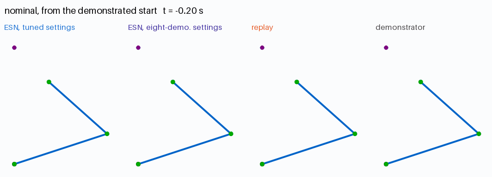

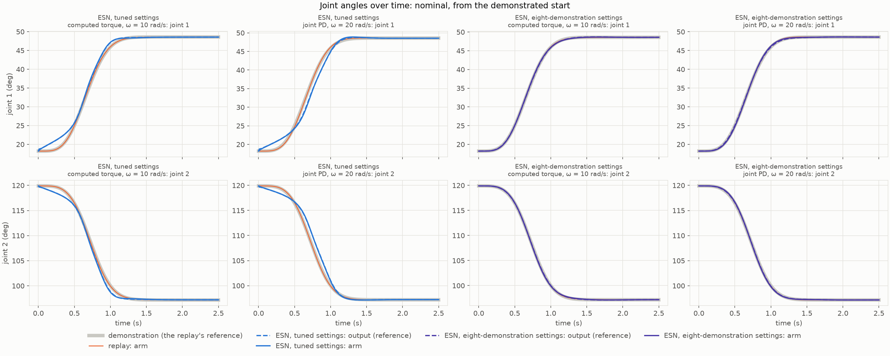

**Figure 10.** No disturbance, from the demonstrated start.

- **The eight-demonstration ESN** lies on the demonstration, output and arm, its
  initial pause included.
- **The tuned ESN starts at once.** Its joint 1 rises from t = 0 while the
  demonstration still pauses. It joins the demonstration's course at about 0.5 s,
  and its output and arm nearly coincide.

#### Offset ahead: (+10°, −10°)

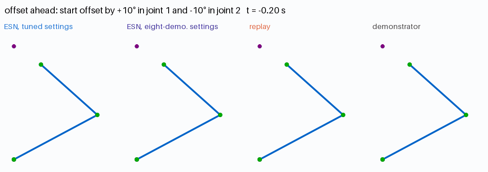

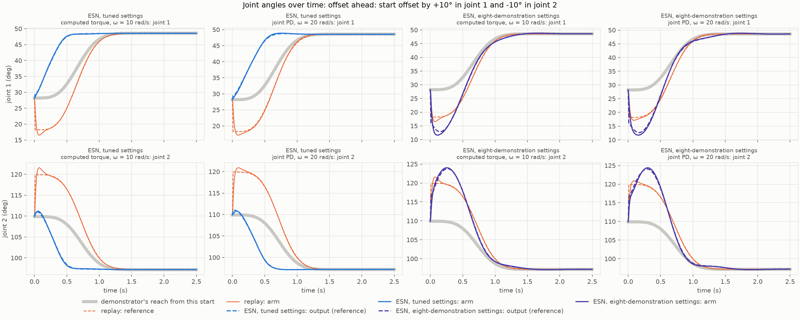

**Figure 11.** The start offset by +10° in joint 1 and −10° in joint 2, roughly
along the demonstrated motion.

- **The demonstrator,** from this start, pauses and then makes a reach of its own
  (gray).
- **The replay's reference jumps back** to the demonstrated start (18°, 120°) at
  t = 0. Its arm follows with a yank, then replays the demonstration.
- **The tuned ESN treats the start as a point along the demonstrated path.** Its
  output goes on toward the end from where the arm is. The arm reaches the end
  posture at 0.5–0.6 s, about half a second before the demonstrator does.
- **The eight-demonstration ESN's output jumps the other way,** past the
  demonstrated start, to about 13° in joint 1 and 124° in joint 2. It then follows
  the demonstration's timing.

#### Offset across: (−10°, −10°)

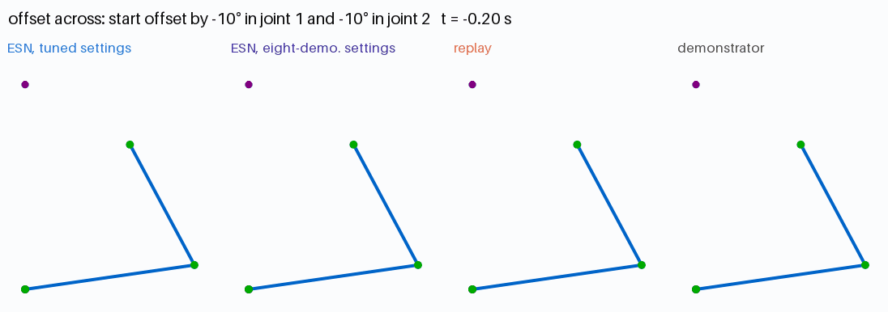

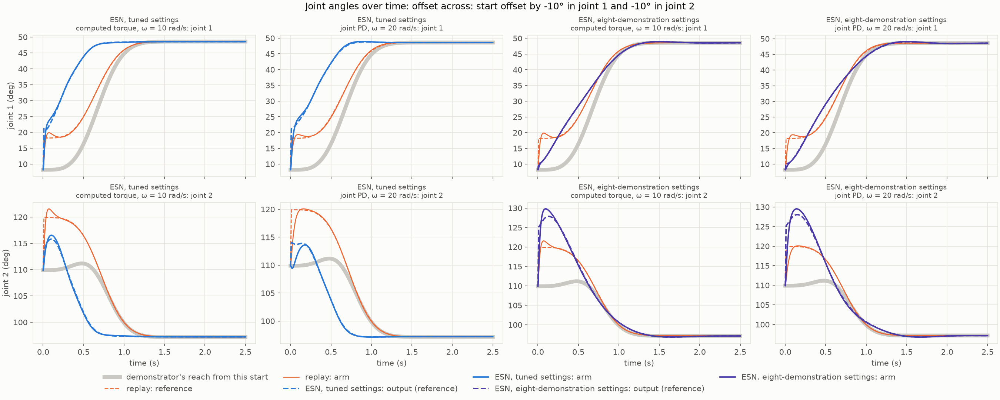

**Figure 12.** The start offset by −10° in both joints, mostly across the
demonstrated motion.

- **The replay** jumps back to the demonstrated start, as from every offset start.
- **The tuned ESN's output jumps toward the demonstrated path** in its first steps:
  joint 1 from 8° to about 21°, joint 2 up to 114–116°. It then runs along the
  path ahead of the demonstration's timing, and reaches the end posture by about
  0.7 s.
- **The eight-demonstration ESN's output jumps in joint 2** above the demonstrated
  start, up to 128°, and its arm overshoots to 130°. It then follows the
  demonstration's timing.

#### Push across the reach

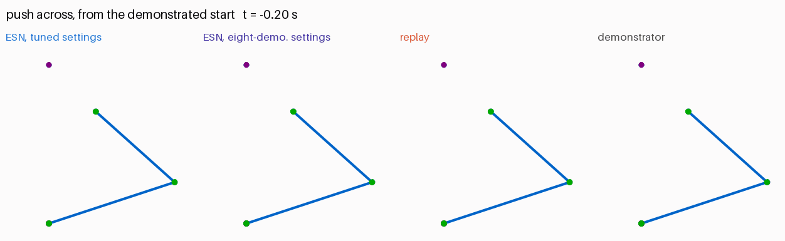

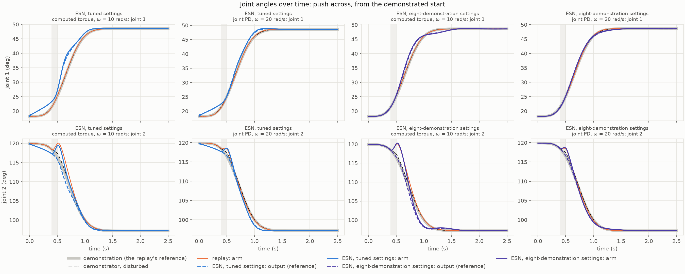

**Figure 13.** A 5 N push at the tip for 0.1 s from 0.4 s (shaded), across the
reach.

- **Every arm is bent back in joint 2,** by up to 4–5° with computed torque and
  2° with joint PD at ω = 20 rad/s.
- **All return to the demonstration's course by about 1 s.** The tuned ESN, which
  started early, stays slightly ahead of it.

#### Push forward along the reach

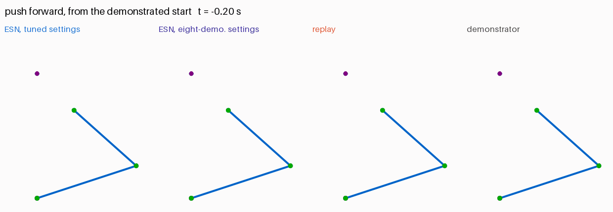

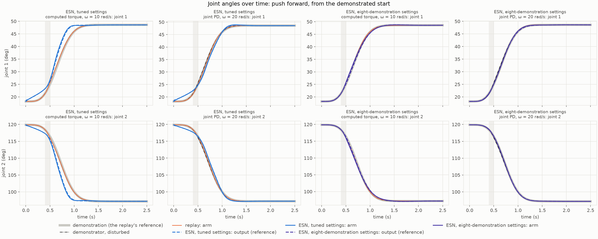

**Figure 14.** The same push, along the reach toward the target.

- **The tuned ESN speeds up after the push.** With computed torque, its output and
  arm run ahead of the demonstration, and it arrives 0.12 s earlier than without
  the push.
- **The push hardly shows in the other arms,** which keep the demonstration's
  course.

#### Push backward along the reach

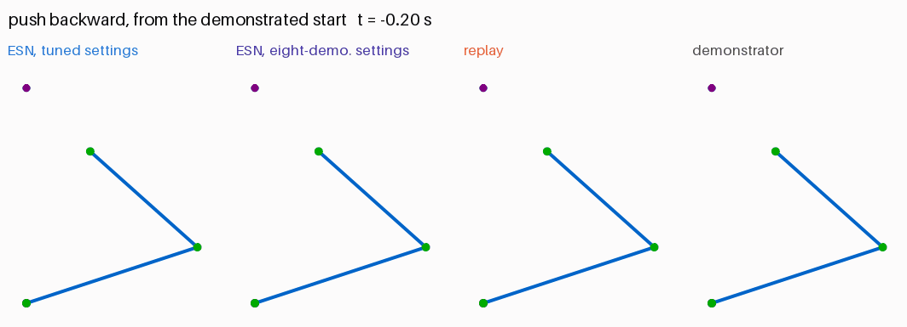

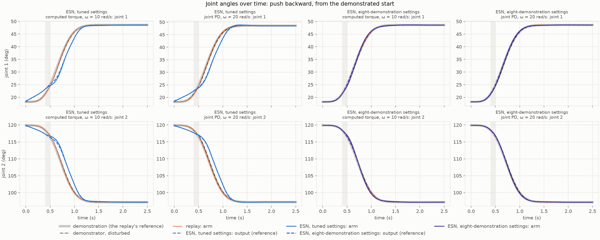

**Figure 15.** The same push, along the reach away from the target.

- **The tuned ESN slows down after the push.** Its joint 1 falls behind the
  demonstration from 0.5 s on, and it arrives 0.14 s later than without the push
  (computed torque).
- **The other arms keep the demonstration's course.**

#### Block

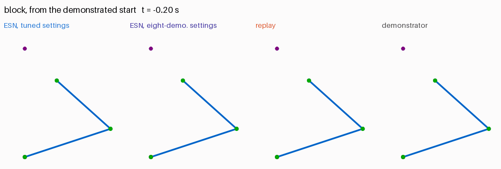

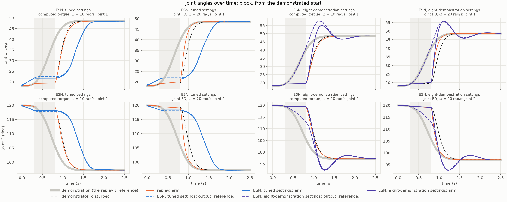

**Figure 16.** The tip held from 0.3 s to 0.8 s (shaded), then let go.

- **The tuned ESN's output stays with the held arm,** within 0.6°. After the
  release, both resume along the demonstrated course, about 0.6 s later than
  undisturbed. In the animation, its holding force (the red arrow) stays small.
- **The eight-demonstration ESN's output runs on.**
  - *During the block:* it follows the demonstration in joint 1, and slows in
    joint 2.
  - *After the release:* the output itself overshoots, to 56–58° in joint 1 (the
    end posture is at 48.6°) and 92–93° in joint 2 (end: 97.2°), and the arm
    follows it there.
- **The replay's reference, the demonstration, runs to its end.** After the
  release, the arm catches up with it, as the demonstrator's own arm does.

### 3.9 Underdamped trackers

Every robot scenario ran again with the tracker underdamped, at the featured
natural frequencies:

- **Damping ratios:** ζ = 1, 0.5, 0.3, and 0.1.
- **Trackers:** computed torque at ω = 10 rad/s and joint PD at ω = 20 rad/s.
- **Starts:** the demonstrated start, except for the offsets, which start from
  the two example offsets of Section 3.8. Each arm thus makes seven runs per
  tracker setting, one for each example.

At ζ < 1 the tracking error oscillates as it decays, at ω√(1 − ζ²); after a step,
it overshoots by 16% at ζ = 0.5, 37% at 0.3, and 73% at 0.1 (as in report 002).

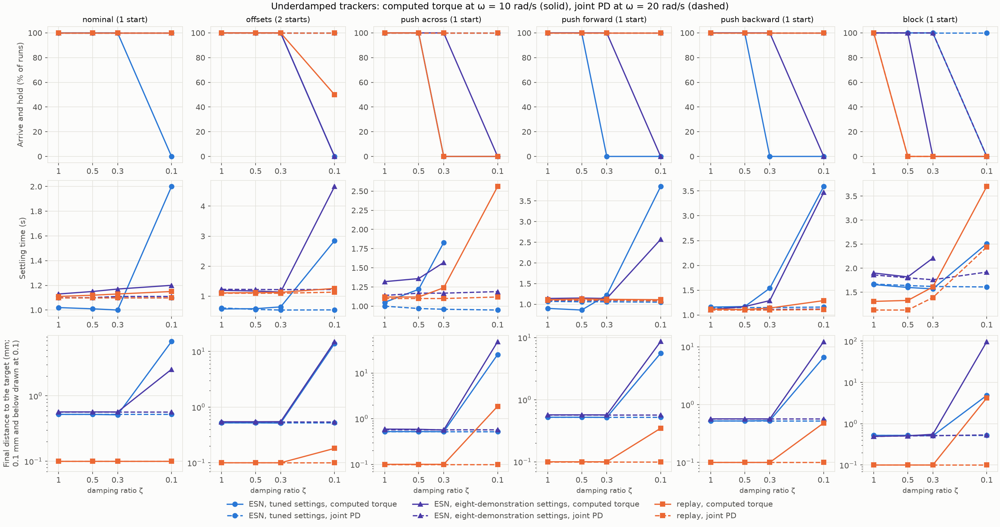

**Figure 17.** Against the damping ratio (falling to the right), for every
scenario:
- *Rows:* the runs that arrive and hold, their settling time (of the runs that
  settle within the 5 s), and the final distance to the target.
- *Styles:* solid is computed torque at ω = 10 rad/s, dashed joint PD at
  ω = 20 rad/s.
- *A note on the final distance:* the ESNs end 0.5 mm from the target even when
  critically damped, where their own end posture is.

Of the 7 runs of each arm (tuned ESN / eight-demonstration ESN / replay):

| Tracker | ζ | Arrive and hold | Settle within the run | Worst final distance (mm) |
| --- | ---: | --- | --- | --- |
| computed torque, ω = 10 | 1 | 7 / 7 / 7 | 7 / 7 / 7 | 0.5 / 0.6 / 0.0 |
| | 0.5 | 7 / 7 / 6 | 7 / 7 / 7 | 0.5 / 0.6 / 0.0 |
| | 0.3 | 4 / 6 / 5 | 7 / 7 / 7 | 0.5 / 0.6 / 0.0 |
| | 0.1 | 0 / 1 / 4 | 5 / 5 / 7 | 25.4 / 97.1 / 4.2 |
| joint PD, ω = 20 | 1 | 7 / 7 / 7 | 7 / 7 / 7 | 0.5 / 0.6 / 0.0 |
| | 0.5 | 7 / 7 / 6 | 7 / 7 / 7 | 0.5 / 0.6 / 0.0 |
| | 0.3 | 7 / 7 / 6 | 7 / 7 / 7 | 0.5 / 0.6 / 0.0 |
| | 0.1 | 7 / 6 / 6 | 7 / 7 / 7 | 0.5 / 0.6 / 0.0 |

How far the arm passes the end posture, the larger of its two joints (deg),
critically damped → at ζ = 0.1 (tuned ESN / eight-demonstration ESN / replay):

| Example | Computed torque, ω = 10 | Joint PD, ω = 20 |
| --- | --- | --- |
| nominal | 0.0 → 1.2 / 0.1 → 0.7 / 0.0 → 0.2 | 0.3 → 0.3 / 0.0 → 0.0 / 0.0 → 0.0 |
| offset ahead | 0.0 → 1.6 / 0.2 → 2.6 / 0.0 → 0.4 | 0.3 → 0.3 / 0.3 → 0.4 / 0.0 → 0.8 |
| offset across | 0.0 → 2.8 / 0.3 → 3.4 / 0.0 → 0.7 | 0.3 → 0.5 / 0.5 → 0.6 / 0.0 → 0.9 |
| push across | 0.0 → 6.5 / 0.1 → 10.1 / 0.0 → 4.2 | 0.3 → 0.4 / 0.1 → 0.2 / 0.0 → 0.5 |
| push forward | 0.0 → 2.5 / 0.1 → 2.0 / 0.0 → 0.6 | 0.3 → 0.3 / 0.0 → 0.1 / 0.0 → 0.1 |
| push backward | 0.0 → 1.9 / 0.0 → 2.3 / 0.0 → 0.9 | 0.3 → 0.3 / 0.0 → 0.1 / 0.0 → 0.1 |
| block | 0.0 → **1.2** / 6.4 → **28.2** / 0.0 → **14.2** | 0.3 → **0.3** / 7.3 → **19.9** / 0.0 → **16.8** |

The ringing after the reaches (2.5–5 s), with computed torque at ζ = 0.1:
- *Amplitude:* the standard deviation of the ESN's output against its arm's, joint
  by joint (1: the output rings as much as the arm; 0: it holds still).
- *Lag:* how far the output lags behind the arm, from their cross-correlation.
- *Coverage:* medians (range) over the joints of the 7 runs that still ring by more
  than 0.2°. With joint PD at ω = 20 rad/s, no joint still rings after 2.5 s.

| ESN | Joints that ring | Amplitude | Lag (ms) |
| --- | ---: | --- | --- |
| tuned | 14 | 0.51 (0.47–0.69) | 23 (6–30) |
| eight-demonstration | 13 | 0.39 (0.36–0.42) | 2 (0–10) |

- **With computed torque, less damping hurts the ESNs more than the replay,** as in
  report 002.
  - *At ζ = 0.1:* no run of the tuned ESN holds, and one of the
    eight-demonstration ESN's, against four of the replay's.
  - *Settling:* the replay settles in all seven runs. Each ESN settles in five, and
    their worst runs end 25 and 97 mm from the target, against 4.2 mm.
- **Each ESN's output rings with its arm,** at half the arm's amplitude (tuned) or
  0.39 of it (eight-demonstration).
  - *Why it matters:* the replay's reference holds still at the end posture, so its
    arm's ringing decays. The ESNs feed the ringing back into their references.
  - *Compared with report 002:* the eight-demonstration ESN there rang at about
    0.6, 30–45 ms behind its arm.
- **After the block, the waiting reference helps.**
  - *Why:* the tuned ESN's reference resumes from where the arm is, so the release
    is no step for its tracker.
  - *Overshoot at ζ = 0.1, computed torque:* its arm passes the end posture by
    1.2°, against 14.2° for the replay and 28.2° for the eight-demonstration ESN,
    which keeps oscillating to the end of the run (Figure 24).
  - *With joint PD:* the tuned ESN holds after the block at every damping ratio.
    The replay fails to hold from ζ = 0.5 on, and the eight-demonstration ESN at
    ζ = 0.1.
- **With joint PD at ω = 20 rad/s, the damping ratio hardly matters.**
  - *At ζ = 0.1,* the tuned ESN still holds in all seven runs, and the other ESN and
    the replay in six (each failing after the block).
  - *A likely reason:* a second-order error's oscillation decays at the rate ζω,
    twice as fast at ω = 20 rad/s as at 10 rad/s.

The joint angles of each example with the trackers at ζ = 0.1, laid out as in
Section 3.8 but over the whole 5 s run:

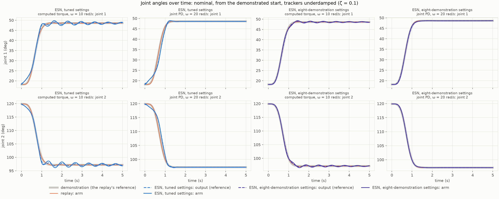

**Figure 18.** Nominal. With computed torque, both ESNs' arms keep ringing around
the end posture to the end of the run, passing it by up to 1.2° (tuned) and 0.7°,
and their outputs ring with them. The replay's arm settles. With joint PD, no arm
rings.

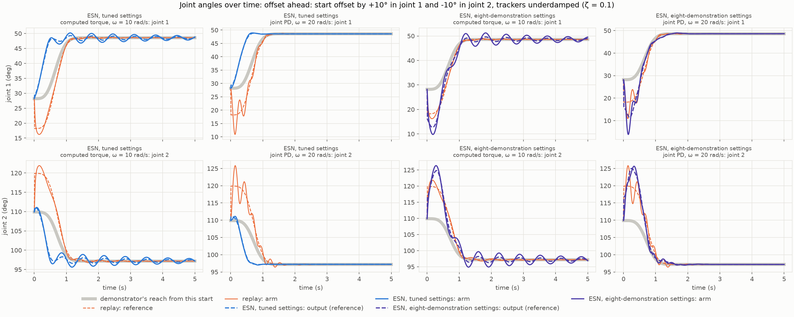

**Figure 19.** Offset ahead, (+10°, −10°). As in the nominal run: with computed
torque, the ESNs' arms keep ringing after their reaches, by up to 1.6° (tuned) and
2.6° past the end posture.

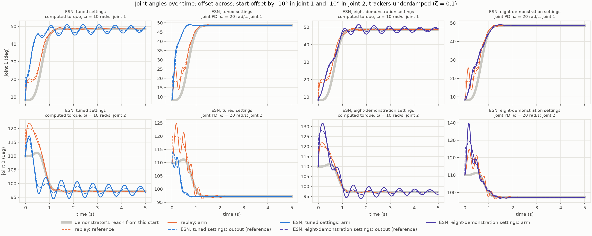

**Figure 20.** Offset across, (−10°, −10°). The replay's jump to the demonstrated
start now rings too, but it settles. The ESNs' arms ring after the reach, by up
to 2.8° and 3.4° past the end posture with computed torque.

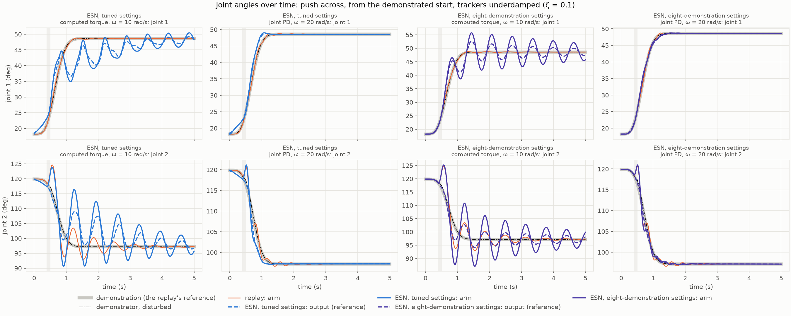

**Figure 21.** Push across. With computed torque, the push sets every arm ringing.
- *The replay's arm* settles by 2.6 s.
- *The ESNs' arms* swing up to 6.5° (tuned) and 10.1° past the end posture, with
  their outputs following. Neither settles within the run.

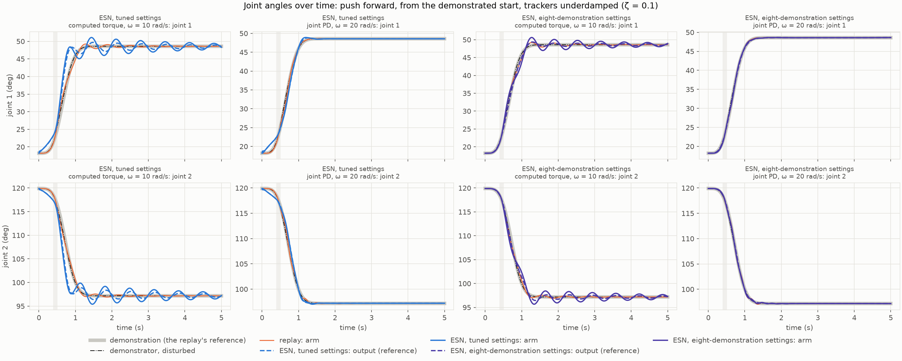

**Figure 22.** Push forward. With computed torque, the tuned ESN still speeds up
after the push, and both ESNs ring around the end posture, passing it by up to
2.5° (tuned) and 2.0°.

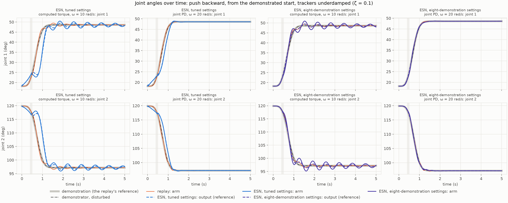

**Figure 23.** Push backward. As with the forward push, the ESNs ring by about 2°
around the end posture with computed torque, while the replay settles.

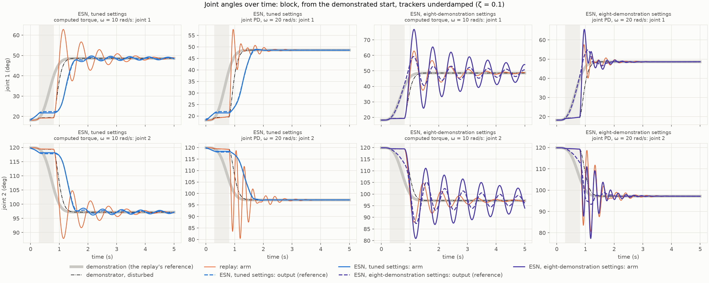

**Figure 24.** Block, at ζ = 0.1.
- *The tuned ESN:* its output waits with the held arm, and both resume smoothly
  after the release.
- *The replay:* its reference is already at the end, so the release is a step for
  the tracker, and the arm overshoots by 14° and rings.
- *The eight-demonstration ESN:* its output has run ahead and overshoots itself
  after the release. Its arm overshoots by 28° and keeps oscillating to the end of
  the run.
- *With joint PD:* every arm's ringing dies out by about 2 s.

## 4. Observations

- **A path-type ESN gives the adaptive reference that report 002 did not find.**
  - *What it does:* the tuned ESN's reference follows the arm's progress along the
    demonstrated path. It waits while the arm is blocked, goes on from where the arm
    is, and carries a push along the path on.
  - *What it buys:* the tracker hardly fights a block. The peak holding force is a
    half to a twenty-seventh of the replay's, the effort under a hundredth of it, and
    the arm keeps to the demonstrated path.
  - *Report 002's guess:* it suggested that waiting may need "a shorter reservoir
    memory". The tuned settings leak four times faster (leak rate 0.2 against 0.05)
    and settle during a long warm-up.
- **The adaptation is along the path only.**
  - *Off the path, the ESN returns to it* rather than moving from where the arm is,
    whether from a start offset or after a push across the reach.
  - *What that costs:* large torques from offset starts, and more deviation and
    torque under a sideways push, than the replay.
  - *In terms of the plan's question:* from one demonstration the ESN learns a
    path, with the progress along it as its state, not a flow over the workspace.
- **Whether the ESN learns a clock or a path depends on the warm-up and the leak.**
  - *A clock:* a short warm-up with a slow leak leaves the reservoir in its
    transient when the motion starts, and the transient keeps time. Only a clock can
    learn the demonstrator's initial pause, but a clock does not wait for the arm.
  - *A path:* a long warm-up with a faster leak lets the reservoir settle, so its
    state encodes the posture instead of the time.
- **One demonstration is not enough to reach as the demonstrator would (RQ2).** No
  setting of the 540 swept, nor any scale of the normalization, makes the ESN reach
  from an offset start as the demonstrator does. Report 002's eight-demonstration
  ESN did, within 1°.
- **On the gains.** As in report 002, an ESN reference needs stiffer joint PD than
  the replay: ω ≥ 20 rad/s here.
- **On the damping.**
  - *Underdamped trackers still expose the feedback:* an ESN reference rings along
    with the arm. The tuned ESN's output follows its arm more closely (Section
    3.7), and rings more with it.
  - *Where waiting helps:* the waiting reference avoids the step that makes the
    replay's arm ring after a block.
  - *A well-damped or stiff tracker* (joint PD at ω = 20 rad/s) keeps every ESN
    run holding.
- **Caveats.**
  - *One demonstration and one seed per setting.*
  - *The tuned settings were chosen by path distance on their own,* not for
    adaptation on the robot.
  - *The reservoir-state analysis covered only the first and eight-demonstration
    settings.*
  - *Single disturbances:* one push size, which moves a stiff arm little, and one
    block.
  - *The progress along the path* means little far from the path, as from the
    outer start offsets.
  - *In simulation:* computed torque used the exact model of the arm.

## 5. Next steps

- **Path-type settings with more demonstrations.** Does an ESN trained on eight
  demonstrations, with a faster leak and a longer warm-up, keep report 002's reach
  from where the arm starts and also wait under a block?
- **Learning a flow off the path.** Noisy teacher forcing, or demonstrations from
  more start postures, might teach the ESN to approach the path gradually or to
  reach as the demonstrator would, instead of jumping back to it. This is open for
  discussion before any experiment.
- **The jump at the release.** The tuned ESN's first step costs a torque spike from
  every start. A bound on the reference's step, or a reference filter, might remove
  it without losing the adaptation.
- **Mapping the adaptation.**
  - Stronger pushes along the reach, other block durations, and a block mid-reach.
  - How the clock or the path emerges as the warm-up and the leak rate change, with
    the reservoir-state analysis of Section 3.2.
