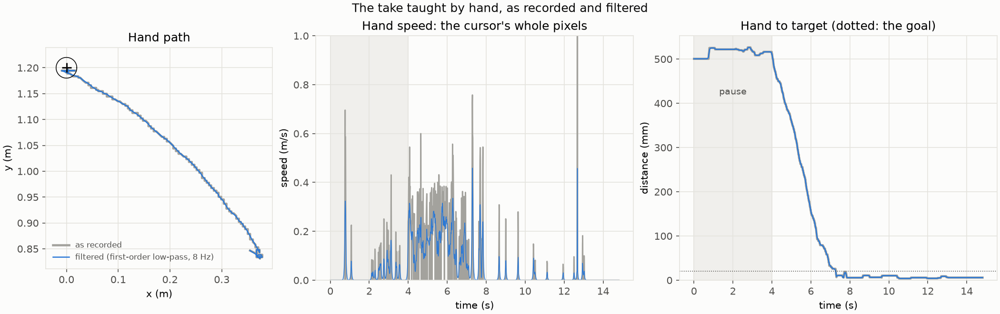
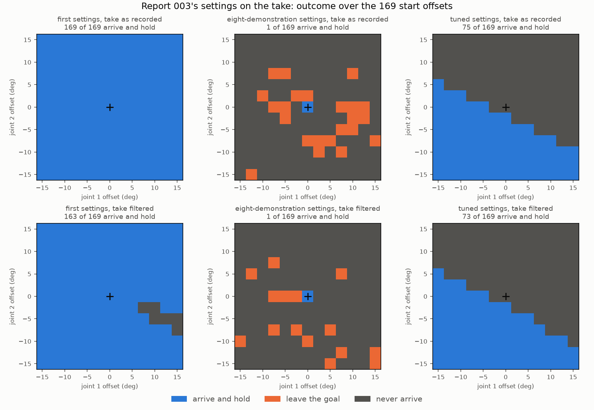
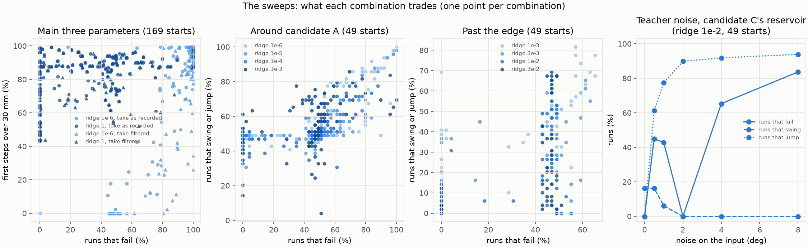
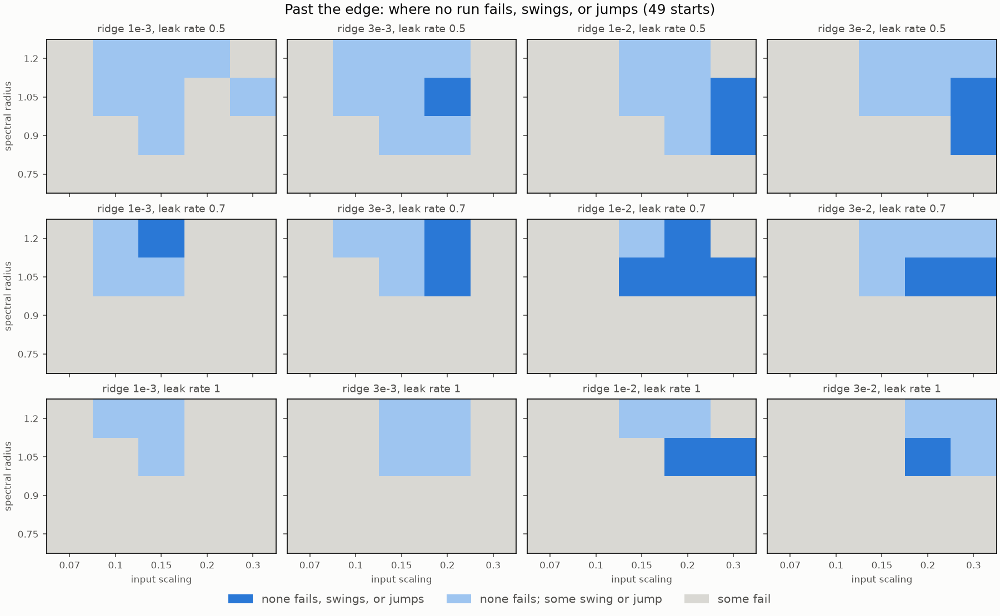
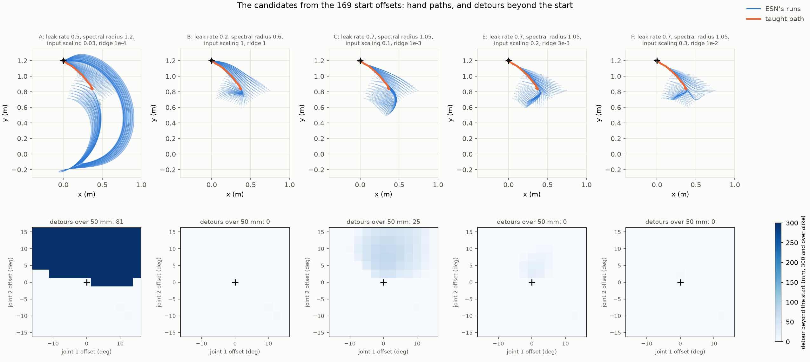
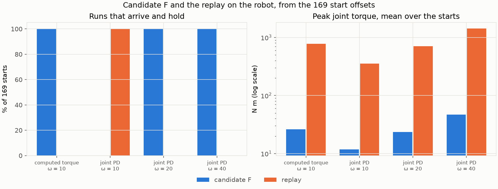
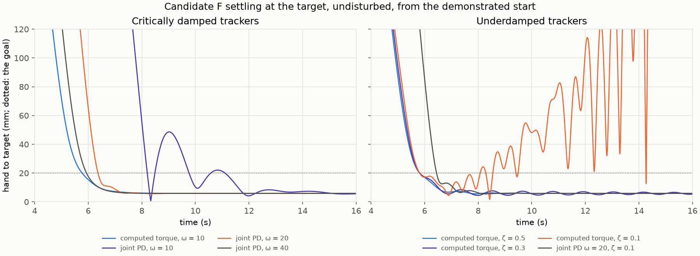
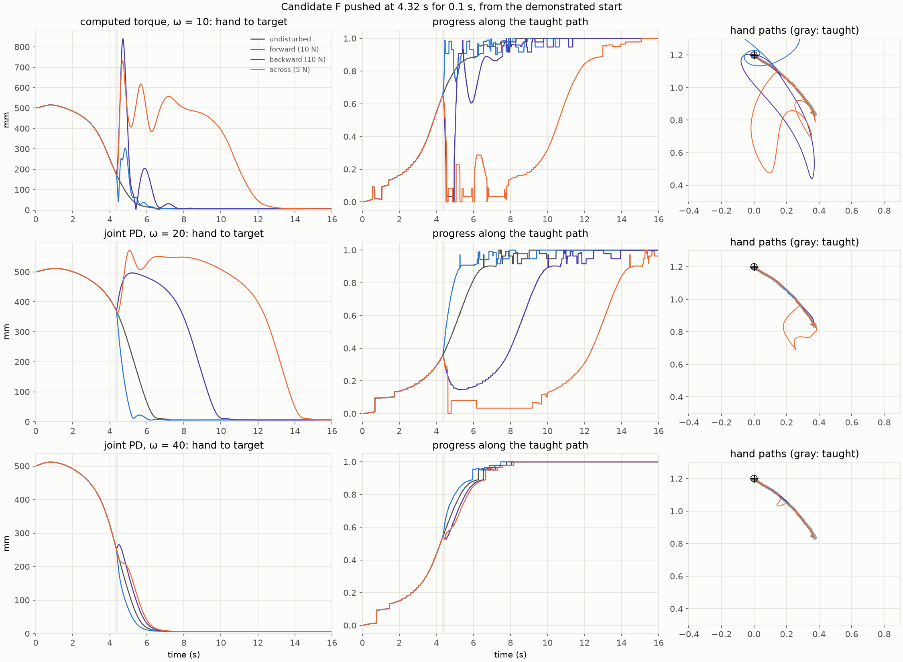

# 004 A demonstration taught by hand: from a pause and pixel steps to a mild return

**Summary.** Report 003's procedure was repeated with its scripted demonstration
replaced by one reach taught by hand: the arm's tip dragged with the mouse in
skelarm's trajectory recorder, from report 003's start posture to its target. The
ESN was trained on that one take and run from 169 start postures up to 15° away
in each joint, first on its own, then as the reference generator of the simulated
arm.

- **The take is not a scripted reach.**
  - *It pauses and corrects.* The hand waits for about 4 s before reaching, reaches
    in 3.3 s, and corrects once inside the goal, out to 18.9 mm of its 20 mm radius.
  - *It moves in pixel steps.* The recorder moves the tip with the cursor in whole
    screen pixels, 5.1 mm at a time: in 193 of the reach's 329 samples the hand does
    not move at all. A first-order zero-phase low-pass at 8 Hz smooths that away
    (joint jitter 0.067° to 0.010°) without overshooting the take; a 4th-order
    Butterworth filter overshot the correction out of the goal.
- **Report 003's settings do not suit it.** The tuned ESN never leaves where the
  hand paused, the eight-demonstration settings fail from every offset start and
  diverge on the robot, and only the first settings arrive from (almost) every start
  (169 trained on the take as recorded, 163 on it filtered), after a first-step jump
  of 36 mm on average.
- **The sweeps were ranked by robustness, then mildness**, as the person teaching
  asked: no run may fail, then the fewest runs that swing (stray from the taught
  path more than 50 mm beyond where they started), then the fewest that jump (a
  first step over 30 mm). How closely a run reproduces the take does not count.
  - *Each lever trades one for the other.* A strong ridge with a strong input makes
    the first step jump; a weak input lets the reservoir's own dynamics carry the
    runs on wide swings (candidate A); noise in teacher forcing removes the swings
    only by making about 90% of the first steps jump.
  - *A region does both.* With input scaling 0.2–0.3, ridge 3e-3 to 3e-2, spectral
    radius about 1.05, and leak rates 0.5–1, 17 combinations neither fail, swing,
    nor jump.
- **Candidate F returns to the taught path mildly.** With leak rate 0.7, spectral
  radius 1.05, input scaling 0.3, and ridge 1e-2, every one of the 169 runs arrives
  and holds, none strays more than 6 mm beyond its start's distance from the taught
  path, and no first step exceeds 23 mm. The runs gather onto the taught path itself
  about 1 s after the start, still about 0.55 m from the target, and keep much of
  the human's pause (median arrival 6.0 s, against the take's 7.3 s).
- **On the robot, F works with a stiff enough tracker.**
  - *From the offsets,* it arrives and holds from all 169 starts with computed
    torque (ω = 10 rad/s) and with joint PD at ω = 20 and 40 rad/s, at 23–47 N m of
    peak torque, where the replay, which jumps to the take's start, needs 709–1418 N m.
  - *Its reference adapts.* Held by the block, it waits; pushed forward or back
    along the reach, it arrives earlier or later, keeping within 6 mm of the taught
    path with joint PD at ω = 40 rad/s.
  - *A slow or ringing tracker makes it hunt.* With joint PD at ω = 10 rad/s, the arm
    oscillates around the target and no run holds. With lightly damped computed
    torque, the 10 N pushes make the arm diverge (damping ratio 0.5 or less), and at
    0.1 the arm leaves the target even undisturbed.
  - *Its weak spot is mid-path.* Pushed off the path mid-reach, across or backward
    with computed torque, F's reference falls back toward the start and the arm
    swings 0.39–0.45 m off the path before reaching again: the sweeps tested offsets
    around the start posture only.

## 1. Question

Report 003 trained an ESN on one scripted reach. Here the demonstration is taught
by a person, with what a person brings: a pause before moving, a slower and uneven
reach, a correction at the end, and, through the recorder, the cursor's whole
pixels. The questions:

1. **The take:** what does a reach taught by hand look like, and does the
   recorder's pixel resolution matter?
2. **Report 003's settings:** do they carry over to such a take, on their own and
   on the robot?
3. **A mild return:** can an ESN trained on the take return from an offset start
   to the taught path gradually, without jumping toward it and without swinging
   away first? In dynamical terms: can it have the taught trajectory as an
   attracting route, and the target as its equilibrium?
4. **The robot:** does such an ESN drive the arm well: from offset starts, under
   disturbances, and does the arm dwell at the target?

## 2. Setup

### The take

The take was recorded with skelarm's `tools/trajectory_recorder.py` in inverse-
kinematics mode at 100 Hz, from report 003's start posture (18.2°, 119.9°, the
hand 0.5 m from the target toward the lower right) to its target (0, 1.2 m, 20 mm
tolerance), dragging the tip with the mouse
([`reach_manual_single.toml`](../../experiments/demonstrations/reach_manual_single.toml)).
One take was recorded, and both the ESN and the robot's replay use it, so that
training and evaluation see the same trajectory. It lasts 14.8 s; nothing was
trimmed, the person's pause included.

[`import_demonstrations.py`](../../experiments/import_demonstrations.py) checks
the take and imports it twice:

- *as recorded* (`demo_00`), with the recorder's uneven sample times;
- *filtered* (`demo_00_filtered`): a first-order zero-phase low-pass at 8 Hz,
  skelarm's `smooth` (`kind = "lowpass"`), which only averages and so never takes
  the hand farther than it went.

Both must begin at the start posture, arrive within the goal and hold there for
2 s, and never move faster than 3 m/s between two samples.

### The ESN

The ESN of report 003, trained by teacher forcing on one take, joint angles
normalized to the take's range, run autonomously with its output fed back. Section
3.2 uses report 003's three settings; the sweeps of Section 3.4 vary the spectral
radius, the leak rate, the input scaling, the ridge, the warm-up, and noise in
teacher forcing:

- **Noisy teacher forcing** (Lukoševičius, *A Practical Guide to Applying Echo
  State Networks*, 2012, §5.2.1): the take is fed in four times, each with fresh
  Gaussian noise on the input, while the target stays the clean take one step
  ahead.

All ESNs have 400 neurons in Section 3.4 and after, 10% reservoir connections, a
bias, a 10 ms period, and seed 0.

### Start postures

As in report 003: the demonstrated start offset by −15° to 15° in each joint in
steps of 2.5° (169 starts). The sweeps around candidate A and past the edge use
steps of 5° (49 starts).

### Measures

There is no demonstrator, so every run is compared with the taught motion and the
target:

- **Arrive and hold:** the hand comes within 20 mm of the target and stays there
  for 2 s.
- **First step:** how far the hand moves in the ESN's first 10 ms step. A **jump**
  is a first step over 30 mm.
- **Detour:** how much farther from the taught hand path a run strays than where
  it started. A run **swings** when its detour exceeds 50 mm.
- **Route convergence** ([`route_convergence.py`](../../experiments/route_convergence.py)):
  the *spread* of a run at a time is the median distance of its hand from the
  routes the other runs take, regardless of timing; a run *joins* the common route
  when its spread stays below 20 mm. The *common route* is the run with the
  smallest mean spread before it reaches the goal.
- **Dwell** (on the robot): from 1 s after the arm arrives to the end, the hand's
  largest distance from the target and its RMS speed.

The sweeps rank their combinations by robustness: the fewest runs that fail, then
the fewest swings, then the fewest jumps (`[ranking]`), and keep every run's first
step and detour in `runs.csv`. How closely a run reproduces the take does not count.

### The robot

As in report 003: the two-link arm tracks the ESN's reference, driven by the
arm's measured posture, with computed torque or joint PD, both critically damped
at ω = 10 rad/s unless stated; the replay tracks the take by time. Every run lasts
16 s. The scenarios are report 003's: undisturbed (`nominal`), from the 169 offset
starts (`offsets`), pushes at the tip for 0.1 s, and the tip held by a stiff
spring-damper. The disturbances strike the take at the same point of its reach as
report 003's struck its scripted reach: the block at 4.1 s (the take's hand 3.4% of
the way to the target) until 4.6 s, and the pushes at 4.32 s (9.9%). The pushes
along the reach push candidate F with 10 N, the push across it with 5 N; report
003's ESNs were pushed with 5 N.

### Reproducing the results

The runs read the take in [`data/`](data) as
`results/demonstrations/20261006-152823-reach_manual_single` under the storage
root, and the robot runs read the trained ESNs (`esn.toml` and `esn.rclib`,
copied into their grid runs' directories here) by their run names. A run is found
by its name anywhere under `results/`; place or link the copies there to rerun.

| Runs | Command |
| --- | --- |
| [`20261006-152823-reach_manual_single`](data/20261006-152823-reach_manual_single) | `uv run python experiments/import_demonstrations.py experiments/demonstrations/reach_manual_single.toml` |
| `grid_*_settings_{raw,filtered}` (6) | `uv run python experiments/autonomous_esn.py experiments/manual_demonstration_autonomous_reaching/<name>.toml` |
| `states_*`, `warmup_*` (8) | `uv run python experiments/{reservoir_states,warmup_esn}.py experiments/manual_demonstration_autonomous_reaching/<name>.toml` |
| `sweep_*` (22) | `uv run python experiments/sweep_esn.py experiments/manual_demonstration_autonomous_reaching/<name>.toml` |
| `grid_candidate_*`, `route_candidate_*` (12) | `uv run python experiments/{autonomous_esn,route_convergence}.py experiments/manual_demonstration_autonomous_reaching/<name>.toml` |
| `<scenario>_<ESN>[_pd_gains\|_damping]_<take>` (90) | `uv run python experiments/robot_esn.py experiments/manual_demonstration_robot_tracking/<name>.toml` |
| [`summary`](results/summary) | `uv run python reports/004-manual-demonstration/make_figures.py --logs` |

The `<scenario>` is `nominal`, `offsets`, `push_across`, `push_forward`,
`push_backward`, or `block`; the `<ESN>` is `tuned` or `multi_demo_settings`
(report 003's robot ESNs) or `candidate_f`; the `<take>` is `raw` (as recorded) or
`filtered`. Each run's directory under [`results/`](results) is named after its
configuration, and its run record (`run.toml`) gives its commit:

| Commit | Runs |
| --- | --- |
| `e267b06` | the take's import |
| `8d3c941` | report 003's settings over the grid |
| `0178ce9` | their reservoir states and warm-up checks, and report 003's ESNs on the robot |
| `3671405`, `74e49d0` | the sweeps of the three main parameters, and of the ridge and warm-up |
| `5270e58`, `24893d1` | candidates A and B, and their routes |
| `dcbc851` | the sweeps around candidate A, and its noise |
| `f6b00a7`, `0b0023d` | the noise of the best around A, candidates C and D, and their routes |
| `9768dac`, `4b2b7ca`, `c32c073` | the sweeps past the edge, candidates E and F, and their routes |
| `5ff8465`, `64e7666` | candidate F on the robot; its pushes along the reach at 10 N |

All runs are deterministic. Each run directory here holds its configuration, its
run record, and its metrics (`metrics.csv`, `sweep.csv` and `runs.csv`,
`states.csv`, `warmup.csv`, or `convergence.csv`); the grid runs of the ESNs used
on the robot or in the interactive app also hold the trained ESN, and the
candidates their maps (`grid.png`, `convergence.png`).
[`make_figures.py`](make_figures.py) draws the figures of
[`results/summary`](results/summary) and prints the tables of Section 3 from those
copies; with `--logs`, it reads the runs' logs under the storage root, which are not
kept in Git, to draw `candidates.png`, `dwell.png`, and `pushes.png` and write
`candidates.csv`, `dwell.csv`, and `pushes.csv`.

## 3. Results

### 3.1 The take: a pause, a correction, and pixel steps

| | As recorded | Filtered |
| --- | --- | --- |
| first moves (5 mm) | 0.76 s (the grab) | 0.75 s |
| arrives | 7.29 s | 7.27 s |
| peak hand speed | 2.13 m/s | 0.46 m/s |
| joint jitter | 0.067° | 0.010° |
| final distance to the target | 5.9 mm | 5.9 mm |

- **A person's reach.** At the grab, the hand moves about 2 cm away from the
  target; it then waits until about 4 s, reaches in 3.3 s, arrives at 7.3 s,
  corrects once inside the goal, and holds still until the take ends at 14.8 s.
- **Pixel steps.** The recorder moves the tip with the cursor, in whole pixels of
  a few millimeters at the window's scale. During the reach (4.0–7.3 s) the hand
  stands still in 193 of 329 samples, then steps 5.1 mm (median, up to 7.7 mm). The
  peak speed of 2.13 m/s is one such step, 3.5 mm, logged 1.5 ms after an 18.6 ms gap
  of the recorder's clock, at 12.7 s during the hold.
- **The filter must not overshoot.** After arriving, the hand corrects out to 18.9
  mm from the target, 1.1 mm inside the goal. A 4th-order Butterworth filter at
  8 Hz overshoots that to 20.8 mm, out of the goal, so its filtered take failed the
  import's checks; the first-order low-pass keeps it at 17.4 mm.

### 3.2 Report 003's settings on the take

| Settings | Take | Arrive and hold (of 169) | First step, offset starts (mean) | From the demonstrated start |
| --- | --- | --- | --- | --- |
| first | as recorded | 169 | 36 mm | arrives at 7.0 s, joint error 0.9° |
| first | filtered | 163 | 36 mm | arrives at 7.0 s, joint error 1.0° |
| eight-demonstration | as recorded | 1 | 816 mm | arrives at 7.3 s, joint error 0.8° |
| eight-demonstration | filtered | 1 | 681 mm | arrives at 7.2 s, joint error 0.4° |
| tuned | as recorded | 75 | 117 mm | never leaves: ends 511 mm from the target |
| tuned | filtered | 73 | 117 mm | never leaves: ends 511 mm from the target |

- **The tuned ESN stays where the hand paused.** It follows the take's grab move,
  2 cm away from the target, and stops there: the take's start posture is followed
  by more of the same for about 4 s, and this ESN, which picks its next posture from
  the current one, holds it. From the starts with the elbow less bent (the lower part
  of the grid) it reaches, but without the pause, 5.7 s earlier than the take.
- **The eight-demonstration settings replay the take's timing,** from the
  demonstrated start only: they arrive within 0.1 s of the take, and the ESN trained
  on the take as recorded even keeps some of its steps (18 speed peaks, against 1 for
  the first settings). From every offset start the first step lands 0.7–0.8 m away, and the
  run never arrives or leaves the goal; no warm-up from 0 to 2.5 s changes that, and
  no offset run joins the take's reservoir states.
- **The first settings arrive from every start,** after a first-step jump of 36 mm
  on average. They wait out the pause once warmed up for 0.25 s or more (without a
  warm-up they skip it and arrive 4.5 s early), and they time the reach from their
  state, not from the reset: longer warm-ups do not move the arrival.
- **Filtering moves their timing, not their path.** Trained on the take as
  recorded, the first settings' offset runs lead the take by 0.81 s during the
  reach; trained on it filtered, they lag it by 0.68 s. Every ESN smooths the
  pixel steps away by itself: the first settings' output jitter is 0.0006°, against
  the take's 0.073°.

### 3.3 Report 003's ESNs on the robot

Report 003's two robot ESNs, the tuned one and the eight-demonstration one, ran
through the six scenarios, trained on the take as recorded and filtered:

- **The tuned ESN stays put** in every scenario but one, its arm 511 mm from the
  target. The backward push knocks the arm out of the paused posture, and then the
  ESN reaches and holds (1.4 s later than the take, trained on the take as recorded).
- **The eight-demonstration ESN diverges** in every scenario, undisturbed included:
  joint errors of 88–144° from the take, the arm ending 1.2–1.4 m from the target.
  On the robot it is driven by the measured posture, so every tracking error is an
  offset, and it fails from every offset.
- **The pixel steps cost the replay torque.** Tracking the take as recorded, the
  replay's peak torque is 55 N m and its effort 444 N² m² s with computed torque,
  against 13.9 N m and 32 N² m² s tracking the take filtered (joint PD: 25.4 against
  7.4 N m).

### 3.4 Sweeps toward a mild return

The sweeps followed Lukoševičius's guide: first the three main reservoir
parameters (§3.3.1) on a coarse grid, then the ridge on a logarithmic grid (§4.2)
with the warm-up, then around the best, and past its edge (§3.3.4).

| Sweep | Combinations | No run fails | And none swings or jumps |
| --- | --- | --- | --- |
| spectral radius 0.3–1.5, leak rate 0.01–0.5, input scaling 0.03–3; ridge 1e-6 or 1; both takes (169 starts) | 600 | 61 | (jumps only: 1) |
| ridge 1e-8–100 × warm-up 0–4 s, for three reservoirs on both takes (169 starts) | 252 | 47 | (jumps only: 9) |
| around candidate A: input scaling 0.01–0.1, spectral radius 0.9–1.5, leak rate 0.3–1; ridge 1e-6–1e-3 | 500 | 41 | 0 |
| noise in teacher forcing, 0–8°, for four reservoirs, against the ridge | 96 | 16 | 0 |
| past the edge: input scaling 0.07–0.3, spectral radius 0.75–1.2, leak rate 0.5–1; ridge 1e-3–3e-2 | 240 | 64 | **17** |

- **A strong ridge and input jump.** With ridge 1, 32 combinations on the take as
  recorded and 28 on it filtered arrive from every start, but each makes at least
  73 of the 169 first steps jump. Most likely, from an unseen posture the readout's
  output is pulled toward the posture it saw during the long pause.
- **A weak input swings.** With ridge 1e-6, input scaling 0.03, leak rate 0.5, and
  spectral radius 1.2, one combination arrives from every start with no first step
  over 18 mm. Its neighbors fail from 77–129 starts; the ridge and warm-up sweep
  widened it to ridge 1e-4 with any warm-up of 1 s or more, on both takes:
  candidate A. About half of its runs swing far first (Section 3.5).
- **Noise trades swings for jumps.** Noise on the teacher-forced input teaches the
  readout to steer an offset posture back, and does so within a step: for candidate
  A's reservoir, any noise from 0.5° makes 28–47 of 49 first steps jump; for
  candidate C's, the swings vanish at 2° only as 90% of the first steps jump.
- **Between them lies a region.** Around candidate A, the best combinations moved
  to the grid's largest input scaling (0.1) and ridge (1e-3): candidates C and D.
  Past that edge, 17 combinations neither fail, swing, nor jump, most with input
  scaling 0.2–0.3, ridge 3e-3 to 3e-2, and spectral radius 1.05:

### 3.5 Candidates and their routes

| Candidate | Leak rate, spectral radius, input scaling, ridge | Detours over 50 mm (largest) | First steps over 30 mm (largest) | Median arrival (from the demonstrated start) | Runs join the common route at (median) |
| --- | --- | --- | --- | --- | --- |
| A | 0.5, 1.2, 0.03, 1e-4 | 81 (943 mm) | 0 (21 mm) | 2.6 s (5.1 s) | 2.4 s, 49 mm from the target |
| B | 0.2, 0.6, 1, 1 | 0 (5 mm) | 73 (166 mm) | 6.9 s (6.0 s) | 1.3 s, 535 mm |
| C | 0.7, 1.05, 0.1, 1e-3 | 25 (79 mm) | 0 (16 mm) | 4.0 s (5.4 s) | 0.9 s, 488 mm |
| D | 0.5, 1.05, 0.1, 1e-3 | 38 (109 mm) | 0 (18 mm) | 3.5 s (5.5 s) | 1.2 s, 355 mm |
| E | 0.7, 1.05, 0.2, 3e-3 | 0 (27 mm) | 0 (20 mm) | 3.7 s (5.8 s) | 0.9 s, 459 mm |
| **F** | **0.7, 1.05, 0.3, 1e-2** | **0 (6 mm)** | **0 (23 mm)** | **6.0 s (5.8 s)** | **1.0 s, 548 mm** |

All six arrive and hold from all 169 starts; the take arrives at 7.3 s.

- **Candidate A has two basins.** Its start space splits sharply near the
  demonstrated start, along a joint-2 offset of about +2.5°. The 88 runs that start
  with the elbow less bent return gradually onto the taught path (detours of 0–5 mm);
  the 81 that start with it more bent swing about 1 m, the arm folding until the
  hand passes near the base at (0, −0.2 m), and come back along an outer arc. The
  runs meet only on the final approach. The demonstrated start lies on the boundary,
  so a small deviation decides which way A goes
  ([its routes](results/20261006-203127-route_candidate_a_raw/convergence.png)).
- **Candidate B snaps, then follows.** Its runs join the taught path itself early,
  but by jumping toward it in their first step.
- **Candidates E and F have the taught path as their attracting route.** Every
  run gathers onto a route within 3–5 mm of the taught path about 1 s after the
  start, still about half a meter from the target, and follows it to the target,
  where it holds; the distance from the taught path grows smoothly with the start's
  offset, with no boundary like A's
  ([F's routes](results/20261006-223252-route_candidate_f_raw/convergence.png)).
  F's output is smooth: a median jitter of 0.0025° and at most 4 speed peaks,
  against the take's 0.073° and 94.
- **F keeps much of the pause.** The median run holds still for about 2 s before
  reaching; runs from below the start first gather in a channel that leads to the
  start of the taught path. Candidate F was chosen with the interactive app
  (`tools/esn_reference_app.py`) for the robot.

### 3.6 Candidate F on the robot: offsets and the dwell at the target

| Tracker | F: arrive and hold (of 169) | F: peak torque (mean) | F: first step (mean) | Replay: arrive and hold | Replay: peak torque |
| --- | --- | --- | --- | --- | --- |
| computed torque, ω = 10 | 169 | 26 N m | 1.9 mm | 0 | 774 N m |
| joint PD, ω = 10 | 0 | 12 N m | 0.8 mm | 169 | 354 N m |
| joint PD, ω = 20 | 169 | 23 N m | 1.5 mm | 0 | 709 N m |
| joint PD, ω = 40 | 169 | 47 N m | 2.6 mm | 0 | 1418 N m |

- **F returns mildly on the robot too.** Its reference peaks at about 40°/s on
  average, against the replay's jump to the take's start at about 1000°/s, and its
  peak torques are about 3% of the replay's.
- **The replay's holds fail on the take's correction,** not on its tracking: the
  stiff trackers reproduce the take's correction out to the edge of the goal, and
  past it. With the slow joint PD it passes.

| Tracker | Undisturbed (nominal and the 169 offsets): runs that hold; hand after arrival (largest distance, RMS speed) |
| --- | --- |
| computed torque, ω = 10 | 170 of 170; within 9 mm, 1.2 mm/s |
| joint PD, ω = 10 | 0 of 170; out to 56 mm, 40 mm/s: it hunts |
| joint PD, ω = 20 | 170 of 170; within 6 mm, 2.3 mm/s |
| joint PD, ω = 40 | 170 of 170; within 7 mm, 0.6 mm/s |
| computed torque, ω = 10, ζ = 0.5 | 3 of 3 (nominal and two offsets); within 11 mm, 6.9 mm/s |
| computed torque, ω = 10, ζ = 0.3 | 1 of 3; out to 35 mm, 87 mm/s |
| computed torque, ω = 10, ζ = 0.1 | 1 of 3; the arm leaves the target, undisturbed |
| joint PD, ω = 20, ζ = 0.1 | 3 of 3; within 8 mm, 3.2 mm/s |

- **A slow or lightly damped tracker makes the arm hunt.** F is driven by the
  measured posture and steers toward the taught path; a tracker that lags (joint PD
  at ω = 10 rad/s) or rings (computed torque at ζ ≤ 0.5) closes a second loop
  around the tracker's own. With joint PD at ω = 10 rad/s, the arm overshoots the
  target and swings back for about 4 s; with computed torque at ζ = 0.1, the
  oscillation grows until the arm leaves.
- **Joint PD at ω ≥ 20 rad/s dwells still at any damping ratio** from 1 to 0.1, as
  computed torque does when critically damped.

### 3.7 Candidate F under disturbances

| Tracker | Push | F's arrival (shift from undisturbed) | Holds | Strays from the taught path | Peak torque: F, replay |
| --- | --- | --- | --- | --- | --- |
| joint PD, ω = 40 | forward, 10 N | 5.63 s (−0.31 s) | yes | 4 mm | 7.0, 63.2 N m |
| joint PD, ω = 40 | backward, 10 N | 6.21 s (+0.27 s) | yes | 6 mm | 7.0, 62.1 N m |
| joint PD, ω = 40 | across, 5 N | 6.34 s (+0.40 s) | yes | 52 mm | 3.7, 62.9 N m |
| joint PD, ω = 20 | forward, 10 N | 5.19 s (−1.18 s) | no: 2.5 mm past the goal's edge, settled 0.56 s later | 13 mm | 4.0, 28.8 N m |
| joint PD, ω = 20 | backward, 10 N | 9.85 s (+3.48 s) | yes | 11 mm | 4.2, 27.7 N m |
| joint PD, ω = 20 | across, 5 N | 14.26 s (+7.89 s) | yes | 181 mm | 4.2, 28.3 N m |
| computed torque, ω = 10 | forward, 10 N | 6.07 s (+0.29 s) | yes | 277 mm | 47.5, 29.7 N m |
| computed torque, ω = 10 | backward, 10 N | 5.39 s (−0.39 s) | no: swings back past the start, settles at 7.44 s | 392 mm | 39.4, 33.3 N m |
| computed torque, ω = 10 | across, 5 N | 12.53 s (+6.75 s) | yes | 453 mm | 22.9, 30.0 N m |

The replay arrives at 7.3 s whatever the push. The disturbances strike the take's
reach as it starts; F, which reaches about 2 s earlier, is then mid-reach.

- **With joint PD at ω = 40 rad/s, F's reference follows the arm's progress.**
  Pushed forward, it skips ahead; pushed back, it waits; pushed across, it rejoins
  the taught path; it keeps within 6 mm of the taught path along it, at a tenth of the
  replay's torque.
- **Pushed back to its start, F waits again.** With joint PD at ω = 20 rad/s, the
  10 N backward push carries the arm back to about the start posture; F treats it as
  the start and waits out part of the pause again before reaching, 3.5 s later than
  undisturbed, still on the taught path.
- **Mid-path, off the path, F's flow still swings.** With computed torque at
  ω = 10 rad/s, the pushes carry the mid-reach arm off the path. Pushed forward, the
  arm overshoots past the target and loops back (277 mm off the path). Pushed backward
  or across, the reference falls back toward the start, and the arm swings out to
  0.73–0.84 m from the target, 0.39–0.45 m off the path, before reaching again. The
  sweeps tested offsets around the start posture only.
- **The block: F waits.** With computed torque, F's reference stops while the tip
  is held, then goes on: it arrives at 6.5 s and holds, at 12.1 N m of peak torque
  against the replay's 40.2 N m (joint PD at ω = 40 rad/s: 17.6 against 168.4 N m).
- **Underdamped computed torque does not survive the pushes.** At ζ = 0.5 the
  arm never arrives after the 10 N pushes, and at ζ ≤ 0.3 after any push. Joint PD
  at ω = 20 rad/s arrives after every push at every damping ratio from 1 to 0.1,
  holding except after the forward push, where it briefly overshoots the goal's
  edge.

## 4. Observations

- **A person's take carries more than the reach.** Its pause, its grab move, and
  its final correction are part of what the ESN learns: the tuned settings learned
  the pause as a place to stay, candidate F waits out the pause when it is returned
  to the start. The correction near the goal's edge also decides the replay's holds.
- **The recorder's pixels are a measurement artifact, and the ESNs filter them.**
  Every ESN's output was smooth whether trained on the take as recorded or
  filtered; the pixel steps mattered for the replay, which tracks them (four times
  the torque), and, through the timing of the reach, for the first settings.
- **Mildness is a balance of input, memory, and regularization.** A strong input
  with a strong ridge maps an unseen posture back toward the training data at once
  (a jump); a weak input lets the reservoir's own dynamics carry the run, which,
  far from the take, includes wide swings and a boundary between basins. Input
  scaling 0.2–0.3 with a moderate ridge (3e-3 to 3e-2) and a spectral radius near 1
  gives a flow that returns onto the taught path within about a second, without
  either. Noise in teacher forcing pushes toward the jump.
- **The taught trajectory can be an attracting route.** Candidates E and F gather
  every run from 169 starts onto the taught path well before the target, where they
  hold: an ESN trained on one take reproduces a flow with the taught path as its
  attracting route and the target as its equilibrium, at least around the start.
- **On the robot, the tracker is part of the loop.** An ESN that corrects toward
  the path adds feedback to the tracker's; together they need a tracker that is
  neither slow nor lightly damped.

## 5. Next steps

1. **Robustness along the path:** add start postures, or perturbations of the
   running ESN, partway along the taught path, off to its sides, and rank the sweeps
   with them; the across and backward pushes showed that F's flow still swings there.
2. **Disturbances at F's own timing:** strike F early in its reach (2.1 s and
   2.7 s, when its hand is 3.4% and 9.9% of the way), as report 003 struck its
   reaches.
3. **Several takes:** train one ESN on several takes taught by hand, the next step
   decided before this one.
4. **Recording:** a finer recorder resolution (a larger window, or sub-pixel
   input) would remove the pixel steps at the source.
