# 005 A remade arm, and an ESN tuned on the robot

**Summary.** Report 004's experiment was repeated on a remade arm, half the size,
with a new take taught by hand, and with the ESN tuned in a new way: not by its
runs on its own, but by how closely the robot, driven by it through the tracker,
follows the taught path.

- **The take** reaches across the arm's workspace, 1.25 m, without the pause of
  report 004's: the hand starts moving at 0.64 s and arrives at 9.64 s. It is
  filtered at 2 Hz rather than 8 Hz: the slow hand crosses the screen's pixels in
  steps that an 8 Hz filter leaves as a train of speed spikes.
- **The tracker** is the one asked for: computed torque and joint PD at
  ω = 20 rad/s, lightly damped (ζ = 0.1), given a zero reference velocity (report
  004, Section 3.10).
- **The score** is the path RMSE from the taught motion: the RMS distance between
  the robot's hand path and the taught one, measured both ways and regardless of
  timing, so that arriving late or waiting costs nothing. A combination must first
  arrive and hold with both trackers.
- **The search** went from 29.9 mm, a first ESN trained with report 004's candidate
  F's settings changed by hand, which arrived at 19 s, to about 1 mm, arriving at
  about 10 s like the take. A slow leak rate (0.03 to 0.05), a strong input (input
  scaling 2), and a spectral radius just below 1 (0.99) did best; the ridge (1e-2)
  and the warm-up mattered little, and the random reservoir as much as the settings.
- **Two ESNs were validated.** The seed check's ESN (leak rate 0.03, seed 4), the
  best seed of the most reliable combination of the last stage, is the more robust:
  48 of 49 offset starts arrive and hold. The chosen ESN (leak rate 0.05, seed 0)
  follows the taught path within 1.0 mm undisturbed and 5.4 mm under a block of
  1 s in mid-reach (the seed check's 10.4 to 10.7 mm), but fails from 19 of the 21
  starts with the elbow straighter. It was chosen for how it yields: pushed, its arm
  is carried 10–60% farther off the path and returns more slowly; held, it waits,
  pressing with 1 to 2 N at the release, against the seed check's 3 to 5 N and the
  replay's 18 to 20 N.

## 1. Question

Reports 003 and 004 tuned the ESN on its own runs, then put it on the robot. The
robot's tracker then lags or rings, and the ESN, driven by the measured posture,
answers to that. Here:

1. **A remade arm:** does report 004's procedure carry over to another arm, start,
   and target, with a new take?
2. **Tuning on the robot:** if each candidate ESN is scored by how the robot follows
   the taught path with it, with the tracker to be used, which settings win, and
   how much does the random reservoir matter?
3. **The chosen ESN:** how does it behave from offset starts, under a block, and
   under pushes, against the replay of the take?

## 2. Setup

### The arm and the take

The arm is report 004's at half size, with its proportions: links of 0.5 m and
0.4 m, 1 kg per meter of link, an inertia about the center of mass of 0.1 m L²
(0.5 kg and 0.0125 kg m², then 0.4 kg and 0.0064 kg m²), and the centers of mass at
the middle ([`reach_manual_v2.toml`](../../experiments/demonstrations/reach_manual_v2.toml)).
Its joint inertia is an eighth of report 004's arm's. The start posture is
(30°, 30°), the hand at (0.633, 0.596) m, and the target (−0.6, 0.4) m, 1.249 m
away, with a goal radius of 20 mm.

One take was recorded with skelarm's trajectory recorder and imported
([`data/`](data)). The import keeps it as recorded (`demo_00`) and filtered by a
first-order zero-phase low-pass (`demo_00_filtered`), at 2 Hz (Section 3.1). The
ESNs are trained on the filtered take, and the replay replays it.

### The ESN and the tracker

The ESN is report 004's: 400 neurons, a 10 ms period, driven by the arm's measured
joint angles, its output the next posture of the reference, with the settings
swept below. The tracker, for every run, is computed torque and joint PD at
ω = 20 rad/s with damping ratio 0.1, given a zero reference velocity, so that the
derivative term damps the arm's own velocity. Report 004 found that such a tracker
lets the arm trail its reference and makes an ESN driven by the measured posture
wait for it (Section 3.10 there).

### Measures

- **Path RMSE** (`taught_path_rmse_m`, `arm_esn_ctrl.metrics.path_rmse`): both
  hand paths, the run's and the taught one, are resampled every 5 mm along their
  length, and the result is the RMS, over the points of both, of each point's
  distance to the other path. A slow stretch or a pause adds nothing; a part of the
  taught path that the run skips counts by how far it lies from the run's path.
- **The requirement:** the hand arrives within the goal and stays there for the
  whole 2 s hold window, with both trackers. The sweeps run 22 s, so that an ESN
  arriving at up to 20 s can show its hold.
- **Ranking:** the fewest failed runs, then the worst path RMSE of the two trackers.
- **Also reported:** the RMS distance from the taught hand at equal times
  (`taught_tip_error_m`), which counts lateness; the path RMSE of the ESN's output
  (`reference_path_rmse_m`), which separates the ESN's error from the tracker's; the
  arrival time; the first step; the peak torque; and, under a disturbance, the
  reference's lead over the arm at its end (`reference_lead`).

### The search

[`sweep_robot_esn.py`](../../experiments/sweep_robot_esn.py) trains each combination
of the swept ESN settings on the filtered take and runs it on the robot from the
demonstrated start, undisturbed, with both trackers. The stages:

| Stage | Swept | Combinations |
| --- | --- | --- |
| 0 | the first ESN (`grid_test_filtered`: leak rate 0.7, spectral radius 0.95, input scaling 0.1, sparsity 0.05) | 1 |
| 1 | leak rate 0.1–1 × spectral radius 0.5–0.99 × input scaling 0.03–1.5 (spectral radius below 1, input scaling up to 1.5, as asked) | 180 |
| 2 | ridge 1e-6–10 × warm-up 0.25–2 s, around the best three of stage 1 | 84 |
| 3 | leak rate 0.05–0.3 × spectral radius 0.5–0.99 × input scaling 1–3; then leak rates 0.02–0.04; then 200–800 neurons × sparsity 0.02–0.2 | 130 |
| 4 | seeds 0–9 of the five best combinations | 50 |

The other settings stay at ridge 1e-2, a 1 s warm-up, 400 neurons, and sparsity
0.05.

### Scenarios

The ESNs chosen are then validated with
[`robot_esn.py`](../../experiments/robot_esn.py), 22 s runs with both trackers:

- **nominal:** undisturbed, from the demonstrated start;
- **block:** the tip held by a stiff spring-damper (20000 N/m, 100 N s/m) for 1 s
  in mid-reach, from 4.5 s, when the take's hand is 32% of the way to the target
  and moving, to 5.5 s (44%);
- **offsets:** the demonstrated start offset by −15° to 15° in each joint, every 5°
  (49 starts);
- **pushes:** three pushes of 0.2 s at the tip, tuned by hand, each 10° off a
  direction of the reach (`angle_deg`, counterclockwise from the direction toward
  the target): 4 N at −170° (nearly backward) at 4 s, 5 N at 80° (nearly across) at
  8 s, and 4 N at −80° (nearly across the other way) at 13 s, after the arrival and
  its hold. A push's direction is fixed for the run by the start posture, so that
  every arm from the same start meets the same forces at the same times.

### Reproducing the results

The runs read the take in [`data/`](data) as
`results/demonstrations/20261008-170034-reach_manual_v2` under the storage root, and
the robot runs read the trained ESNs (`esn.toml` and `esn.rclib`, copied into their
runs' directories here) by their run names. A run is found by its name anywhere
under `results/`; place or link the copies there to rerun.

| Runs | Command |
| --- | --- |
| [`20261008-170034-reach_manual_v2`](data/20261008-170034-reach_manual_v2) | `uv run python experiments/import_demonstrations.py experiments/demonstrations/reach_manual_v2.toml` |
| `grid_*_filtered` (5) | `uv run python experiments/autonomous_esn.py experiments/manual_demonstration_v2_autonomous_reaching/<name>.toml` |
| `sweep_robot_*` (22) | `uv run python experiments/sweep_robot_esn.py experiments/manual_demonstration_v2_robot_tracking/<name>.toml` |
| `<scenario>_test_filtered`, `<scenario>_robot_<ESN>_filtered` (10) | `uv run python experiments/robot_esn.py experiments/manual_demonstration_v2_robot_tracking/<name>.toml` |
| [`summary`](results/summary) | `uv run python reports/005-tuned-on-the-robot/make_figures.py --logs --animations` |

The `<ESN>` is `best` (the best of stage 1), `fine_best` (the chosen one, the best
of the finer grid with seed 0), or `final` (the seed check's choice). Each run's
directory under [`results/`](results) is named after its configuration, and its run
record (`run.toml`) gives its commit:

| Commit | Runs |
| --- | --- |
| `2d61479` | the take's import, filtered at 2 Hz |
| `980f0a3` | the first ESN (its record shows uncommitted changes: the robot configuration, then untracked; its own configuration is the commit's) |
| `b2edb3b` | the first ESN on the robot |
| `fb9f0cd` | stages 0 and 1 |
| `f478a55`, `e7300f7` | the best ESN of stage 1, trained and on the robot |
| `f1b11c9` | stage 2 |
| `da38401`, `c11a686`, `6146f1a`, `836f4f4`, `516337b` | stage 3: the finer grid, its best ESN (the chosen one), the slower leak rates, their best ESN, and the reservoir's size |
| `a4f9572`, `f6466f5` | stage 4, and the ESN of its choice |
| `9b7b182`, `a893294` | the validation of the two ESNs, undisturbed and from the offsets |
| `fd4faf6`, `b9b16dd` | the pushes of the seed check's ESN; the chosen ESN's undisturbed and pushes runs, with `torques.png` |
| `513ad39` | the block of both ESNs, for 1 s in mid-reach |

All runs are deterministic. Each run directory here holds its configuration, its
run record, and its metrics (`metrics.csv`, or `sweep.csv` and `runs.csv` with the
heatmaps of `sweep.png`); the grid runs also hold the trained ESN and their maps
(`grid.png`), and the offsets runs theirs. [`make_figures.py`](make_figures.py)
draws `take.png`, `stage1.png`, `stage3.png`, and `seeds.png` and prints the tables
of Section 3 from those copies. With `--logs`, it reads the runs' logs under the
storage root, which are not kept in Git, to draw the chosen ESN's joint angles and
torques (`<scenario>_joints.png`, `<scenario>_torques.png`, with `robot_esn.py`'s
own functions) and the arms' distance from the taught path under the pushes
(`flexibility.png`, `flexibility.csv`), and to print the forces and the return
under the block. With `--animations`, it exports `nominal.gif`, `block.gif`,
`pushes.gif`, `offset.gif`, and `offset_failure.gif`, each arm rendered by
skelarm's player.

## 3. Results

### 3.1 The take, and its filter

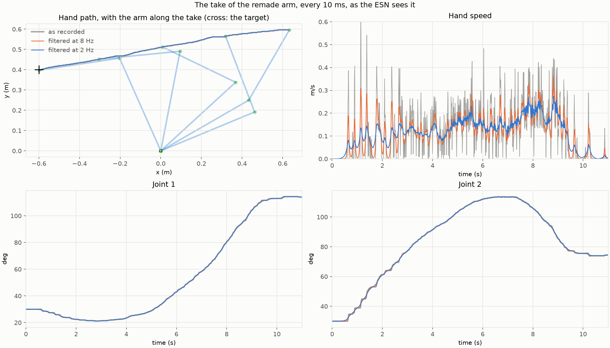

The faint arms in the hand path are five postures of the 2 Hz take, spread evenly
along its path: the start, the end, and three between.

| | Moves | Arrives | Length | Joint jitter | Final error |
| --- | --- | --- | --- | --- | --- |
| As recorded (`demo_00`) | 0.64 s | 9.64 s | 18.47 s | 0.113° | 2.8 mm |
| Filtered at 2 Hz (`demo_00_filtered`) | 0.61 s | 9.58 s | 18.47 s | 0.005° | 2.8 mm |

- **The hand moves at once and evenly.** It leaves the start at 0.64 s, is 32% of
  the way at 4.5 s and 50% at 5.92 s, and is in the goal at 9.64 s, along a nearly
  straight line; joint 2 bends to 114° on the way and opens again. It never leaves
  the goal after arriving.
- **The pixels show more than in report 004.** The hand is slower and the arm
  smaller: 47% of the samples during the reach do not move, and the median step is
  2.7 mm. Filtered at 8 Hz, as in report 004, the speed is still a train of spikes;
  at 2 Hz it is a continuous profile, its RMS hand acceleration at 10 ms down from
  1.71 to 0.74 m/s² (6.63 as recorded), while the hand stays within 8.5 mm of the
  take at every moment.
  Below about 1 Hz, the zero-phase filter would spread the reach back into the start
  and move the start posture.

### 3.2 A first ESN

The first ESN (`grid_test_filtered`: leak rate 0.7, spectral radius 0.95, input
scaling 0.1, ridge 1e-2, sparsity 0.05) arrives and holds from all 49 starts on its
own. On the robot with the tracker above, from the demonstrated start, it reaches
the target only at 18.8 s (computed torque) and 19.1 s (joint PD), against the
take's 9.6 s, its path 29.0 and 29.9 mm off the taught one: the slowness report 004
found with a zero reference velocity.

### 3.3 Stage 1: the main parameters

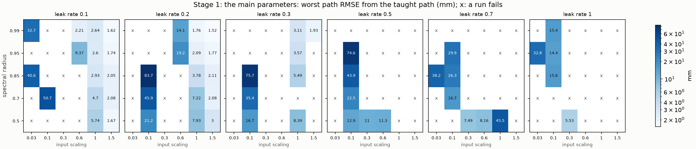

56 of the 180 combinations arrive and hold with both trackers.

- **A strong input is what matters.** At leak rates 0.1 and 0.2, every combination
  with input scaling 1 or 1.5 holds, at 1.5 to 8 mm. With input scaling 0.03 to 0.3,
  most combinations fail (196 of the 243 failed runs never arrive), and the 24 that
  hold stray 5.5 to 84 mm.
- **A slow leak rate wins.** The best at each leak rate: 1.62 mm (0.1), 1.52 mm
  (0.2), 1.93 mm (0.3, arriving at 19.8 s), then 5.5 to 11 mm (0.5 to 1).
- **The best, leak rate 0.2, spectral radius 0.99, input scaling 1.5 (1.52 mm),**
  lies at the edge of the input scaling swept.
- **The error left is the ESN's.** In every combination that holds, the path RMSE
  of the ESN's output is within 3% of the arm's: the tracker follows it closely, and
  it is the output's path that strays.

### 3.4 Stage 2: the ridge and the warm-up

Around the best three of stage 1 (leak rate and spectral radius 0.2 and 0.99, 0.1
and 0.99, 0.1 and 0.5; input scaling 1.5), the worst path RMSE (mm), over the four
warm-ups; `*` marks a failed run:

| Leak rate, spectral radius | Ridge 1e-6 | 1e-4 | 1e-3 | 1e-2 | 0.1 | 1 | 10 |
| --- | --- | --- | --- | --- | --- | --- | --- |
| 0.2, 0.99 | 229–264* | 2.0–2.4 | 1.48–1.52 | 1.45–1.63 | 3.5–3.6 | 2.5 | 2.2–2.3 |
| 0.1, 0.99 | 138–395* | 3.9–203* | 1.8–2.2 | 1.47–1.62 | 1.9–2.1 | 2.9–3.3 | 2.4–2.5 |
| 0.1, 0.5 | 335–372* | 3.3–3.5 | 2.8–3.8 | 1.46–1.71 | 2.8–3.5 | 2.0–2.1 | 2.3–3.3 |

- **Ridge 1e-2 is as good as any.** At 1e-6 the ESN never brings the arm to the
  target; above 1e-2 every run holds, at 2 to 3.5 mm.
- **The warm-up hardly matters,** within about 0.2 mm from 0.25 to 2 s.

### 3.5 Stage 3: a finer grid

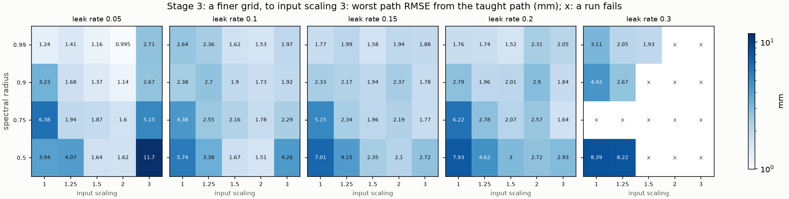

With the input scaling extended to 3, 87 of the 100 combinations hold.

- **Leak rate 0.05 takes the top six places,** from 1.00 mm (spectral radius 0.99,
  input scaling 2) to 1.41 mm; leak rates 0.1 to 0.2 reach 1.5 to 1.6 mm at best,
  and 0.3 fails often.
- **Input scaling 2 is the best;** at 3 the error grows again (2.7 to 12 mm at leak
  rate 0.05). Spectral radius 0.99 is again the best.
- **Slower leak rates:** 0.04 and 0.03 reach 0.92 and 0.96 mm (spectral radius
  0.99, input scaling 2), 0.02 1.20 mm at best: the bottom is flat from 0.03 to
  0.05. They arrive at 9.7 to 9.9 s, close to the take.
- **The reservoir's size and connectivity** (leak rate 0.04): 400 neurons with
  sparsity 0.05 stay the best (0.92 mm), but the others vary irregularly, from 0.93
  to 3.66 mm, without a trend: a different size or sparsity draws a different random
  reservoir.

### 3.6 Stage 4: the random reservoir

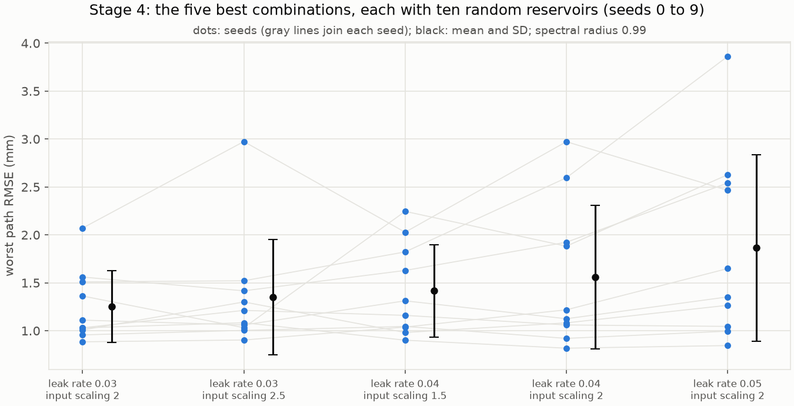

| Leak rate | Input scaling | Worst path RMSE, mean ± SD | Median | Min | Max |
| --- | --- | --- | --- | --- | --- |
| 0.03 | 2 | 1.25 ± 0.37 mm | 1.07 mm | 0.88 mm | 2.07 mm |
| 0.03 | 2.5 | 1.35 ± 0.60 mm | 1.15 mm | 0.90 mm | 2.97 mm |
| 0.04 | 1.5 | 1.42 ± 0.48 mm | 1.24 mm | 0.90 mm | 2.25 mm |
| 0.04 | 2 | 1.56 ± 0.75 mm | 1.17 mm | 0.82 mm | 2.97 mm |
| 0.05 | 2 | 1.86 ± 0.97 mm | 1.50 mm | 0.85 mm | 3.86 mm |

All with spectral radius 0.99; all 50 combinations hold.

- **The reservoir matters as much as the settings.** The spread over seeds (SD 0.4
  to 1 mm) is as large as the differences between the combinations. Seeds 3 and 8
  are among the four worst for every combination (1.5 to 3.9 mm), and seed 9 among
  the five best for every one, the best for three (0.82 to 1.08 mm).
- **Leak rate 0.03 with input scaling 2 is the most reliable,** with the smallest
  mean and spread; seed by seed, it beats leak rate 0.04 with the same input scaling
  for 8 of the 10 seeds. Its best seed, 4 (0.88 mm), was trained as the seed
  check's ESN (`grid_robot_final_filtered`).
- **The best of stage 3 had a good seed.** Leak rate 0.05 with seed 0 gave 1.00 mm;
  its mean over seeds is 1.86 mm.

### 3.7 Validation: two ESNs

| Scenario | Chosen ESN (leak rate 0.05, seed 0) | Seed check's ESN (leak rate 0.03, seed 4) | Replay |
| --- | --- | --- | --- |
| Nominal: path RMSE (computed torque / joint PD) | 0.92 / 1.00 mm | 0.79 / 0.88 mm | 0.13 / 0.85 mm |
| Nominal: arrival | 9.98 / 9.99 s | 9.75 / 9.74 s | 9.60 / 9.59 s |
| Block: path RMSE | 5.43 / 5.44 mm | 10.37 / 10.70 mm | 7.47 / 16.64 mm |
| Block: force at the grip (peak) | 10.6 / 10.3 N | 11.2 / 11.0 N | 9.4 / 11.3 N |
| Block: force at the release (pressing) | 1.3 / 2.3 N | 2.7 / 4.6 N | 18.5 / 20.0 N |
| Block: reference ahead of the hand at the release | 14 / 14 mm | 25 / 25 mm | 154 / 156 mm |
| Block: after the release, farthest from the path | 23 / 20 mm | 39 / 35 mm | 39 / 53 mm |
| Block: arrival | 10.58 / 10.60 s | 10.03 / 10.01 s | 9.60 / 9.59 s |
| Offsets: starts that arrive and hold | 30 / 30 of 49 | 48 / 48 of 49 | |
| Offsets: median path RMSE | 30.3 / 28.0 mm | 15.5 / 17.0 mm | |
| Offsets: median peak torque | 86 / 6.6 N m | 73 / 5.7 N m | |

Offset runs: [chosen](results/20261008-203445-offsets_robot_fine_best_filtered/grid.png),
[seed check's](results/20261008-200751-offsets_robot_final_filtered/grid.png).

- **Undisturbed, both follow the taught path within about 1 mm** and arrive within
  0.4 s of the take.
- **Under the block, the chosen ESN waits the more.** Each ESN's output stays
  near the held hand, 14 mm ahead of it at the release for the chosen ESN and
  25 mm for the seed check's, so each arm presses lightly: 1 to 2 N and 3 to 5 N
  at the release, against the replay's 18 to 20 N, whose reference runs 155 mm
  ahead. The peak force, about 10 N for every arm, is the grip's: the damper
  stopping the moving hand.
- **After the release, the chosen ESN keeps closer to the path.** Its arm lurches
  20 to 23 mm off the taught path and is back within 5 mm in 1.4 to 1.5 s; the
  seed check's, 35 to 39 mm and 2.4 s; the replay's, 39 to 53 mm, ringing. The chosen
  ESN then carries on about 1 s behind the take and arrives 0.6 s later than
  undisturbed; the seed check's, which waited less, 0.3 s later.
- **From the offsets they differ.** The chosen ESN fails from 19 of the 21 starts
  with the elbow straighter (a joint 2 offset of −5° to −15°); in each, it never
  arrives. The seed check's ESN fails from one, (+15°, −15°). The replay arrives and
  holds from all 49.
- **Computed torque passes on the reference's first step from an offset**, with
  its acceleration: median peak torques of 73 to 86 N m, against 5.7 to 6.6 N m with
  joint PD. The replay, whose reference jumps to the take's start, needs 125 and
  12 N m.

### 3.8 Pushes: how each ESN yields

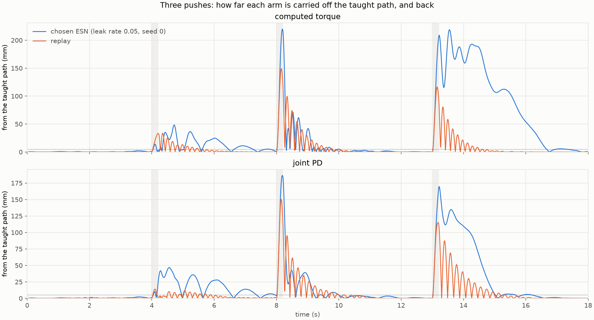

The farthest each arm is carried off the taught path after each push, and when it
settles back within 5 mm (counted from the push's end, until the next push or 4 s
after its onset):

| Arm | Tracker | Push at 4 s | Push at 8 s | Push at 13 s | Path RMSE |
| --- | --- | --- | --- | --- | --- |
| Chosen ESN | computed torque | 48 mm, 3.6 s | 220 mm, 1.8 s | 219 mm, not settled | 76.8 mm |
| Chosen ESN | joint PD | 47 mm, not settled | 187 mm, 1.8 s | 170 mm, 3.0 s | 53.9 mm |
| Seed check's ESN | computed torque | 38 mm, 3.6 s | 193 mm, 2.5 s | 157 mm, 3.1 s | 47.4 mm |
| Seed check's ESN | joint PD | 29 mm, 3.6 s | 169 mm, 3.0 s | 149 mm, 2.8 s | 42.4 mm |
| Replay | computed torque | 34 mm, 1.4 s | 149 mm, 1.6 s | 116 mm, 1.3 s | 34.1 mm |
| Replay | joint PD | 14 mm, 1.7 s | 150 mm, 2.0 s | 115 mm, 2.2 s | 32.7 mm |

All arms arrive (the ESNs at 10.3 s) and hold.

- **The chosen ESN yields more.** Every push carries its arm farther off the path,
  10 to 60% farther than the seed check's, and twice it is not back within the
  window: after the push at 13 s with computed torque, its arm wanders off for
  about 4 s before returning. Its reference gives way at once: at the end of the
  pushes at 8 and 13 s it is within 0.3% of the path of the arm, and after the
  backward push at 4 s 5 to 9% ahead, as the replay's (9%).
- **The seed check's ESN pulls back to the taught path more firmly,** as it does
  from the offsets.
- **The replay is the stiffest.** Its reference ignores the arm, so the tracker
  drags the arm straight back onto the take's course, ringing at ζ = 0.1.
- **The chosen ESN was chosen for this compliance,** after trying both in the robot
  app.

### 3.9 The chosen ESN, scenario by scenario

The animations show three arms side by side on one clock, each rendered by
skelarm's player; the purple dot is the target, the red arrow the force at the
tip. Each panel names the arm's reference, an ESN or the replay of the take by
time, and its tracker. In the pushes and the offset starts, the chosen ESN is set
beside the seed check's ESN (leak rate 0.03, seed 4), the other ESN validated in
Section 3.7, and the replay, all three through joint PD. The figures show the
chosen ESN's joint angles (the taught motion, thick gray; the ESN's output, dashed
blue; the ESN's arm, blue; the replay's arm, orange) and the joint torques, with
both trackers; the disturbances are shaded.

#### Nominal

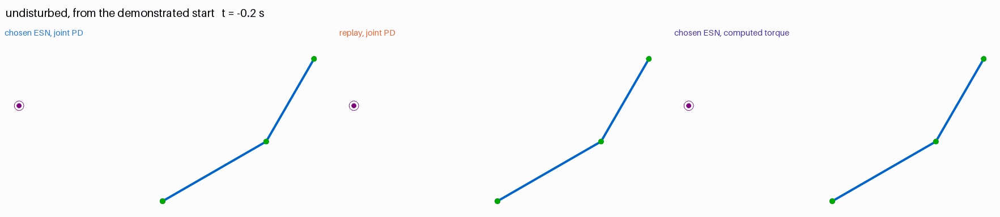

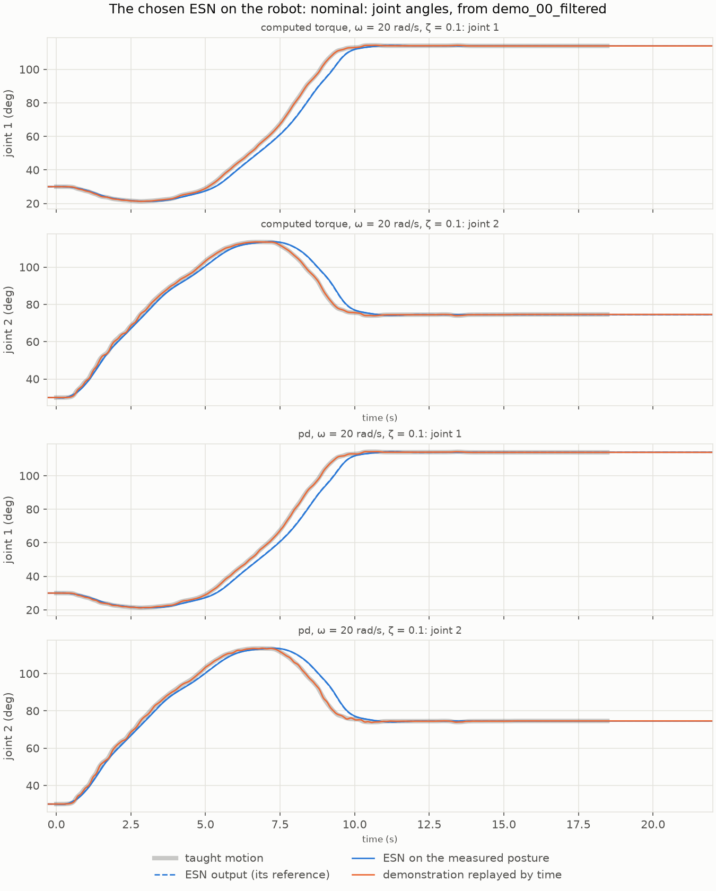

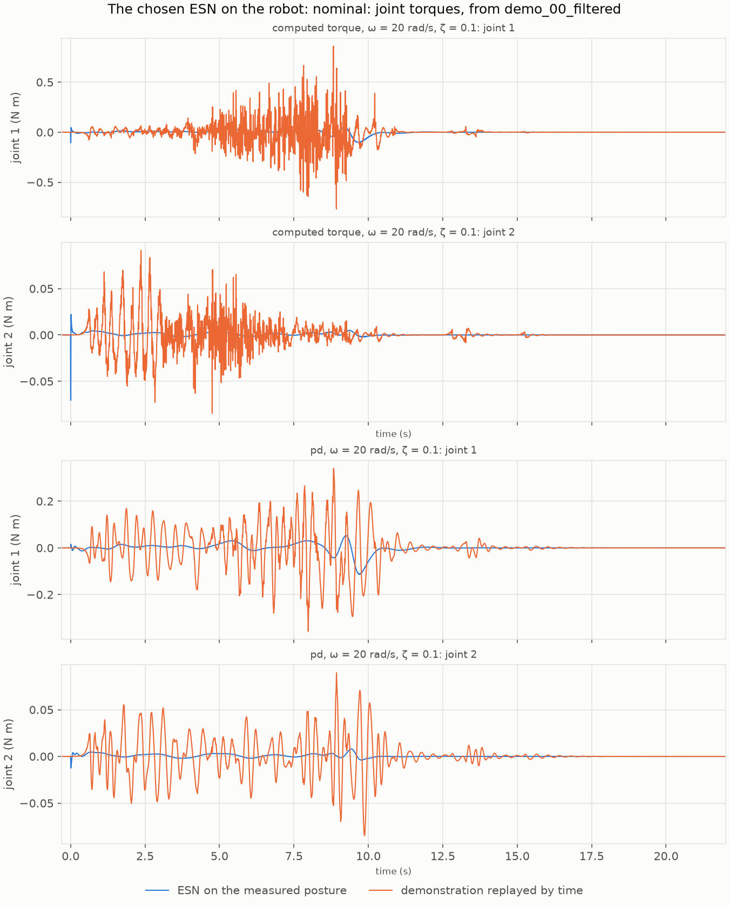

The ESN's arm follows the taught joint path, its output on it, and arrives at
10.0 s, 0.4 s after the take. Its torques stay small and smooth, within about
0.1 N m; the replay's, tracking the take's remaining pixel steps, jitter and ring,
up to 0.8 N m with computed torque.

#### Block

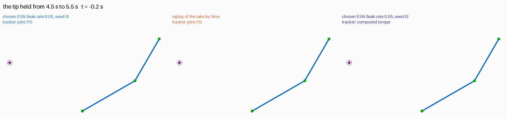

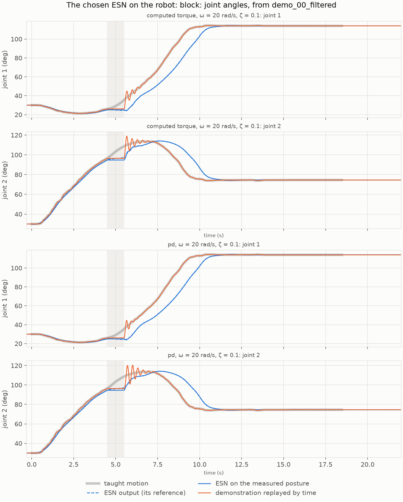

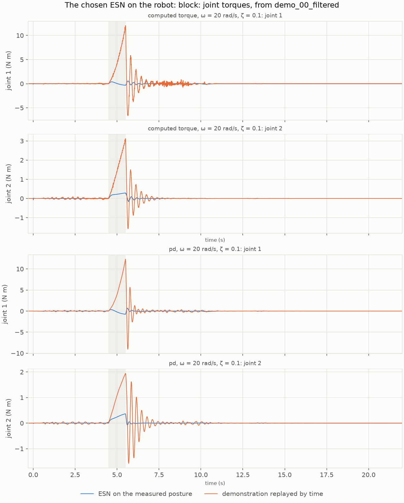

While the tip is held, from 4.5 s to 5.5 s, the ESN's output stays with the held
arm, 14 mm ahead of the hand at the release, and its torques stay under 1 N m; the
replay's reference runs on, its torques climb to 12 N m until the release, and its
arm snaps forward and rings for about 1.5 s. The ESN's arm lurches 20 to 23 mm off
the path at the release, then carries on about 1 s behind the take and arrives at
10.6 s.

#### Pushes

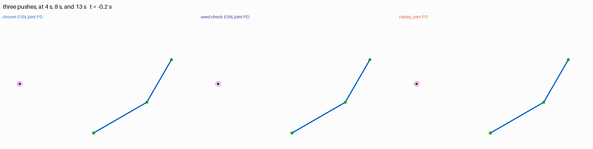

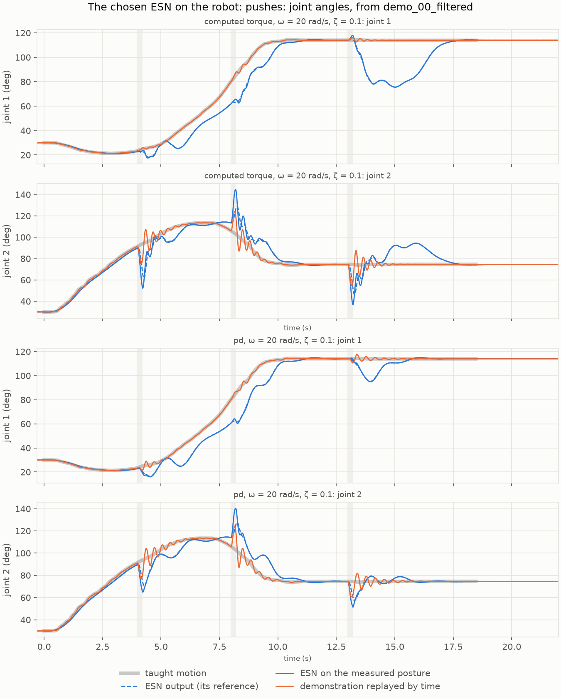

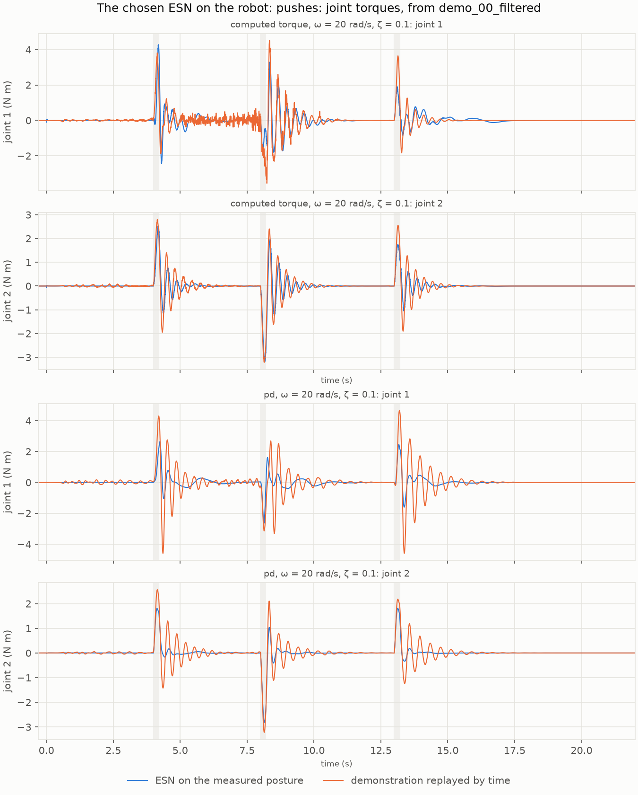

The animation sets the chosen ESN beside the seed check's, both with joint PD, and
the replay. After each push, the chosen ESN's output goes with the arm and carries
on from where it was pushed; its torques peak at 2.5 to 4.3 N m, as high as the
replay's or lower, and die out within about 1 s, while the replay's ring for 2 to
3 s with joint PD.

#### Offset starts

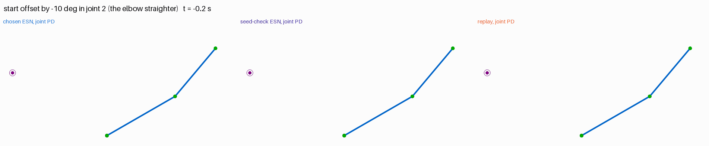

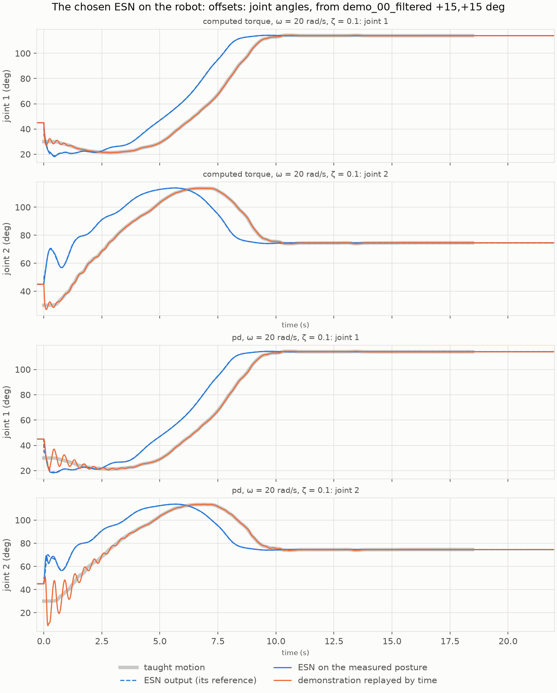

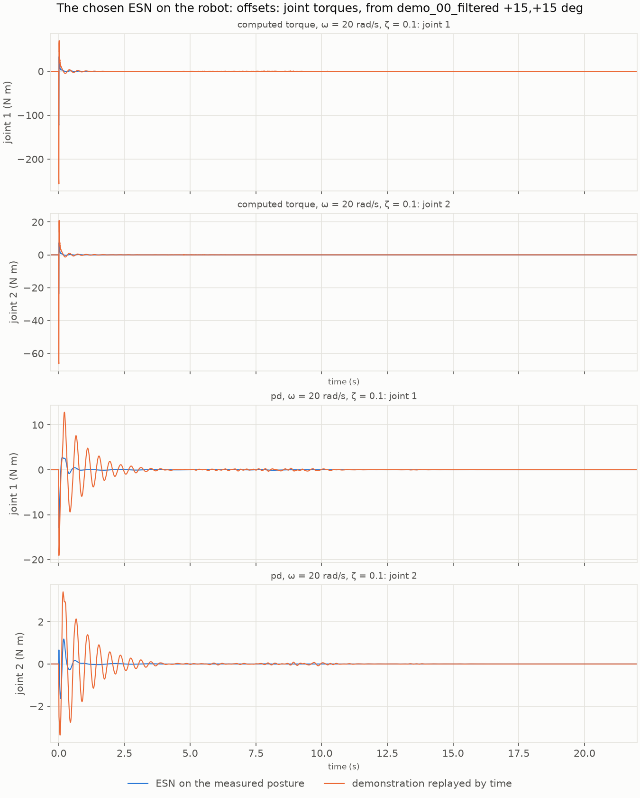

From the start offset by +15° in both joints, the arm turned counterclockwise and
the elbow more bent, the largest offset from which the chosen ESN arrives and
holds, its output brings the arm onto the taught motion within about 1 s, but
farther along it: the arm then runs about 1 s ahead of the take and arrives at
8.4 s, 31 mm off the taught path with joint PD, having skipped the path's first
part. The seed check's ESN arrives at 9.8 s, 32 mm off. The replay's reference
jumps back to the take's start: its arm swings there and rings for about 2 s with
joint PD (68 mm off the path), and with computed torque the jump costs a peak
torque of 257 N m, against the ESN's 123 N m.

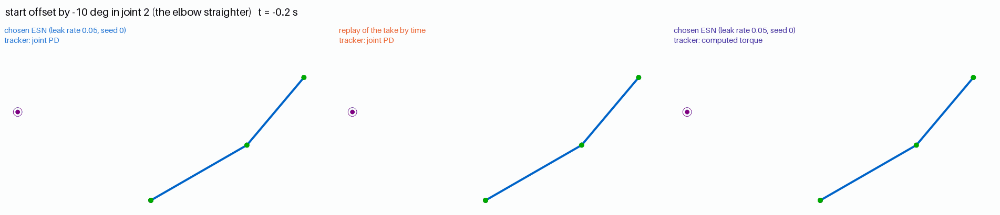

From the start offset by −10° in joint 2, the elbow straighter, one of the 19
starts from which the chosen ESN fails, it straightens the arm out and stays
there, 1.35 m from the target. The seed check's ESN arrives at 9.9 s and holds;
the replay's reference jumps back to the take's start, and its arm follows it
there before replaying the take.

## 4. Observations

- **Tuning on the robot finds an ESN that keeps time despite the tracker.** With a
  zero reference velocity, the first ESN's arm arrived twice as late as the take;
  with a strong input and a slow leak rate, the ESNs found arrive within 0.4 s of
  it, though timing was not scored. A likely reading: the strong input ties the
  ESN's output closely to the measured posture, and the slow leak rate keeps its
  memory of where it is in the motion.
- **The score is the ESN's own.** The ESN's output path is within 3–5% of the
  arm's in every combination that holds: with this tracker, the remaining error is
  the ESN's.
- **Precision from one start, robustness from many.** Scored from the demonstrated
  start alone, the search found ESNs that replicate the take within 1 mm; whether
  they also return from offset starts depends on the reservoir drawn, as the two
  ESNs validated show (30 and 48 of 49 starts).
- **Compliance and firmness trade.** The ESN that yields more to pushes and waits
  more for a held arm, which was preferred, also returns less from offset starts;
  the one that returns more firmly is the more robust.
- **One seed is not a setting.** The best combination of stage 3 owed half its
  score to its seed; the seed check changed the ranking.

## 5. Next steps

1. **Robustness in the score:** add a few offset starts to the sweeps on the robot,
   such as a ring at 5° or 10°, and rank by failures there before the path RMSE.
2. **Seeds earlier:** score each combination over a few seeds from stage 3 on, so
   that a lucky reservoir does not lead the search.
3. **Disturbances in the score:** the block and the pushes as scenarios of the
   sweep, scored by the path RMSE, so that the compliance preferred is tuned for.
4. **Report 004's comparisons:** the zero reference velocity against a tracker
   given the reference velocity, now on this arm and with the ESN tuned for it.
